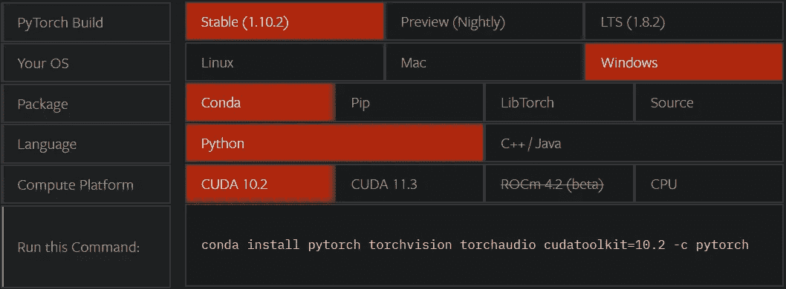
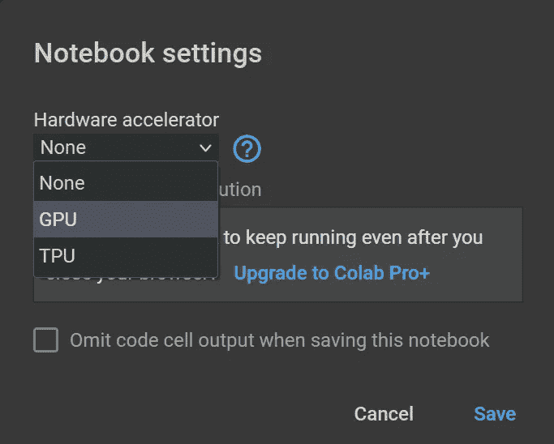
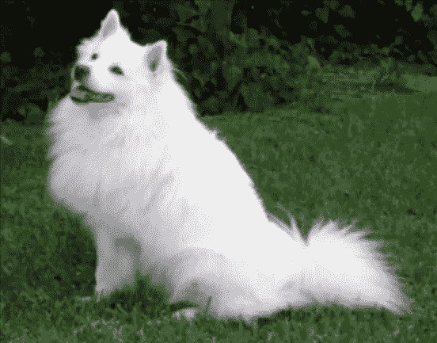
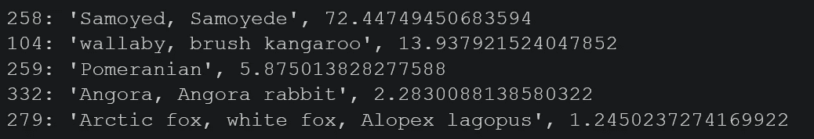

# 深度学习 PyTorch 简介

> 原文：<https://medium.com/geekculture/introduction-to-pytorch-for-deep-learning-483d4a65d594?source=collection_archive---------2----------------------->

## 深度学习教程

## 基于迁移学习的 PyTorch 图像分类。


Photo by [Aziz Acharki](https://unsplash.com/@acharki95?utm_source=medium&utm_medium=referral) on [Unsplash](https://unsplash.com?utm_source=medium&utm_medium=referral)

推荐系统、网络搜索、语言翻译、无人驾驶汽车等人工智能应用改变了我们的生活。人工智能最热门的子领域之一是深度学习。

深度学习是人工神经网络的扩展。人工神经网络由一个隐藏层组成，而深度神经网络由多个隐藏层组成。

深度学习分析中用到很多矩阵运算。您需要使用一个库来实现这些操作。深度学习使用最多的库是 PyTorch 和 TensorFlow。TensorFlow 多用于工业，PyTorch 多用于学术研究。

在这篇文章中，我将谈论深度学习的 PyTorch。总而言之，

*   PyTorch 是什么？
*   PyTorch 的优点。
*   如何安装 PyTorch？
*   用真实世界的数据集练习。

举个简单的例子，我从网上拿一张图片，用 PyTorch 预测这张图片的类别。对于想要学习 PyTorch 的初学者来说，这是一个完美的例子。在这个例子中，我将使用一张狗的图片并预测狗的属。如果你愿意，你可以使用不同的图片，如茶或花。

在开始之前，请不要忘记订阅我们的 youtube 频道，我们在那里创建关于人工智能、数据科学、机器学习和深度学习的内容👇

[](https://www.youtube.com/channel/UCFU9Go20p01kC64w-tmFORw) [## 蒂伦达兹学院

### Tirendaz Academy 是一个在线教育平台，在数据科学、人工智能、机器…

www.youtube.com](https://www.youtube.com/channel/UCFU9Go20p01kC64w-tmFORw) 

让我们深入了解 PyTorch 是什么。

# PyTorch 是什么

PyTorch 是一个用 Python 语言编写的流行库。专门用于深度学习。PyTorch 主要是由脸书开发的。它后来在 2017 年成为一个免费的开源库。

使用 PyTorch，您可以轻松地执行数组操作并构建动态神经网络。您也可以使用 GPU 来加速这些过程。换句话说，你可以简单灵活地使用 PyTorch 来制作快速的深度学习项目。

那么为什么要选择 PyTorch 呢？让我们来看看 PyTorch 的优点。

[](https://www.youtube.com/shorts/9yD_AZeAD6A) [## 找数据科学工作的 5 个技巧

### 数据科学技巧|数据科学家路线图|人工智能与机器学习和深度学习教程(python 2022Hi…

www.youtube.com](https://www.youtube.com/shorts/9yD_AZeAD6A) 

# 为什么是 PyTorch？

它非常受欢迎，因为 PyTorch 易于使用。它有一个庞大的开发者和用户社区。许多公司和研究小组使用 PyTorch 进行深度学习。因此，了解 PyTorch 在工业界和学术界都是一项抢手的技能。

您还可以使用 PyTorch 进行端到端的项目。也就是说，你可以将它与 PyTorch 一起用于深度学习项目步骤，如数据预处理、模型构建和模型部署。

如你所知，Python 是一种解释性语言。在 PyTorch 中，它以渴望模式工作，因为它是用 Python 编写的。换句话说，您可以立即看到您用 PyTorch 编写的代码的结果。因此，您可以很容易地找到您的调试代码。

云对于大数据非常重要。像 AWS 或 Azure 这样的云服务让你的工作变得更容易，因为深度学习与大数据一起工作。你可以在云平台上使用 PyTorch。

深度学习需要强大的计算机。如果你没有强大的电脑，也不用担心。你可以在 Google Colab 和 Kaggle 内核上免费使用 PyTorch。

PyTorch 支持并行计算。所以你可以在 PyTorch 中使用 GPU 或者 TPU 进行数学运算。因此，你可以更快地完成深度学习过程。

PyTorch 拥有一个庞大的生态系统以及基于 PyTorch 的开源库。比如让深度学习项目代码编写变得简单的 fastai，就是基于 PyTorch 编写的。有了 fastai，你可以同时分析计算机视觉和自然语言处理。

如你所见，PyTorch 是深度学习项目的完美库。选择 PyTorch 的理由还有很多。我在这里只提到了一些重要的优势。让我们继续，看看如何安装 PyTorch。

[](https://www.youtube.com/shorts/81r8_xrfWqc) [## 数据科学的 7 个真实例子

### 现实生活中的数据科学示例|数据科学应用|机器学习和深度学习项目嗨，伙计们…

www.youtube.com](https://www.youtube.com/shorts/81r8_xrfWqc) 

# PyTorch 装置

如果你有一台功能强大的电脑，你可以在电脑上安装 PyTorch。在你的电脑上安装 PyTorch 非常简单。PyTorch 的官方网站通过准备一个简单的界面使安装变得容易。要安装 PyTorch，去 PyTorch 的官网，选择合适的选项，然后就创建了一个命令。



[PyTorch Installation](https://pytorch.org/)

之后，在终端或您在 anaconda 中创建的虚拟环境中运行这个命令。要在 Anaconda 上安装 PyTorch，请打开 Anaconda 提示符并设置以下代码来创建一个新的虚拟环境。

```
conda create — name pytorch
```

创建了一个名为 PyTorch 的新虚拟环境。接下来，你要激活这个环境。为此:

```
conda activate pytorch
```

之后，将从 PyTorch 站点复制的命令粘贴到这里。

```
conda install pytorch torchvision torchaudio cudatoolkit=10.2 -c pytorch
```

就这么简单。如果你的电脑有 NVIDIA 显卡，别忘了选择 GPU 选项。有了 GPU，你可以把你的深度学习分析速度提高 50 倍。

如果你没有强大的电脑，也不用担心，你也可以利用 AWS 这样的云平台做深度学习分析。但是使用这项服务是要付费的。

如果你想免费做你的深度学习分析，你可以用 Colab。Colab 是谷歌提供的基于云的免费服务。Colab 的界面类似于 Jupyter 笔记本。您可以在 Colab 中运行您的 Python 代码。也可以配合 GPU 使用 Colab。

PyTorch 安装在 Colab 中，所以不需要单独安装。现在来看看 PyTorch 的安装版本。

```
import torch
print(torch.__version__)
```

Colab 的一个优点是界面类似于 Jupyter 笔记本。如果你知道如何使用 Jupyter 笔记本，你可以很容易地使用 Colab。默认情况下，Colab 不支持 GPU。我们来看看这个。

```
print(torch.cuda.is_available())
```

输出为假。要使用 GPU，请从运行时菜单中选择更改运行类型，并从硬件加速器部分选择 GPU。



Change Run Type

现在让我们再次运行这个命令。

```
print(torch.cuda.is_available())
```

true 被写到屏幕上。之后，我的代码在 GPU 上运行。如果你买的是 Pro 版的 Colab，可以用更好的 GPU，更大的内存。免费版本足以满足我在这篇博文中将要做的分析。

到目前为止，已经向我介绍了 PyTorch 并展示了如何安装它。我希望一切都好。你可以在评论区写下你的问题。最好的学习方法是通过做让我们继续做一个简单的应用程序来理解 PyTorch。

[](https://www.youtube.com/shorts/iYSWwZeEC2c) [## 7 个了不起的计算机视觉项目创意

### 计算机视觉项目创意机器学习应用深度学习人工智能项目 Python AI…

www.youtube.com](https://www.youtube.com/shorts/iYSWwZeEC2c) 

# Pytorch 应用

现在让我向你展示如何使用 PyTorch 进行图像分类。在本练习中，我将从互联网上获取一张图片，并指定这张图片的类别。

在 2000 年代，图像分类是一个难题。但是 2010 年以后，随着新架构的发展和 GPU 的提升，图像分类变得更容易做了。

> 你可以在这里找到我在这篇博文[中使用的笔记本。](https://github.com/TirendazAcademy/Deep-Learning-with-PyTorch/blob/main/1-Introduction_PyTorch.ipynb)

例如，让我们给一只狗拍照。如果您愿意，可以使用不同的图像进行分析。让我们使用 urlib 库从 web 上获取一个图像。首先，让我们导入这个库并请求。

```
import urllib.request
```

好了，现在让我们用一个 url 变量，把我们要获取图片的网站的链接赋给这个变量。

```
url = “[https://github.com/pytorch/hub/raw/master/images/dog.jpg](https://github.com/pytorch/hub/raw/master/images/dog.jpg)"
```

让我们将在这个链接中找到的图像的名称赋给 file_name 变量。

```
file_name = “dog.jpg”
```

现在让我从网上找一张图片。

```
urllib.request.urlretrieve(url, file_name)
```

现在，我们有了一张照片。

现在先用枕头库看图，再用 matplotlib 看图。首先，让我们导入库。

```
import matplotlib.pyplot as plt
from PIL import Image
```

让我们将图像赋给 img 变量。

```
img = Image.open(‘dog.jpg’)
```

用 matplotlib 来看图吧。

```
plt.imshow(img)
```



[A cute dog](https://github.com/pytorch/hub/raw/master/images/dog.jpg)

我们理解这个图像是一只狗。但是计算机将如何理解这张图片呢？我要谈谈这个。我的目标是找到这张图片的标签。为此，我将使用基于神经网络的算法。

在将图像交给算法之前，需要对图像进行预处理。确保图片可用于算法。我们的照片是彩色的。它有 3 个通道，RGB，尺寸为 1600*1200。记住，Pytorch 中的数据预处理步骤称为转换。现在让我们用变换使图像适合分析。

我们先导入 PyTorch，然后进行转换。

```
import torch
from torchvision import transforms
```

让我们使用 compose 方法来定义一系列预处理步骤。

```
preprocess = transforms.Compose([
    transforms.Resize(256),        #1
    transforms.CenterCrop(224),    #2
    transforms.ToTensor(),         #3
    transforms.Normalize(          #4
    mean=[0.485, 0.456, 0.406],
    std=[0.229, 0.224, 0.225])])
```

让我们看看这些代码:

1.  我用 resize 方法将图像的大小调整为 256。
2.  我应用中心剪辑来拟合神经网络。
3.  如你所知，神经网络处理数字数据。我把这个图像转换成张量。张量是 PyTorch 中的基本数据对象。你可以把张量想象成一个有额外特性的 NumPy 数组。
4.  图像由像素值组成。我在 0-1 之间缩放这些像素值。通过这种缩放，您可以做出更快、更准确的预测。

因此，我们创建了数据预处理步骤，使图像适合神经网络，并将其分配给预处理变量。现在，让我们将这些步骤应用到现有的图片中。

```
img_tensor = preprocess(img)
```

你可以看到，img_tensor 的大小是 224*224，由 3 个通道以 RGB 的形式组成。深度学习算法处理数百万数据。一次给模型提供所有这些数据是没有意义的。数据以称为批的组的形式提供给神经网络。大数据的批量通常是 32 或 64。您可以根据您的分析来指定这些值。

我只有一张图片，但是深度学习模型期望数据是批量的。现在让我们向数据中添加一个批处理。我将使用 unsqueeze 方法向数据添加一个维度。在这个方法中，我们需要指定添加维度的位置。我将设置 0，在开始时添加维度。

```
batch = img_tensor.unsqueeze(0)
```

现在让我们看看数据的大小。

```
print(batch.shape)
```

因此，我的数据是 1 批，3 个通道，224*224 像素。现在图像准备进入神经网络。

如你所知，训练深度学习模型既费时又费钱。使用预先训练好的模型更有意义。你可以在 PyTorch repo 中找到预先训练好的模型。

例如，用 Torchvision 上传一个用于分类图像的模型是非常容易的。让我们用 2012 年赢得 ImageNet 比赛的 AlexNet 来对图像进行分类。首先，我们从 torchvision 导入模型。

```
from torchvision import models
```

AlexNet 对图片进行分类效果很好。AlexNet 有不同的型号。您可以选择适合您的分析的模型。

> 深度学习与其说是一门科学，不如说是一门艺术。

现在让我们安装 alexnet。使用 pretrained=True 选项，加载之前训练的模型系数。

```
model = models.alexnet(pretrained=True)
```

现在让我们创建一个设备变量，如果它在 GPU 上，那么分析将在 GPU 上运行，如果它不在 GPU 上，那么分析将在 CPU 上运行。

```
device = “cuda” if torch.cuda.is_available() else “cpu”
```

因为我正在制作一个简单的应用程序，所以这个分析不需要 GPU。您也可以在 CPU 上运行此分析。现在让我们用 model.eval 配置模型。

```
model.eval()
```

让我们选择运行模型的设备。为此，我使用了刚刚创建的设备变量。

```
model.to(device)
```

让我们将运行模型的命令分配给变量 y。

```
y = model(batch.to(device))
print(y.shape)
#outout : torch.Size([1, 1000])
```

我们来看 y 的维度，这里 1 代表数据的批次。因为我们只有一个图像，所以批号是 1。因为类的数量是 1000，所以 1000 的值写在屏幕上。现在让我们看看获得最大值的类。

```
y_max, index = torch.max(y,1)
```

让我们把这些变量打印到屏幕上。

```
print(index, y_max)#output: tensor([258], device='cuda:0') tensor([16.8252], device='cuda:0', grad_fn=<MaxBackward0>)
```

我的模型找到了官方最高值为 16.8252 的第 258 个指数的类。但是我们不知道索引为 258 的类。现在让我们从 PyTorch 的站点获取类名。让我先创建一个 url 变量。

```
url = ‘[https://pytorch.tips/imagenet-labels'](https://pytorch.tips/imagenet-labels')
```

让我们创建一个类标签变量。

```
fname = ‘imagenet_class_labels.txt’
```

现在让我们用这些变量从网上得到这个列表。

```
urllib.request.urlretrieve(url, fname)
```

让我们打开这个列表。

```
with open("imagenet_class_labels.txt") as f:
  classes = [line.strip() for line in f.readlines()]
print(classes[258])# output: 258: 'Samoyed, Samoyede'
```

如你所见，狗的品种写在屏幕上。那么，模型达到这个结果的概率是多少呢？让我们使用 softmax()函数来看看这一点。

```
probe = torch.nn.functional.softmax(y, dim=1)[0] * 100
```

现在让我展示一下这种可能性。我准备用 tensor.item()方法来看概率。

```
print(classes[index[0]], probe[index[0]].item())# output: 258: 'Samoyed, Samoyede', 72.44749450683594
```

该模型对狗的品种的预测达到了 72%。您还可以使用 sort()方法打印前 5 个预测。

```
 _, indices = torch.sort(y, descending=True)
```

现在，让我们打印最大到 5 的预测。

```
for idx in indices[0][:5]:
    print(classes[idx], probe[idx].item())
```



正如你所看到的，我的模型最初预测萨摩耶犬 72 %,而预测沙袋鼠犬 13 %,博美犬 5%。

# 结论

在这篇文章中，我谈到了深度学习的 PyTorch。综上所述，我首先解释了 PyTorch 是什么，以及它的优点。接下来，我向您展示了安装。最后，我讲述了如何使用预先训练好的 alexnet 来估计图像的类别。

就是这样。感谢您的阅读。我希望你喜欢它。你可能会对下面的文章感兴趣。

[](/geekculture/6-steps-to-become-a-machine-learning-expert-5a1f155f7207) [## 成为机器学习专家的 6 个步骤

### 机器学习是人工智能的一个子领域，旨在使用数据自动建立模型。在这篇文章中，我将…

medium.com](/geekculture/6-steps-to-become-a-machine-learning-expert-5a1f155f7207) [](https://levelup.gitconnected.com/top-10-python-libraries-and-5-best-books-for-data-science-fa0d0cf171a6) [## 10 大 Python 库和 5 本最佳数据科学书籍

### 在这篇文章中，我将谈论数据科学家应该知道的 10 个 Python 库。我还会推荐 5 本书…

levelup.gitconnected.com](https://levelup.gitconnected.com/top-10-python-libraries-and-5-best-books-for-data-science-fa0d0cf171a6) 

别忘了关注我们的[YouTube](https://www.youtube.com/channel/UCFU9Go20p01kC64w-tmFORw)|[GitHub](https://github.com/tirendazacademy)|[*Twitter*](https://twitter.com/TirendazAcademy)*|[ka ggle](https://www.kaggle.com/tirendazacademy)|*|*[*LinkedIn*](https://www.linkedin.com/in/tirendaz-academy)*👍**

*****如果这篇帖子有帮助，请点击鼓掌👏按钮几下，以示支持👇*****