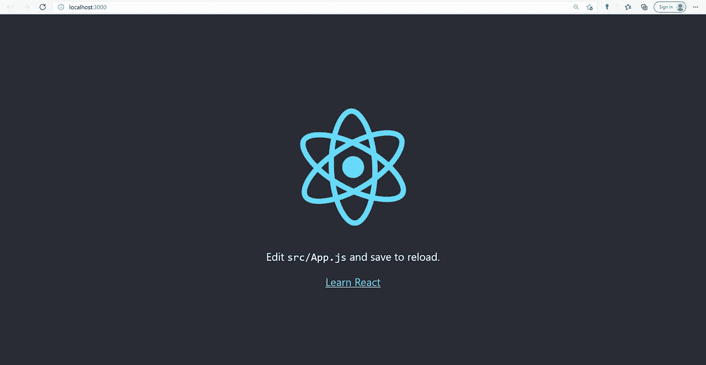

# React 简介

> 原文：<https://medium.com/geekculture/introduction-to-react-75744511253d?source=collection_archive---------15----------------------->

# 什么是反应？

React 是一个技术栈框架，属于 JavaScript UI 库组。它是一个用于构建用户界面的前端 JavaScript 库。它使网站更具互动性，速度更快。React 经常被用作 MVC 架构中的 V。在现有项目中尝试 React 的一个小特性很简单，因为它没有对技术堆栈的其他部分做任何假设。

# 谁使用 React？

React 目前被 9514 家公司使用，包括

优步

脸谱网

推特

亚马孙

购物化

照片墙

拼趣

网飞

爱彼迎（美国短租平台）

# react 的优势

它使得编写组件的整个过程更加容易。

它提高了效率，并使未来的维护更容易。

它保证了更快的渲染时间。

它确保代码是安全的。

它是搜索引擎友好的。

它包括一系列有用的开发工具。

对于移动应用创建，有 React Native。

它以人为中心，简单易懂。

它背后有一个强大的社区。

财富 500 强公司和新锐创业公司都在使用它。

# react 的缺点

快速的变化

缺少文档。

仅视图部分

JSX 是一个障碍

# 反应堆的特征

开发人员社区喜欢 ReactJs 的健壮特性。使其与众不同的一些 ReactJs 特征是:

虚拟 Dom

反应自然

声明式用户界面

基于组件的体系结构

单向数据绑定

## 1.虚拟 Dom

虚拟 DOM 是 React 最重要的特性之一，它允许快速灵活地创建应用程序。

得益于其内存协调算法，React 可以在其虚拟内存中重新创建网页。虚拟 DOM 以这种方式反映了初始 DOM。React 将虚拟 DOM 与原始 DOM 进行比较，然后呈现更改。从而使 React 应用程序更快。

## 2.JSX

JSX 代表 JavaScript XML。

这是一种非常类似于 HTML 的标记语言，用于解释应用程序的用户界面是什么样子的。

## 3.单向数据绑定

单向数据流是在您的下一个项目中使用 Reactjs 的最有说服力的理由之一。Reactjs 中的数据流是单向的。因此，开发人员无法直接修改任何部分。为了对元素进行调整，它们必须使用回调函数。单向数据绑定是这个过程的名称。

## 4.反应自然

React Native 是一个自定义的 Reactjs 渲染器。React Native 使用本地组件，而不是 web 组件。

## 5.声明式用户界面

对于为移动和 web 应用程序设计引人入胜的用户界面，Reactjs 是最佳选择。

Reactjs 在数据发生变化时制作并更新适当的组件。它为每个应用程序状态创建了一个简单的视图。该函数提高了代码的可读性，并使调试更加容易。

## 6.基于组件的体系结构

Reactjs 有一个基于组件的架构。换句话说，基于 React 的移动或 web 应用程序的用户界面被分成几个部分。每个组件都遵循自己的逻辑。逻辑是用 JavaScript 编写的，而不是使用模型。这允许 Reactjs 开发人员在框架中传输数据，而不必担心 DOM。

# 如何创建你的第一个 React 应用？

在安装 React 之前，我们需要确保我们已经在计算机中安装了 npm。您可以通过在终端中键入以下代码来检查它

> **npm -v**

如果已安装，它将显示版本，否则您将必须安装 npm。

如果您已经安装了 npm，那么您可以在终端中键入以下代码来创建您的 react 应用程序。

> **npx 创建-反应-应用 myapp**

您可以键入 React 项目的名称，而不是 myapp。确保名称只包含简单的字母，否则可能会出现错误。运行上述命令后，需要几分钟的时间来完成安装，安装完成后，将会创建一个具有给定名称的文件夹，其中包含 React 项目所需的文件。

进入文件夹，打开终端，输入下面的代码启动服务器。

> **npm 开始**

这将启动服务器，一旦服务器启动，打开您最喜欢的浏览器，键入 ***localhost:3000*** 并查看您是否得到以下输出，如果没有，请确保您正确遵循了上述步骤。

恭喜你！您已经创建了您的第一个 React 应用程序。您可以在您喜欢的 IDE 中打开项目文件夹并开始编辑。

如果你需要了解更多关于 React 的信息，你可以访问他们的官方网站:https://reactjs.org/