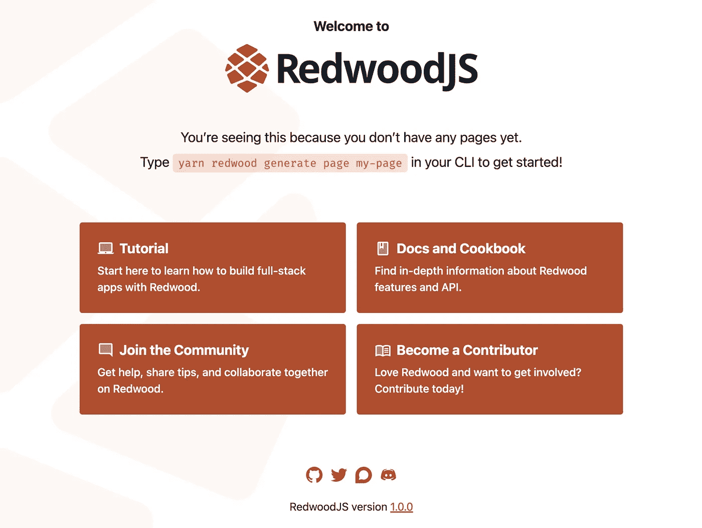
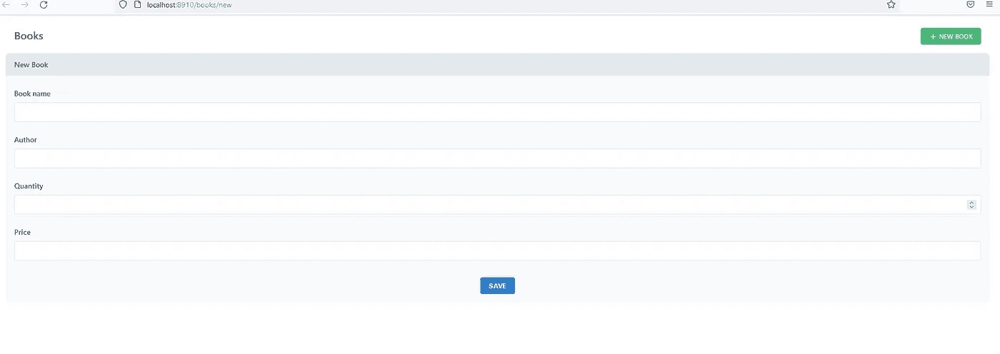
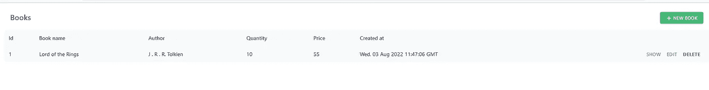
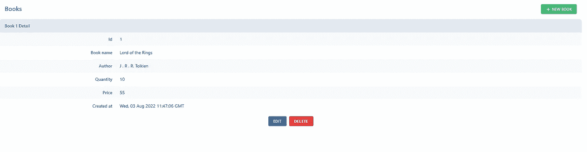

# RedwoodJS | Reflect 简介

> 原文：<https://medium.com/geekculture/introduction-to-redwoodjs-reflect-d25be39779a?source=collection_archive---------14----------------------->


RedwoodJS 是 JavaScript 生态系统中几个新的全栈 web 框架之一。它被设计成容易上手，但同样容易从小项目扩展到成熟的创业公司。

RedwoodJS 将几个流行的库合并到一个单一的一体化框架中，并实现了自己的特性，使构建和维护应用程序的过程更加容易。这包括 RedwoodJS CLI，以及一些有用的特性，比如基于路由的代码分割。

# 背景

雷德伍德 JS 是由[汤姆·普莱斯顿-沃纳](https://en.wikipedia.org/wiki/Tom_Preston-Werner)创造的。普雷斯顿-沃纳是 [GitHub](https://github.com/) 的联合创始人、 [Jekyll](https://jekyllrb.com/) 和 [Gravatar](https://gravatar.com/) 的创造者、[语义版本规范](https://semver.org/)的作者、 [TOML](https://toml.io/en/) 的发明人。

红杉是以原产于北加州的红杉命名的，汤姆·普雷斯顿·沃纳就生活在那里。普雷斯顿-华纳认为该框架与红杉树有共同的特征，特别是它从一棵小树苗开始，但成长为一棵健壮成熟的树的能力。

除了类比，让我们探索 RedwoodJS 的细节，并演示如何创建您的第一个 RedwoodJS 应用程序。

# RedwoodJS 与其他流行的全栈框架有什么不同？

RedwoodJS 应用程序由前端和后端组件组成。在这方面，它可能与 Next.js 联系最紧密，后者是当前最流行的 JavaScript 应用程序全栈框架。在 RedwoodJS 中，后端实现一个 GraphQL API，前端用 React 构建。前端包含*单元*，它允许您声明性地管理获取和显示数据的组件和常规 React 组件的生命周期。简而言之，RedwoodJS 应用程序是一个与自定义 GraphQL API 通信的 React 前端。

一些关键特性包括:

*   简单而强大的路由使您能够映射 URL 路径来轻松地对“页面”组件做出反应。它用动态(类型化)参数、自定义类型和用于生成正确 URL 的命名路由函数在一个文件中定义了所有路由。
*   Redwood 的 GraphQL API 实现允许您开发内部“服务”，这些服务代表它们自己的内部 API，并自动将它们与 Apollo 连接起来。API 使用 Prisma 的 ORM 与数据库交互，Prisma 的迁移工具有助于简化数据库模式的更改。
*   与 Jest 测试框架以及 Storybook 的紧密集成使得单元测试和组件测试非常容易设置。
*   RedwoodJS 包括自动代码分割，它根据每个路由边界分割代码。此外，其他关键功能，如设置身份验证或 CSS 框架，使用 RedwoodJS 非常容易，因为只需一次命令行调用。

# RedwoodJS 在用什么库和技术？

Redwood 的理念是尽可能利用流行的库，并提供一个垫片层，使开发体验更具凝聚力。RedwoodJS 由以下 JavaScript 库组成:

# 代码示例:使用 RedwoodJS 创建一个简单的应用程序

在开始开发 RedwoodJS 应用程序之前，请确保您已经安装了以下先决条件。

接下来，我们将看到如何使用 RedwoodJS 全栈框架创建一个简单的应用程序。

# 使用“创建 redwood-app”创建即时 RedwoodJS 应用程序

如果您使用的是 Windows，请在终端中运行以下命令来安装 LTS 版本的 Node。

```
nvm install lts --latest-npm
```

然后，对于以下示例，安装最新的 LTS 和 npm，例如 16.13.1。

RedwoodJS 使用 Yarn 作为它的包管理器，所以您需要通过下面的命令来安装它:

现在您已经准备好用 Redwood 创建您的第一个应用程序了。使用以下命令创建一个 Redwood 项目框架。

```
yarn create redwood-app my-first-redwood-app
```

如果您更喜欢使用 TypeScript，可以用一个命令创建一个 TypeScript 应用程序:

```
yarn create redwood-app my-redwood-project --typescript
```

命令完成后，使用以下命令导航到创建的应用程序目录。

最后，启动开发服务器:

一个新的浏览器窗口将在`http://localhost:8910`打开本地开发服务器。您应该会在浏览器中看到以下应用程序:



恭喜你，你现在有了一个可用的 RedwoodJS 应用程序！RedwoodJS CLI 有很多功能可以帮助加速开发，即使在最初的应用程序创建之后。您可以通过在线文档或 CLI 帮助，运行“redwood”或“redwood-tools”命令来探索此功能。

# 定义模式

用 Redwood 创建即时应用程序非常容易。通常，数据是应用程序 CRUD 操作的核心部分。您需要从希望包含在应用程序中的数据库模式或表开始。打开 api/db 文件夹中的“schema.prisma”文件，并为您的应用程序定义模式。RedwoodJS 使用 [Prisma](https://www.prisma.io/) ，一种流行的 JavaScript/TypeScript ORM，与数据库通信。这个模式文件定义了应用程序的数据模型。

假设我们正在创建一个让您管理图书收藏的应用程序，我们希望创建一个让您输入图书详细信息并将其保存到数据库的页面。此外，我们可能还想列出数据库中现有的书籍，并执行 CRUD 操作，如创建、删除、编辑等。在“schema.prisma”文件中定义 book 表的模式，如下例所示。

```
model Book { id Int @id @default(autoincrement()) BookName String Author String Quantity Int @default(0) Price Float createdAt DateTime @default(now()) }
```

# 创建迁移

一旦您定义了模型，您需要将您所做的更改应用到您的开发数据库中。为此，使用 [Prisma Migrate](https://www.prisma.io/migrate) 可以轻松地迁移您的数据库，不会出现任何问题。键入以下命令来创建迁移，并将它们应用到开发数据库。

```
yarn rw prisma migrate dev
```

在提示中提供迁移的名称。对于本例，我们将名称指定为“创建书籍”然后，使用下面的命令生成在我们的图书模型上执行所有 CRUD(创建、读取、更新、删除)操作所需的一切。

```
yarn redwood g scaffold book
```

转到网址`http://localhost:8910/posts/new`。您将获得一个基于 Book 模式的小应用程序，如下所示。



输入书名、作者、数量和价格细节，然后点击“保存”按钮。它将在 book 表中创建新记录，您将看到所创建数据的输出。单击“创建帐簿”按钮创建新数据。



点击“显示”按钮，您可以查看数据的详细视图。您也可以通过相应的按钮进行编辑和删除操作。



该应用程序已自动创建以下路径的页面列表。

*   新书-> `/books/new`
*   editBook -> `/books/{id:Int}/edit`
*   书-> `/books/{id:Int}`
*   书籍-> `/books`

您一定已经注意到，您没有为这些 CRUD 操作编写任何代码。您只为您的模式声明了模式，框架会自动生成这些操作所需的前端布局和后端功能。这意味着即使像这样简单的应用程序也可以用更少的代码提供重要的功能。它显示了这个框架对于初学者来说是多么容易掌握，并且可以更快地扩展到更复杂的应用程序。

# 部署选项

RedwoodJS 脱颖而出的另一个原因是其可用的部署选项。我们可以将一个 RedwoodJS 应用程序部署到一个无服务器或传统的服务器和容器提供者上，而彼此之间不需要修改代码。这意味着它为无服务器和传统基础设施提供一流的 Jamstack 风格的部署: [Netlify](https://www.netlify.com/) 、 [Vercel](https://vercel.com/) 、[无服务器](https://www.serverless.com/)、 [Render](https://render.com/) 或 [Docker 容器](https://community.redwoodjs.com/t/dockerize-redwoodjs/2291)(用于 AWS、谷歌云、Azure 等。).

# 结论

RedwoodJS 是一个全栈的 web 框架，它让您可以用更少的代码开发从简单到复杂的应用程序。本文描述了它区别于其他流行框架的独特特性，以及它使用的库和技术。本文还解释了如何用这个框架创建一个简单的应用程序。总的来说，RedwoodJS 是创业公司更快构建应用程序的一个很好的框架。它使您的应用程序更快上市。

*最初发布于*[*https://reflect . run*](https://reflect.run/articles/introduction-to-redwood-js/)*。*