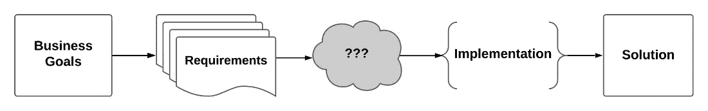
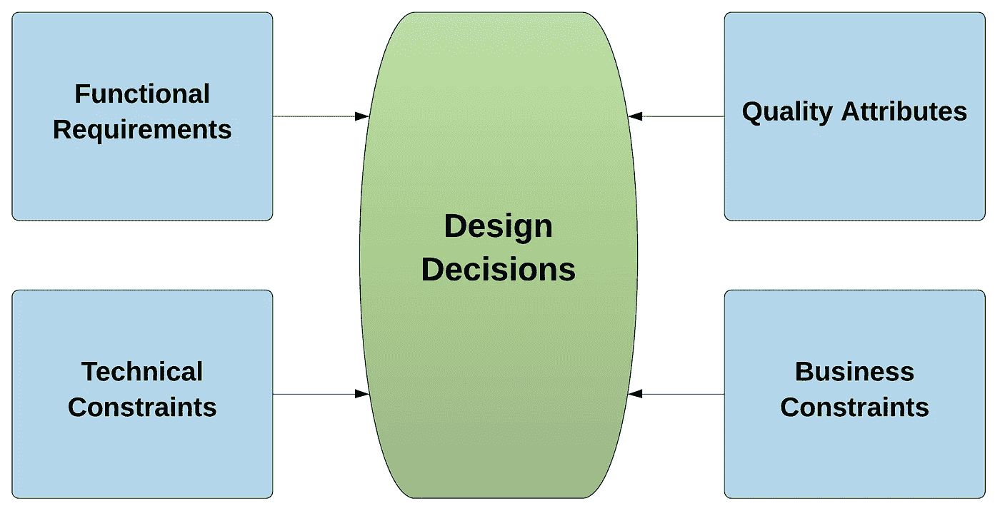
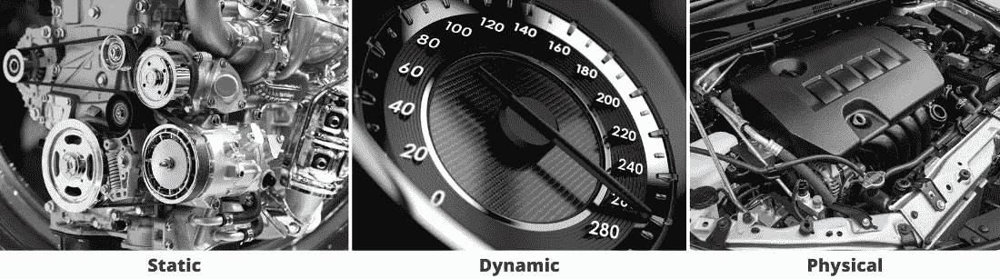
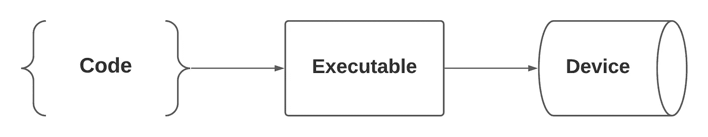
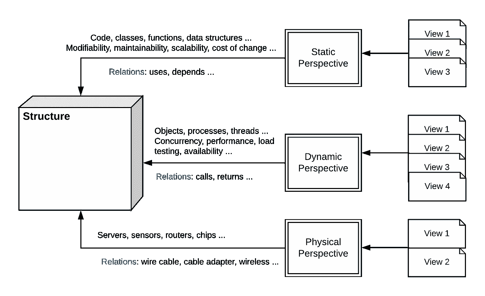

# 软件架构介绍(第一部分)

> 原文：<https://medium.com/geekculture/introduction-to-software-architecture-part-1-3358ede31af9?source=collection_archive---------14----------------------->

软件架构(SA)经常被错误地认为是一堆使用特定技术、经验和直觉生成的线条和方框图。偶尔，这可能会奏效，尤其是在生产的最初几天，但是随着时间的推移，这种情况很可能会变成一场噩梦。

事实上，SA 是一个工程学科，其工件应该被设计、分析、评估、记录，然后被实现。错过这些步骤中的一个或多个应该被认为是对所涉及的利益相关者的严重警告。

在这个系列中，我们将正式定义软件架构，理解它在软件开发中的作用，并讨论其应用的主要挑战。我们将学习如何设计、分析、评估和记录软件架构，以及如何权衡利弊和生成替代架构。我们还将讨论主要的架构风格、模式、策略等等。

第一篇文章是介绍我们将在整个系列中使用的基础的起点。它从正式定义和展示 SA 在项目生命周期中的重要性开始，然后涵盖了诸如架构驱动因素、结构和视角等主题，最后讨论了作为工程学科的 SA 应用所面临的挑战。

本系列的后续文章将关注特定的主题，例如[质量属性和与之相关的策略](/geekculture/introduction-to-software-architecture-quality-attributes-requirements-part-2-7d22eab57e58)，文档和 SA 可交付成果，风格和模式，等等。

# 定义软件架构

**什么是软件架构？**

软件系统被设计用来解决抽象的商业目标。这些目标被列为需求(又名规范)。为了向客户交付解决方案，应该实现需求。但是这里缺少了一些东西:我们如何从需求中得到可以实现的具体操作和指令，这些需求通常是在非常高的抽象层次上指定的。中间应该有东西把它们粘在一起，如图 1 所示。

Figure 1

图 1 中的灰色云是 SA 发挥作用的地方。它是连接高级业务目标和解决方案的桥梁。

**软件架构的定义**

通俗地说，软件架构是一种抽象，它捕获了系统的某些部分，而忽略了其他部分。所选择的部分是对系统进行推理所需的关键元素，而省略的部分是高级推理不需要的细节。

在软件工程协会(SEI)的网站上可以找到几十个定义，在互联网上也有更多的定义，但最好地总结这些定义的一个是:“*系统的软件架构是推理系统所需的一组结构，它包括软件元素、它们之间的关系以及两者的属性。*【1】

换句话说，软件架构包括将一个系统分解成一组元素，或者“结构”，通常在一个更高的抽象层次上，定义那些元素如何相互通信，我们称之为“关系”，然后定义结构和关系的属性。这种分解通常遵循一种风格(或模式)，我们将在以后的文章中更详细地介绍这种风格(或模式)。

**我们为什么需要软件架构**

让我们考虑以下要求和约束:

1.  目前，我们的网站每天有 10，000 名访客。如果我们达到每天 100 万的访问量，网站应该完全以同样的性能和可用性水平运行。
2.  作为用户，当我触发操作“A”时，它应该在不到 0.5 秒的时间内完成并返回其输出，因为操作“B”将在“A”启动后的 0.5 秒内搜索“A”的输出。
3.  一个“严重”的 bug 应该在不超过 0.5 人/天的时间内修复。
4.  一个新的模块在被开发出来之后应该“容易地”集成到项目中。

我们如何满足这些限制？要求 3 中的“关键”是什么意思？要求 4 中的“容易”是什么意思？

这就是 SA 的神奇之处。软件架构的决策和策略允许我们提升感兴趣的[质量属性](/geekculture/introduction-to-software-architecture-quality-attributes-requirements-part-2-7d22eab57e58)，并抑制那些对于手头的系统不太重要的属性。

例如，如果我们关心可修改性，我们需要仔细地将系统分解成子部分，然后分配责任，以便将来的更新不会传播到系统的其他部分。

如果我们关心性能，在某种程度上，我们需要采取与可修改性相反的方向。我们还需要注意共享资源的使用，仅举几个战术。关于质量属性的更多细节将是本系列第 2 部分的主题。

软件架构还允许我们在设计阶段预测系统的行为，而不是等到实现阶段才检查需求和约束是否得到满足。这主要是通过促进或抑制候选的[质量属性](/geekculture/introduction-to-software-architecture-quality-attributes-requirements-part-2-7d22eab57e58)，选择可能导致期望结果的适当的架构风格/模式，在竞争的质量属性中校准和选择最佳折衷，以及通过进行实验然后评估候选架构来完成的。

此外，SA 帮助我们处理需求中的模糊性，比如上面需求中提到的“关键”和“容易”限定符。架构团队应该将这些模糊性转换成量化的数据(数字、持续时间、接受标准等)。其他不明确的例子可能是:

*   系统应该“快速”响应用户的请求。
*   用户界面应该“易于”使用。

因为 SA 是连接高层业务目标和解决方案的抽象，它极大地增强了不同涉众之间的交流。它在技术人员和非技术人员之间架起了一座桥梁，这对于解决需求的模糊性、放松复杂的部分、协商冲突的需求等等都是至关重要的。

# 建筑驱动因素

设计决策受到多种因素的影响。架构师应该捕获将形成设计决策的关键需求和约束，称为架构驱动因素，并抽象出不重要的细节。架构驱动是最重要和最有影响力的需求和约束。

如图 2 所示，有四种类型的架构驱动因素:功能需求、[质量属性(QA)需求](/geekculture/introduction-to-software-architecture-quality-attributes-requirements-part-2-7d22eab57e58)，技术约束和业务约束。

Figure 2

**高级功能需求**:这些是系统必须执行的功能特性和能力的高级概括描述。例如，一个在线电子商务平台应该允许客户创建他们的帐户，创建他们的虚拟购物车，在线支付等。用例可以用来探索、分析和记录功能需求。请记住，在这个阶段，细节被抽象掉了，我们只关注高层次和有影响的需求。

另一个例子是输液泵系统，其中用户可以打开或关闭泵，如果 AC 适配器在操作期间出现故障，泵将自动切换到电池模式，当出现故障时，泵产生音频警报，例如流体输送已经停止，当泵在电池模式下运行时电池电量低，等等。

[**质量属性需求**](/geekculture/introduction-to-software-architecture-quality-attributes-requirements-part-2-7d22eab57e58) :有时也称为“非功能需求”。它们是性能、可测试性、安全性、可靠性、可维护性、可用性等属性。有时候，质量属性需求是由涉众明确声明的，但是在大多数情况下，它们应该是推断出来的，这使得它们很难以一种详尽的方式被捕获。

回到我们的例子。在线电子商务平台主要关注安全性，因为它处理用户的个人信息和在线支付，易用性以减轻现有用户的体验并吸引新用户，以及可用性。关于输液泵系统，安全性和可靠性可能是很好的选择。

重要的 QA、与它们相关的战略和战术(以及更多)将是本系列第 2 部分的主题。

**技术约束**:架构师在设计系统时应该考虑的强加的技术约束。技术约束可以是一种硬件、操作系统、数据库、编程语言、软件程序和工具等。

最糟糕的情况是这些约束阻止了一些功能或质量属性需求的实现。例如，使用不支持音频报警的特定输液泵品牌。

业务约束:这些间接影响架构决策，因为它们不直接强加技术选择，但是它们隐含地这样做。有限的预算、截止日期和现有工具的重用是业务约束的一些例子。

现在，让我们问一个问题:哪个架构驱动因素对设计决策的影响最大？花一分钟，想一想，试着回答。如果需要，你可以重读上一节。

好吧！假设你是 Java 编程语言的专家，你想用 Java 实现电子商务平台。最终，您将使用 Java 优雅的风格将您的解决方案捆绑到类中。但是等等，客户端要求使用 C 编程语言。这意味着，您不能使用 Java 内置的面向对象支持和其他开箱即用的 Java 功能。相反，你必须使用结构化编程范式。最终，不管您使用哪种编程语言和模式，系统都应该具有所要求的特性，这就是功能需求。但是设计会受到强加的技术约束(在这种情况下是编程语言)的强烈影响。

再比如。我们喜欢优雅的编程趋势，并尝试应用它们，如单一责任原则(SRP ),这样我们就可以保证低耦合，也许还有高内聚，这将产生一个结构良好的解决方案。但是在更深入地研究了规范之后，我们意识到我们有一些硬性的期限约束(性能)。因此，我们不得不增加系统某些部分的耦合，使它们相互靠近，这样我们就减少了它们之间的“距离”(抽象层)。同样，无论我们将系统的不同部分放在哪里，我们都保证拥有所请求的特性，这是功能需求。但是为了满足给定的性能要求，我们必须重新设计。

你明白了吗？质量属性需求和约束比功能需求对设计决策的影响更大。

# 结构、视角和视图

正如我们已经看到的，架构师需要将系统分解成一组结构，捕捉它们之间的关系，然后找出它们的属性。但首先，我们需要知道什么是结构，以及我们如何对它进行推理。

我们举个汽车发动机的例子，这种情况下就是我们的结构。怎样才能分析一个汽车发动机？好吧，让我们先打开引擎盖，更深入地看看发动机，检查它不同的金属零件和物体，如正时链条。这样的“*静*分析够了吗？显然不是。我们需要启动引擎，看看它在运行时如何动态地"*"运转。我们还需要看看它如何适应它的世界，如何与它的物理环境互动。图 3 展示了我们刚刚描述的现有结构的三个视角:静态、动态和物理。*

**

*Figure 3*

*透视图是对应该在设计阶段完成的结构的逻辑推理。这种逻辑推理对于产生有效和适当的架构文档是至关重要的。视图是特定视角的文档。*

*回到软件架构。结构是复杂的元素，应该从不同的角度来看。只查看模块和代码相关的元素不足以获得系统的所有属性。所有系统都有三个视角:静态、动态和物理:*

**

*Figure 4*

***静态视角**对于可修改性、可维护性、可伸缩性以及变更成本的推理至关重要。它侧重于面向代码的元素，如包、模块、类、函数、文件、数据结构等。静态元素之间的关系包括:使用、继承和依赖。*

***动态视角**关注结构的运行时组件，如对象、进程、线程等。常见的关系包括:调用、返回、触发器和中断。这种视角应该用于思考诸如并发性、内存和 CPU 利用率、性能、负载测试和可用性等问题。*

***物理视角**对于系统集成和测试至关重要。它侧重于物理组件，如服务器、传感器、路由器、芯片等。物理元素之间的关系包括有线电缆、电缆适配器、无线等。*

*如上所述，**视图**用于记录视角。视图是从给定视角对结构的表示。有时单个视图可能就足够了，但是在实践中，我们通常需要多个视图来捕捉给定视角的所有细节。*

*图 5 描绘了一个结构的高级图，它的透视图，它的视图，以及它们之间的关系。*

**

*Figure 5*

# *将 SA 作为工程学科应用的挑战*

*SA 作为一个工程学科的应用面临着几个挑战。主要的明显障碍是缺乏合格的资源。公司倾向于使用依赖经验和直觉的专用软件应用程序。虽然实践经验对于某些类型的项目来说可能已经足够了，但是对于要求更高的项目来说可能就不够了。缺乏雇用合格架构师的财政资源，以及缺乏对软件架构在项目生命周期中的重要性的理解，可能是导致这一障碍的主要原因。*

*在项目生命周期的早期，与充分使用 SA 相关的时间和成本也可能是一个障碍。IT 公司倾向于强调上市时间的限制，并采用类似敏捷的流程，从而实现快速和定期的更新。这在某种程度上打破了以架构为中心的方法。另一方面，从事嵌入式项目的公司倾向于采用更稳定的软件工程过程，这通常更适合以架构为中心的方法。这仍然是敏捷流程爱好者和软件架构师之间激烈争论的话题，超出了本文的范围，但是值得一提的是，在敏捷和以架构为中心的方法之间需要权衡。*

# *包扎*

*这部分到此为止。我们首先定义了软件架构，并讨论了它对项目生命周期的重要性。我们讨论了架构驱动因素，然后定义了结构、视角和视图。最后，我们讨论了作为一个工程学科应用 SA 所面临的一些障碍。我们将在随后的帖子中使用这些定义和概念，届时我们将讨论[质量属性和与它们相关的策略](/geekculture/introduction-to-software-architecture-quality-attributes-requirements-part-2-7d22eab57e58)、风格和模式、文档和 SA 可交付成果等等。*

***参考文献**T4【1】巴斯、克莱门茨、&卡兹曼。实践中的软件架构，第三版，2013 年
[2] Clements 等著《记录软件架构:观点与超越》，第二版，2011 年
[3]j . la tanze 著《构建软件密集型系统——从业者指南》，2017 年
[4] David E. Arney，Raoul Jetley 等著，宾夕法尼亚大学。通用输液泵危险分析和安全要求 1.0 版，2009 年*