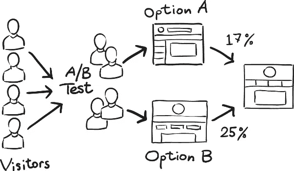

# 软件体系结构介绍——质量属性需求(第二部分)

> 原文：<https://medium.com/geekculture/introduction-to-software-architecture-quality-attributes-requirements-part-2-7d22eab57e58?source=collection_archive---------14----------------------->

在软件架构介绍(第一部分)中，我们正式定义了软件架构，并讨论了它在项目生命周期中的重要性。我们还讨论了架构驱动因素、结构和视角等主题，然后我们讨论了作为工程学科应用 SA 所面临的一些障碍。

在这篇文章中，我们将进一步关注质量属性(QA)，这是我们在[第一部分](/geekculture/introduction-to-software-architecture-part-1-3358ede31af9)中定义的最有影响力和最关键的架构驱动因素之一。正如我们所看到的，QA 比功能需求对设计决策的影响更大，因此它们需要架构师的特别关注。

即使系统功能是具体的观察结果，它们本身也不能满足用户的所有需求。他们需要支持来履行职责。想象一下，一个银行系统允许您执行在线电汇操作，但您的数据是通过网络传输的，没有任何加密。或者，一个 web 应用程序在只有 100 个用户同时使用时运行良好，但当这个数字增加时就会崩溃。

想象一个拥有所有需要的特性的系统，但是任何微小的改变都需要大量的时间和努力。或者可以输送其流体但在任何意外情况下不可靠的输液泵系统。

所有这些系统都具有所需的功能，但它们并不完整，这可能使它们变得毫无用处。安全性、可伸缩性、可维护性、可靠性和安全性是前面示例中缺少的部分。

感兴趣的质量属性与功能同等重要，甚至更重要。作为前面提到的银行系统的用户，我可能会容忍功能上的错误，但安全问题是不可原谅的。

质量属性是看不见的，直到事情出错。大多数时候，系统被重构，甚至被重新实现，不是因为它们缺少特性，而是因为它们速度慢、不安全、不可维护，或者缺少任何其他感兴趣的质量属性。

在随后的章节中，我们将正式定义 QA，并展示为什么它们对 SA 至关重要。我们将讨论 QA 的模糊性和量化，并提供一个框架，以一种可测量和可测试的方式正式规定它们。我们还将更深入地研究一些主要的质量属性，并为它们中的每一个提供一个通用的场景以及它们的策略和战术。

# 定义

有时在后缀后称为“能力”(例如“可维护性”)，或者非功能需求，**质量属性是系统的非功能属性，应该是可测量和可测试的，并用于评估系统的感兴趣的质量**。

正如我们在本系列的[第 1 部分](/geekculture/introduction-to-software-architecture-part-1-3358ede31af9)中所看到的，有时质量属性是明确陈述的。我们提供了以下示例:

*   目前，我们的网站每天有 10，000 名访客。如果我们达到每天 100 万的访问量，网站应该完全以同样的性能和可用性水平运行。
*   作为用户，当我触发操作“A”时，它应该在不到 0.5 秒的时间内完成并返回其输出，因为操作“B”将在“A”启动后的 0.5 秒内搜索“A”的输出。

在第一个要求中，我们有一个目标数字(1，000，000)，而在第二个要求中，我们有一个操作“A”要满足的明确的截止日期(少于 0.5s)。然而，在大多数情况下，质量保证要么没有明确说明，要么含糊不清地提到。架构师的工作是发现并清楚地指定它们。

以下是来自[第 1 部分](/geekculture/introduction-to-software-architecture-part-1-3358ede31af9)的两个例子，这些例子提到了一些含糊不清的质量保证:

*   系统应该“快速”响应用户的请求。
*   用户界面应该“易于”使用。

## 含糊

正如我们已经看到的，模糊性是架构师需要处理的挑战之一。我们区分两种类型的歧义。第一个与感兴趣的质量保证的量化和测量相联系。量化歧义的例子可以是“快速响应”、“安全系统”、“用户友好的用户界面”。

第二个是关于问答的范围。例如，当系统不响应请求时，这是安全攻击、性能问题还是可用性问题？

## 可测量和可测试的质量保证

根据定义，质量属性应该是可测量和可测试的。让我们考虑一下前面提到的例子:“系统应该快速响应用户的请求。“5 秒算“快”吗？3 秒呢？我们需要再往下推吗？嗯，我们无法回答这个问题。这个没有明确的规范。

另一个含糊提到的规范呢？"用户界面应该易于使用."“容易”是什么意思？同样，我们无法回答这个问题。

架构师必须清楚地定义 QAs 验收标准，以便能够验证系统是否履行其职责。质量属性使用数字、持续时间、百分比或简单的真/假回答来衡量。

# 质量属性规格

为了处理我们刚刚讨论的模糊性和量化问题，有一个很好的框架叫做**六部分场景**，架构师用它来正式指定质量属性。顾名思义，它有 6 个部分:

1.  刺激:到达系统需要响应的事件或请求。正常的用户请求、安全攻击、网站流量的增加都是刺激的例子
2.  刺激源:谁/什么触发了事件或发起了请求。知道刺激的来源是最重要的。对付一个黑客当然不同于回应一个普通用户。用户、系统管理员或致动器是刺激源的一些例子。
3.  环境:刺激被触发的系统条件。在系统升级后处理 bug 与升级前处理 bug 是不同的。类似地，在过载情况下处理事件与在正常操作中不同。“正常”用来表示在刺激到来之前，没有什么特别的情况需要提及。
4.  工件:刺激可能涉及系统的一个特定部分，多个部分，或者整个系统。数据库系统、前端层、注册模块和整个系统都是可能的工件的例子。
5.  反应:作为对刺激的反应而采取的行动。对可修改性请求(刺激)的响应是所请求特性的实现、测试和部署。对安全攻击(刺激)的反应是应该保护数据和服务免受未经授权的访问。
6.  响应度量:响应应该是可度量的，这样我们就可以测试它是否满足了特定的需求。例如，可修改性需求可以用实现、测试和部署更新请求所需的人工日数来度量。性能需求可以通过延迟或吞吐量来衡量。可靠性要求可以用平均无故障时间(MTTF)来衡量。

6 部分场景用于在某些情况下对单个 QA 进行推理。例如，如果我们有五个潜在的可修改性场景，我们需要一个包含六部分的场景。

## 质量属性架构

术语“策略”、“策略”和“设计决策”在文献中是同义词，指的是提升感兴趣的质量属性所需的步骤。这些策略和策略的范围只涉及一个 QA。换句话说，架构师应该忽略其他质量属性以及它们如何影响当前的质量属性。当我们讨论样式和模式时，我们将在以后的文章中看到如何平衡权衡。

在一篇文章中涵盖所有的 QAs 是不可行的。因此，我们将把重点放在一些最重要的方面，即:可修改性、可用性、性能和安全性。在这个过程中，我们将简要地涉及其他 QA，例如可维护性、可学性、可用性、可伸缩性和可靠性。

# 可变性

可以进行更改来改进功能、修复缺陷或添加新特性。变更可以超越功能，以其他质量属性为目标；它们可以提高性能，实现可伸缩性，并使系统更加安全。

可修改性主要与做出改变所需的成本和时间有关。这意味着架构师应该能够在设计时预测和/或指定未来更新的变更成本。这似乎是一项具有挑战性的任务，的确如此。

幸运的是，有许多策略和模式可以促进可修改性，并使在设计时预测变更的成本变得更加容易。我们将在下一节讨论可修改性策略。样式和模式是本系列下一篇文章的主题。

> 可维护性是可修改性的一部分。它是系统能够支持变化的程度。

## 可修改性架构

促进可修改性背后的主要思想是避免过大的模块:处理多个关注点且职责重叠的模块。这种结构意味着对任何模块的任何修改都可能传播到其他模块。

我们需要分离关注点。避免大模块，减少耦合，增加内聚性是促进可修改性的主要策略。

> 静态视角可以用来推理可修改性。

**减少模块的大小**:维护和修改多个责任有限的小模块比管理多个关注点的大模块更容易。将大模块分割成小模块是提高可修改性的关键。以下两个小节提供了关于如何适当拆分模块的指南。

**低耦合**:耦合是多个模块职责重叠的时候。高耦合意味着对任何模块的任何更改都可能影响其他模块。为了提高可修改性，耦合应该被最小化，这样涉及到给定模块的给定变化就不会传播到其他模块。

高内聚是指一个模块中的职责紧密相关。任何模块职责的更新都可能影响同一模块中的其他职责。高内聚促进可修改性。对于给定的更新，可以通过将未改变的职责转移到另一个现有的或新的模块来修复低内聚性。

> 可修改性是性能的敌人。

## 可修改性的六部分场景

以下是可修改性的六部分场景的一些例子:

*   刺激源:客户、用户、管理员。
*   刺激因素:添加一个新特性，修复一个 bug，改进特定模块的响应时间，优化一些数据库查询。
*   工件:整个系统，数据库系统，产品管理模块。
*   环境:运行时、开发时间、测试时间。
*   响应:进行、测试和部署变更。
*   应对措施:变革的成本，进行变革所需的时间(x 人-日)。

# 可用性

可用性是用户能够有效和高效地使用系统的程度。可用性的主要目的是改善用户体验，从而提高用户满意度。

可用性对于某些类型的商业系统来说是至关重要的，因为它直接影响用户对系统的感知。

可用性和可修改性是紧密联系在一起的，主要是因为我们在可修改性策略中讨论的关注点的分离也促进了可用性，并且允许在操作模式中快速的改变和修复。

## 可用性架构

当设计可用性时，我们通常关心两件事:

*   可学性:用户会很快熟悉用户界面吗？聊天机器人系统、工具提示、帮助弹出窗口、操作视频和教程都是指导用户使用系统的好方法。
*   **系统主动性**:系统为用户提供什么支持？长期运行操作的进度条、定期反馈消息、能够撤销操作以及基于历史的下一步建议是系统可以向用户提供的支持的一些示例。

**原型和迭代设计**:这是一种用户驱动的方法，也是设计高效用户界面的有效途径。它包括开发快速和迭代的原型。

原型应该考虑以前版本的积极和消极方面(如果有的话)，最终用户的偏好(如果事先知道的话)，以及在类似类型的应用中使用的趋势(如果有的话)。有几种工具可以用来创建快速的交互式用户界面。

经验事实:目标是评估和量化用户满意度。给定任务所用的时间、成功操作与错误的比率、用户使用系统提供的支持的次数(例如，撤销操作)，以及用户在 chatbot 上提出的问题类型，这些都是架构师可以用来提高可用性的例子。

**A/B 测试**:这是探索用户喜欢/不喜欢什么并相应调整决策的好方法。A/B 测试超出了本文的范围，但是简单地说，它包括一个用户体验方法，该方法将用户随机分成两个或更多的组，然后为每个组提出一个不同的系统版本。如图 1 所示，A/B 测试的最终目标是从统计上确定哪个版本的系统性能良好。

Figure 1

**询问最终用户**:调查和民意测验是了解用户需求的另一种方式。测试版也可能是最终用户测试新版本系统的好方法。

## 可用性的六部分场景

可用性的六个部分的例子

*   刺激:通过用户界面与系统交互(使用系统功能，执行长时间运行的任务，删除项目。)
*   刺激源:最终用户、管理员。
*   工件:整个系统，产品管理模块，意愿列表模块。
*   环境:运行时。
*   响应:用户有效且高效地执行操作。
*   响应度量:成功任务与错误的比率、用户满意度(例如，使用投票)、任务的运行时间。

# 表演

性能是最具挑战性的 QA 之一(尽管是非常令人兴奋的一个)。不仅因为它隐藏了多个复杂的概念，而且它是许多其他质量保证的敌人，如可修改性和可维护性、可测试性和安全性。

性能是基于时间的属性:

*   响应请求或事件需要多长时间(延迟)；
*   给定单位时间内处理了多少事务(吞吐量)；
*   系统子部分的状态转换之间的最后期限是什么(最后期限)。

架构师不能忽视性能，即使没有明确说明或者不是手边系统的主要 QA 候选。仅仅是因为用户不接受非常慢的系统。“快速”反应总是更好。

说到性能，架构师应该仔细分析的一个最重要的概念是并发性。并发性是一个巨大的主题，需要一系列专门的文章来讨论(我将在未来几周内讨论)。

它是关于进程(和线程)的并行执行以及它们的同步和优先级。显然，在性能和资源利用方面，并行执行要比顺序执行好得多，但这是有代价的。

并发错误是最难捕捉和修复的错误之一。竞争条件、死锁和饥饿就是一些例子。进程和线程的交错本质使得标准测试技术很难捕捉这些类型的错误。对于关键系统，正式的验证技术是必须的。

另一个挑战是处理事件的发生频率:它是否是确定性的，以及什么样的调度策略适合当前的情况。

## 性能架构

有多种策略可以提升性能，从优化高效的算法到强大的 CPU 和更快的网络。然而，并不是所有的方法都是可行的，架构师的工作就是优化使用可用的方法。

在本节中，我们将讨论一些在性能至关重要时要考虑的一般规则。我们不会深入探讨并发性问题，尽管我们会提到其中的一些。

并发性(Concurrency):并行执行，加上适当的调度策略，是提高性能的一个很好的方法。例如，架构师可以使用基于优先级的方案:可以首先处理高优先级的事件。

在这种情况下，会出现诸如饥饿/公平和抢占策略等问题，架构师应该仔细分析这些问题。

另一方面，如果事件具有相同的优先级，常见的策略是在处理下一个流之前，限制流中首先处理的事件的数量。这提供了更多的可预测性，但是也出现了其他问题:队列管理、溢出情况、丢失事件(丢失率)...

对于非常严格的最后期限约束(所谓的“实时”)，策略超越了进程，将不同类型的多条指令放在同一进程中，从而减少 CPU 中断，从而减少 CPU 上下文切换。

同样，并发性超出了本系列的范围，但是值得一提 SA 上下文中前面的概念和策略。

> 可以从动态的角度记录和查看并发性。

**减少中介:**正如我们已经看到的，关注点的分离和中介的使用有利于可修改性，但是它们阻碍了性能。这是性能和可修改性之间非常常见的折衷。

在性能方面，应减少或完全取消中介(如果适用)，并且应将元素分组并放在同一位置。中介可以是消息代理，它链接系统的某些元素、网络中需要远程调用的不同节点，或者只是本地子例程调用。

> 动态视角可用于对中介进行推理。

**资源的高效利用**:将繁重的计算任务分派到多个节点上可以显著提高性能。此外，复制和缓存数据是获得现成响应的一种方式。

诸如应该缓存哪些数据以及数据一致性和同步等问题是架构师需要处理的一些问题。

当然，额外的强大 CPU 和更快的网络是架构师需要考虑的其他因素。

> **可伸缩性**是系统在不影响性能的情况下处理负载增加的特性。它通常与两种常见策略相关联:横向扩展(例如，添加更多节点/服务器)和纵向扩展(例如，向单个节点添加更多资源)

## 绩效的六部分情景

绩效的六部分情景示例

*   刺激:事件的发生(以确定性或非确定性的频率)。
*   刺激源:终端用户、执行机构、外部系统。
*   工件:系统的一个子部分，整个系统。
*   环境:过载、紧急、正常。
*   响应:处理到达事件，系统状态转换。
*   响应度量:吞吐量、延迟、失败率、截止时间。

# 安全性

安全性是衡量系统在向合法用户提供服务的同时防止未经授权使用数据和服务的能力。安全性包含 6 个主要问题，它们是:

*   机密性:断言秘密信息受到保护而不被未授权访问的属性。例如，您在网站上的个人信息只能由您访问。
*   授权:断言合法用户可以执行所需任务的属性。
*   身份验证:一种属性，表明事务中涉及的用户确实是他们所声称的那个人。
*   完整性:断言数据被正确传送而没有未经授权的修改的属性。
*   可用性:断言系统对授权用户可用的属性。我们一会儿将简要讨论可用性。
*   不可否认性:断言任务的执行者不能否认后来执行了该任务的属性。例如，电子邮件的发件人不能否认发送了电子邮件，收件人也不能否认收到了电子邮件。

架构师应该关心 3 个主要问题，它们是:需要保护的业务资产，要考虑的可能威胁的种类，以及系统应该如何响应这些威胁。

> 可用性:它是可靠性的一部分。可用性是系统在用户需要时随时可用的属性。它用可用系统时间与总工作时间的比率来表示。

## 安全架构

**抵御攻击**:这种战术旨在保护系统免受潜在的攻击。认证、授权、加密以及数据完整性检查就是一些例子。使用防火墙、设置允许的端口和 IP 地址是抵御攻击的一些其他方法。

抵抗攻击的另一个策略是限制你的资源暴露。例如，将您的系统部署在地理上分散的基础设施上，这样，如果任何给定的节点由于安全攻击而停机，基础设施的其余部分不会受到影响。

> **可靠性**是系统在一些预先定义的条件下保持长时间运行的特性。可靠性以平均无故障时间(MTTF)来衡量。

可用性策略:可用性是安全性的一部分，因此可用性策略有助于从安全攻击中恢复。数据镜像、冗余和回滚到以前的已知状态是一些要考虑的策略。

另一个重要的可用性策略是降级可用性，当可靠性是主要的质量保证之一时，这一策略非常关键。这旨在保持系统的关键功能，并关闭不太重要的功能。

例如，如果飞机软件在飞行中出现错误，飞机必须不惜一切代价飞行和降落，即使机舱内的照明或空调出现故障。

## 安全的六部分场景

安全性的六部分场景示例

*   刺激因素:攻击(拒绝服务、SQL 注入、跨站点脚本等)。)
*   刺激源:黑客(一个人或一个系统)。
*   工件:数据存储，系统产生的数据，系统的一些服务…
*   环境:运行时，测试时间。
*   回应:应该保护数据和服务免受未经授权的访问。在漏洞被利用的情况下，应评估损害，并回滚到以前的安全状态。如果可用性或可靠性至关重要，则定义的关键功能应该继续在受损节点中运行，或者委托给其他安全节点。在任何情况下，系统都应该将攻击细节保存在报告中，以便进行分析和安全改进。
*   响应措施:检测到的漏洞数量、被利用的漏洞数量、系统抵抗的已知攻击数量、针对给定攻击受到危害的服务数量、攻击成功后返回正常操作模式需要多长时间…

# 包扎

这部分到此为止。我们从定义质量属性开始，并展示了它们在软件项目生命周期中的重要性。我们讨论了由六部分组成的场景框架，并展示了它是如何正式指定和量化 QAs 的。

我们还深入研究了可修改性、可用性、性能和安全性，并讨论了它们的策略。然后，我们简要地讨论了其他一些 QA，比如可维护性、可学性、可用性、可伸缩性和可靠性。

在接下来的文章中，我们将关注风格和模式、文档和 SA 可交付成果，以及架构评估。

**参考文献** 【1】软件架构实践，第三版，Bass，Clements，&卡兹曼，2013
【2】记录软件架构:观点与超越，第二版。Clements 等人，2011 年。
[3]构建软件密集型系统—实践者指南—安东尼·拉坦泽，2017