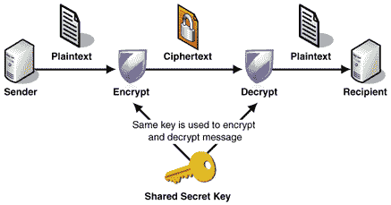
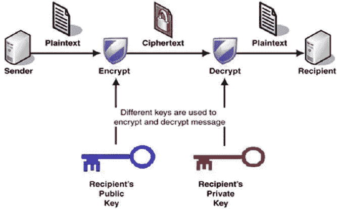

# 软件安全、密码学和非技术黑客入门

> 原文：<https://medium.com/geekculture/introduction-to-software-security-and-cryptography-52ff87bd4bb5?source=collection_archive---------22----------------------->

# 应用安全与软件安全

# 应用程序安全性

这是一种在部署完成后防御软件攻击的方法。

*   基于问题的短期方法。
*   威胁建模
*   代码审查

# 软件安全性

这是一种通过构建安全的软件来防御软件漏洞的方法。

*   根本原因分析。
*   组织变革

# 安全违规行为

指可能导致未经授权访问计算机数据、应用程序或设备的任何活动。导致—

*   财务损失
*   公司声誉的损失
*   诉讼

# 攻击类型

有 5 种主要的攻击类型。

1.  泄露—敏感数据的泄露。
2.  篡改——未经授权篡改信息。
3.  资源窃取—未经许可使用资源。
4.  故意破坏——扰乱系统运行。
5.  拒绝服务—中断系统使用。

# 攻击方法

*   窃听:在没有适当授权的情况下获取信息的副本。
*   欺骗:在没有授权的情况下使用另一个主体的身份。
*   消息篡改:截取和修改消息。
*   重放:存储消息并稍后发送。
*   泛滥:同时发送太多消息。

# 密码系统

> 密码学是指秘密书写的艺术。目标是不让不该看到的人看到这些信息。这是通过“扰乱”数据来实现的。

使用一种算法对数据进行加扰。

*   2 个输入:数据和密钥。
*   只有授权用户知道密钥。

**密码分析**:不使用密钥将密文转换成明文的技术或科学。

**加密**:将信息转换成隐藏信息真实含义的密码的方法。

# 克霍夫原理

> 一个密码系统应该是安全的，即使关于该系统的一切都是公开的，除了密钥。

这与“通过模糊获得安全感”正好相反。几乎所有新的加密算法都遵循这一原则。

公开加密算法的优点，

*   如果我们把算法保密，如果有人破解了它，那么所有的信息都会被解密。
*   其他人可以识别算法中的问题。

# 早期加密技术

1.  凯撒密码—用偏移量移动一个字母(偏移量是关键)。
2.  爱经——将字母表分成 2 行或更多行，并用第 2 行中的相应字母替换原始字母(偏移量是拆分数字)。
3.  一次性密码本

这些算法的问题:**没有安全的方法来分发密钥。**

# 零

指用于执行加密和解密的算法。一个好的密码有两个主要特征。

*   混乱——即使我们改变了原文中的 1 个字符，密文中也应该有显著的差异。
*   扩散—原始文本应该分布在整个密文上。

应该考虑这两个因素。否则，攻击者可能能够猜出密文。

**无条件安全**:无论计算能力/时间如何，密码都无法被破解。

**计算安全**:密码可以用暴力破解(尝试不同的组合)。然而，这可能需要很长时间。

# 密码学基础

有两类加密算法

## 对称密钥加密

在对称密钥加密中，加密和解密使用同一个密钥。有许多不同的对称密钥算法。

*   数据加密标准
*   三重 DES
*   高级加密标准
*   电子密码本
*   密码块链接

这些算法速度很快，并且只需要一个密钥。然而，也存在许多问题，如密钥分配问题和密钥管理问题。

## 非对称密钥加密

提供单向安全性。生成两个密钥作为公钥和私钥。

> ***需要私钥来解密用公钥加密的东西。***

发送者必须从可信的来源获得接收者的公钥。发送方使用这个公钥加密消息。即使有人窃取了密文，也无法解密，因为他们不知道接收者的私钥。

这消除了对称加密中的密钥分发问题。然而，这种方法要慢得多，而且计算量很大。

# 相当好的隐私(PGP)

***最初，我们使用非对称密钥加密来建立安全通道，以便交换对称加密的密钥。***

通常用于消息和数字签名的加密。PGP 结合了非对称密钥加密和对称密钥加密。

# 哈希函数

这些都是单向函数。

最常用于-

*   **存储密码**
*   区块链
*   完整性保护(如 Sha256)

**将文本转换成某种其他格式(也称为摘要、散列输出),但没有将其转换回原始格式的目标。**

对于每个输入，应该有一个唯一的输出。

有为流行的加密散列函数发布的散列表。这些被称为“彩虹桌”。在反向 Hashlookup 的过程中，应用程序会通过这个表来搜索哈希值。

**哈希冲突**:如果 2 个输入产生相同的哈希值。(哈希算法为 2 个输入产生相同的哈希值)

为了克服这个问题，我们使用加盐散列法。

# 咸杂碎

> **将一些随机数据添加到散列函数的输入中，以保证唯一的输出。**

这个腌制过程是根据 OWASP 指南完成的。这种技术将防止字典攻击和反向散列查找。这将为相同的输入创建唯一的哈希值。

# **社会工程**

这是利用人类心理的艺术。攻击者仍然可以在不使用任何技术手段的情况下获取密码并进行攻击。这被称为社会工程。

示例:

*   使用电话——社会工程师可能会打电话，假装是同事或朋友，获取信息。
*   在线——使用各种社交网站，社交工程师可以获得用户的敏感信息。

# 非技术黑客

如前所述，黑客不需要依靠技术手段来实施攻击。让我们详细看看其中的一些方法。

## 密码安全性

“密码”是一个秘密的词或短语，用于获得对服务或资源的访问。在互联网上，我们使用许多不同用途的密码。但是，在定义密码之前，有一些重要的因素需要考虑。否则，攻击者有可能破解密码。

*   密码不应该是与你相关的东西(你的姓名、地址、年龄、位置的一部分)
*   长话短说。
*   使用混合字符。
*   避免使用容易记忆的键盘路径。

## 通过 WIFI 网络的安全威胁

到目前为止，WIFI 可以被认为是最普遍的无线通信技术之一。现在在比较拥挤的地方都设置了公共 WIFI 接入点，方便上网。但是，攻击者可能会使用流氓热点来窃取用户的信息。

## 流氓热点

恶意热点是一种名称类似于合法热点的开放热点。攻击者利用这一点诱使用户连接到他们的网络。一旦连接，攻击者可能会拦截连接用户的数据，甚至将恶意软件注入这些设备。因此，不需要太多的努力，攻击者就可以很容易地做到这一点。作为一种预防技术，我们应该始终将设备连接到可信的 Wifi 网络。

社交媒体网络也被广泛用于实施身份盗窃。

# 与社交网络相关的安全风险

现在有许多社交网站，我们几乎每天都在使用它们。因此，了解与这些社交网站相关的安全风险以及如何避免这些风险是非常重要的。

## 数据挖掘

想象一下我们创建一个新的社交媒体档案的情况。我们可能会泄露我们的姓名、地址、电话号码、电子邮件甚至信用卡信息等信息。广告公司可以获得更好的信息和个性化的广告选择。

这是在没有用户适当认可的情况下大规模完成的。攻击者可以执行攻击并轻松复制受害者，因为所有必要的信息都存储在一个中心位置。这导致了身份盗窃。

# 恶意软件共享

指能够通过未经授权访问计算机来获取信息的软件。他们的主要目标可能是窃取敏感信息。通过社交网站，攻击者可能会与用户共享这种恶意软件，并试图窃取信息。因此，用户应该始终小心不可信来源的共享链接和软件。

# 网络钓鱼攻击

示例-

攻击者可以创建一个看起来像脸书登录页面的网站。然后托管它，URL 也可能看起来与原始 URL 相似，只是稍有变化(一两个字母的变化)。现在他可能会共享这个 URL，用户可能会意外地输入他或她的用户名和密码。现在攻击者掌握了细节。

实施这些类型的攻击是为了窃取敏感信息。因此，作为用户，在输入任何敏感信息之前，我们应该始终仔细检查和验证网站。

# 可能的预防措施

## 总是检查隐私规则。

不同的社交媒体网站有不同的隐私协议。仔细了解这些设置并有一个好的理解是很重要的。否则，用户的隐私可能会受到影响。数据可能在用户不知情的情况下泄露出去。

## 不要过度分享和了解观众

我们可以在脸书等社交网站上分享任何事情。但是，这可能会导致有价值的信息泄露。因此，在社交网站上分享照片、视频，甚至是故事更新之前，一定要仔细检查。最好是把观众限制在你在现实生活中认识的有限的几个人。

# 参考

 [## 社交媒体在网络犯罪中是如何使用的——防御是有效的

### 就用户数量而言，社交媒体平台无疑是本世纪的成功故事。给你一个…

thedefenceworks.com](https://thedefenceworks.com/services/cyber-and-security-awareness/guides/how-social-media-is-used-in-cybercrimes/)  [## 社会工程解释:罪犯如何利用人类行为

### 社会工程是利用人类心理的艺术，而不是技术性的黑客技术，来获得访问…

www.csoonline.com](https://www.csoonline.com/article/2124681/what-is-social-engineering.html#:~:text=Social%20engineering%20definition-,Social%20engineering%20is%20the%20art%20of%20exploiting%20human%20psychology%2C%20rather,to%20buildings%2C%20systems%20or%20data)