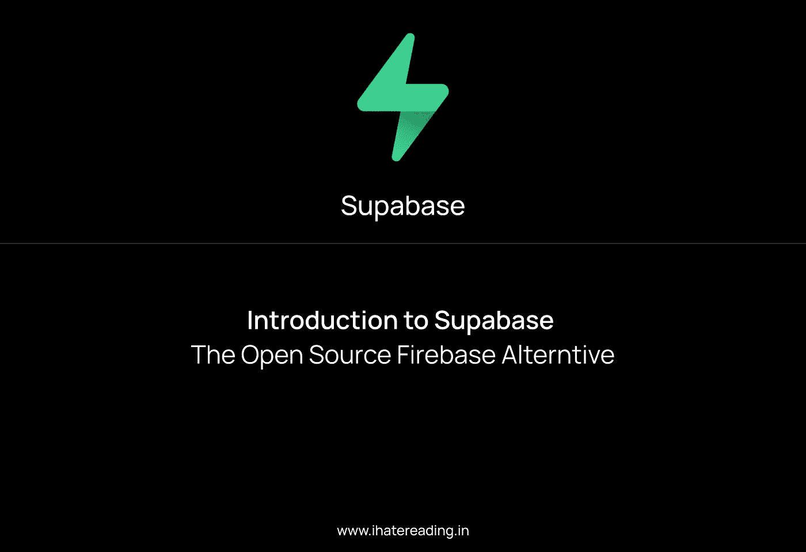

# Supabase 简介 Firebase 替代方案

> 原文：<https://medium.com/geekculture/introduction-to-supabase-the-firebase-alternative-e714e1f3ef93?source=collection_archive---------11----------------------->

用 SQL 数据库代替非 SQL

[**website**](http://ihatereading.in)

## 在后台

故事开始于我读到它的一位联合创始人的推文。Supabase 是该产品的名称，他们声称这是直接的 firebase 替代品。作为 firebase 的替代方案，我很兴奋，这意味着更多的表格数据库结构，或者可能更容易建立多对多关系…