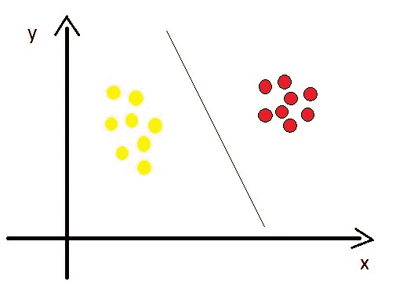
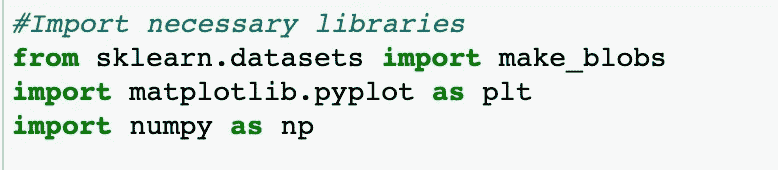
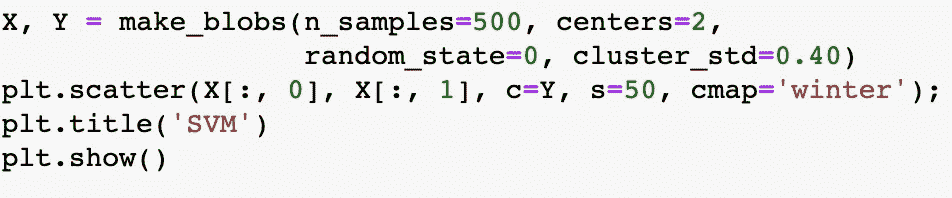
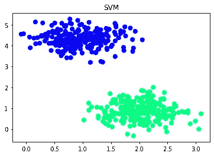
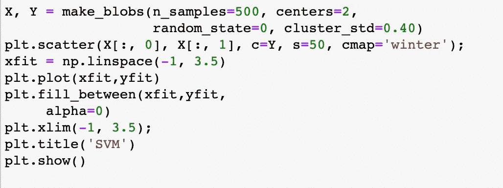
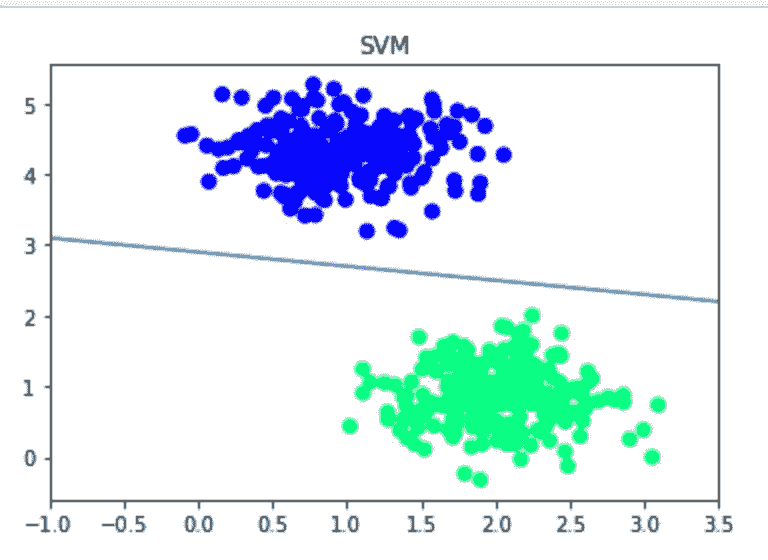
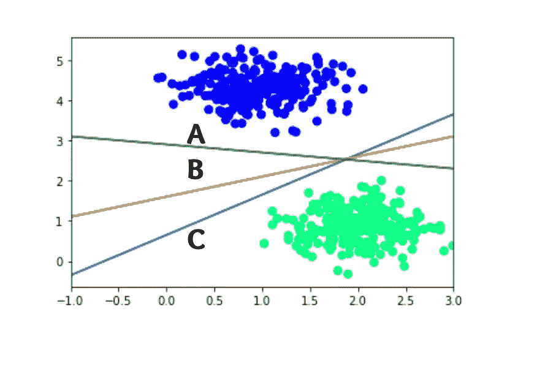

# Python 中的支持向量机(SVM)简介

> 原文：<https://medium.com/geekculture/introduction-to-support-vector-machines-svm-from-scratch-in-python-2c3503f4ad0d?source=collection_archive---------29----------------------->

在大量的数据中区分一组属于同一类别的对象，不是很难吗？

为了解决这样的问题，我们使用了支持向量机(SVM)。

支持向量机在分类问题中是众所周知的，它是监督学习的一部分。

让我们详细了解一下支持向量机(SVM)

## 到底什么是支持向量机？

支持向量机是一种监督学习算法，用于分类和回归问题。在 SVM 模型中，我们将可用数据绘制为维度空间中的点，并映射到不同的类别，这些类别由超平面或超线坐标中的空白划分。

下图显示了一个示例:

Support Vector Machines

让我们创建一个包含两个不同类别的数据集，并观察 SVM 是如何工作的:

为了创建数据集，

使用的平台:Jupyter 笔记本

使用的编程语言:Python

Python 库:Scikit-Learn、Matplotlib、Numpy

**步骤 1:** 导入必要的库

Import Python Libraries

步骤 2:使用 make_blob 函数，绘制图表

Plotting the graph with two different datasets

— make_blobs 函数用于生成液滴类的数据点，samples 用于生成数据集中应该出现的液滴数量。

—中心用于生成固定的中心位置，随机状态用于随机数生成器。cluster_std 确定标准差。

— plt.scatter()用于点，s 表示大小，cmap 是具有两种不同颜色的颜色图。

— plt.show()显示绘图。

SVM Plot

从上面的图中，我们可以观察到存在两种不同的分类数据。

现在让我们试着用现有代码中的小附件在它们之间绘制一个超平面或线。

Plotting the graph by differentiating two datasets with line

np.linspace()函数指示绘图中的起始值和结束值。

plt.plot()绘制 x 和 y 数据点，fill_between 填充水平曲线之间的区域。

plt.xlim()设置 x 坐标的限制。

SVM plot with hyperplane

上图显示了如何用超平面区分两个不同的数据集。

**如果有两个或更多的超平面，哪一个最好分离？**

假设我们有两个或更多的超平面来区分数据集，如下所示，如何选择正确的一个？

在上面的图片中，你可以观察到 A 和 C 离数据集最近，而 B 离数据集更远。所以 B 可以是比 A 和 C 超平面更好的超平面。我们需要根据较大的距离或边缘来选择超平面，因为较短的边缘可能会导致错误分类。

点击此页面查看更多内容驱动型文章:

 [## 利希塔·卡卡努鲁-培养基

### 你猜怎么着？？？AWS 峰会将于本月 6 月 29-30 日在印度举行。每个人可能都会想这是怎么回事…

likhithakakanuru.medium.com](https://likhithakakanuru.medium.com/)