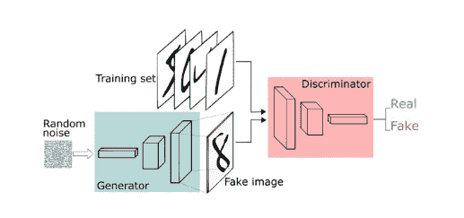
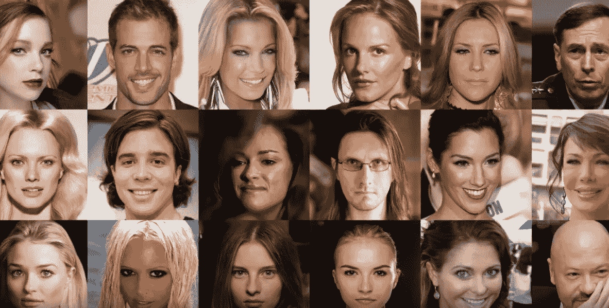
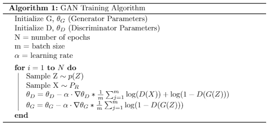
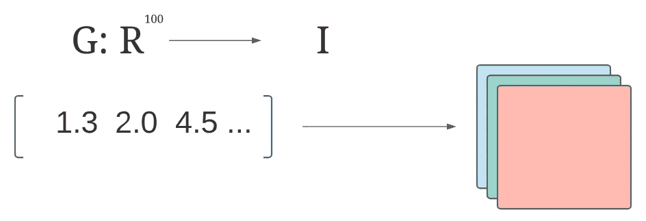

# GANs——py torch 中的理论与介绍

> 原文：<https://medium.com/geekculture/introduction-to-the-gan-in-pytorch-bba920347b01?source=collection_archive---------18----------------------->

本文面向有兴趣了解 GAN 架构基础知识、其组件背后的直觉以及如何使用 PyTorch 实现基本 GAN 的初学者。我们开始吧！

# 什么是甘？

生成对手网络是一种神经网络架构，广泛用于图像生成和半监督学习等任务。

GAN 背后的主要前提是，我们可以将问题作为两个神经网络之间的游戏，而不是执行一些复杂的统计分析来生成与我们的输入数据相似的令人信服的新样本。*生成器*将试图生成令人信服的数据点——例如人脸图像——而*鉴别器*将试图区分真实数据点和虚假数据点。

这就是我们所说的 GAN 架构是*对抗的意思:*这两个网络是游戏中的对手。

Diagram of GAN Architecture

# 它是如何工作的？

如果你已经熟悉神经网络，你就会知道，为了训练神经网络，我们需要标记数据。然而，在数据生成的情况下，我们的目标不是基于输入数据预测输出，相反，我们希望生成看起来与我们的输入集相似的样本。

我们首先需要一些指标来确定我们的模型是否擅长生成令人信服的样本。通常，这将采取损失函数的形式，但不能保证传统的损失函数将封装我们想要的。重要的是，我们没有想要发电机制造什么的例子。

Examples of Generated Faces. Source: [https://arxiv.org/abs/1710.10196](https://arxiv.org/abs/1710.10196)

我们希望生成的样本看起来属于输入数据来源的分布。特别是当我们不知道输入数据来源的真实分布时，我们如何估计这个指标呢？我们用的是神经网络！鉴别器只是一个分类器，它确定给定的输入是否属于与真实数据点相同的类。

鉴别器为生成器提供梯度，它预测生成的输出看起来是否属于真实数据点集。然后我们可以计算这些预测的损失，因为我们知道哪些样本是真的，哪些是假的。生成器的目标是通过产生鉴别器分配给“真实”类的输出来“愚弄”鉴别器。

## 培训是如何进行的？

为了训练 GAN，我们首先对一组真实数据点进行采样，并在这些数据点上训练带有“真实”标签的鉴别器，就像传统的分类器一样。然后，我们向发生器输入随机噪声，并从中产生一组假数据点，我们在这些点上训练带有“假”标签的鉴别器。然后，我们生成一组假样本，并要求鉴别器对它们进行预测，生成器根据鉴别器对生成的点是真实的有多有信心来计算其损失。

我们继续这样，先训练鉴别器，再训练生成器。这两个模型都会随着时间的推移而不断改进，直到生成器必须拿出非常令人信服的例子来愚弄鉴别者。当然，这都是理论上的，实际上，传统的 GAN 架构在训练期间可能不稳定，并且不会始终如一地收敛。然而，它确实有效，GAN 架构的后续迭代(如 Wasserstein-GAN)旨在解决这些问题，以实现更一致的 GAN 训练。

Here Z is random noise and X is a batch of real samples.

## 理解潜在空间

作为一个初学者，我们会给生成器输入随机噪声来得到一个预测，这让我困惑不已。从表面上看，这没有任何意义。毕竟，我们用神经网络解决的大多数问题都涉及到向网络输入有意义的特征，以便它们能够做出预测，这些与随机数相反！

为了理解我们为什么给生成器提供随机噪声，首先让我们记住神经网络是做什么的:它学习一组参数来逼近从输入空间映射到输出空间的函数。我们不一定要给生成器提供随机数，相反，我们可以将这个过程概念化为我们给生成器一组输入空间中的坐标，它应该学习从该坐标到输出空间中的元素的映射。

让我们以人脸生成为例，其中我们的图像大小为 3x256x256。我们将致力于使用 100 个随机数的向量作为我们的随机噪声——这是生成器的输入。我们希望生成逼真的人脸。在每个训练步骤中，我们实际上是在训练生成器从ℝ ⁰⁰的某个坐标映射到大小为 3x256x256 的唯一图像。随着生成器变得更加优化，给定坐标的输出图像开始看起来越来越像真实的人脸。

We can conceptualize the Generator as a function that maps from real numbers to images.

虽然这看起来很平常，但实际上很重要，因为以这种方式训练 GAN 的一个重要副作用是我们产生了一个*结构化的潜在空间。*最终，我们提供给生成器的 100 维数字向量被解释为特征向量，因此ℝ ⁰⁰中彼此靠近的点会产生看起来相似的图像。这意味着，如果我们想要生成一系列看起来非常相似的图像，我们可以对一系列彼此非常接近的点进行采样。

因为这个向量的作用就像一个坐标，所以我们可以对输出图像执行通常只对实数有意义的操作。这意味着我们可以在两幅图像之间进行加、减、乘，甚至插值运算，只需对它们在潜在空间中的相应坐标进行这些运算！所得到的矢量可以被馈送到生成器，以生成期望的图像。我们不仅有能力生成新的图像，而且我们可以穿越潜在空间，生成具有我们想要的品质的新图像。

在实践中，整个潜在空间可能是不可用的——我们可能不会在训练期间使用随机数“击中”潜在空间的每个区域，尤其是当我们使用 100 维的空间时。通常，在潜在空间中有一个结构化的流形，在那里可以映射大多数高质量的图像，并且值得遍历它。在这个流形之外，我们发现嘈杂的，不可信的图像，可能有点像真实的数据，但不是特别令人信服。然而，虽然潜在空间确实通过训练过程本身变得有些结构化，但这种结构不一定是可解释的——毕竟，我们仍在随机生成坐标。

This is an example of interpolation in the Latent Space, the faces “between” the endpoints correspond to coordinates that are between those images’ respective coordinates in the Latent Space.

潜在空间的概念实际上与统计学中潜在变量的概念更紧密地联系在一起。如果我们想要严格，我们可以解释潜在空间的表面结构，说我们程序性地推断潜在随机变量的性质，这与我们在训练过程中的输入分布有关。就我们的目的而言，将它概念化为一个我们可以映射的输入空间有助于建立我们的直觉，即为什么这个过程乍看起来是无意义的。

最后，要注意的另一个要点是，我们选择多大的潜在空间确实很重要。[过小的潜在空间会限制模型捕捉真实数据点全部分布的能力。](https://towardsdatascience.com/why-do-gans-need-so-much-noise-1eae6c0fb177)

# PyTorch 实现

这里我们将介绍一个简单的 GAN 实现，它从各种二维分布中生成点。我们将模拟一些抛物线和高斯曲线。我们在此使用的步骤可直接应用于 GAN 的任何其他应用，包括生成图像数据。

生成器将生成(x，y)对，鉴别器将确定每一对是否属于真实分布。

## 模型

## 培养

让我们遵循上面概述的训练过程，迭代地训练鉴别器，然后是生成器。我们使用二元交叉熵损失来确定鉴别器和发生器的损失。我们对两者都使用 Adam 优化器。

## 结果

让我们看看各种函数的输出是什么样的。下面是每一步训练过程的可视化，因此我们可以观察生成器如何学习适应数据。

# 结论

在这篇文章中，我们学习了什么是 GAN，为什么该架构能够工作的直觉，以及如何在 PyTorch 中实现 GAN。要查看带有此实现的原始 Colab 笔记本[，请单击此处](https://colab.research.google.com/drive/1kGLVViQJqjLeR_Ml4Usf6oDUD_obU3A6?usp=sharing)。如果你对实现图像数据的 GAN 感兴趣，[这个 PyTorch 教程](https://pytorch.org/tutorials/beginner/dcgan_faces_tutorial.html)非常棒。

希望这是有帮助的！请给我留下对内容的反馈和我可以做些什么来改善它！

[1]生成性敌对网络(2014 年 6 月 10 日)。【https://arxiv.org/abs/1406.2661】T5

[2]GANs 的逐步发展(2018 年 2 月 26 日)。
[https://arxiv.org/abs/1710.10196](https://arxiv.org/abs/1710.10196)

[3]优化生成网络的潜在空间(2019 年 5 月 20 日)。
[https://arxiv.org/abs/1707.05776](https://arxiv.org/abs/1707.05776)

[4]为什么 GANs 需要这么大的噪音？(2020 年 2 月 26 日)。
[https://towards data science . com/why-do-gans-need-so-much-noise-1 aee 6 c 0 FB 177](https://towardsdatascience.com/why-do-gans-need-so-much-noise-1eae6c0fb177)

[5] NIPS 2016 年教程:生成性对抗性网络(2017 年 4 月 3 日)。
[https://arxiv.org/abs/1701.00160](https://arxiv.org/abs/1701.00160)