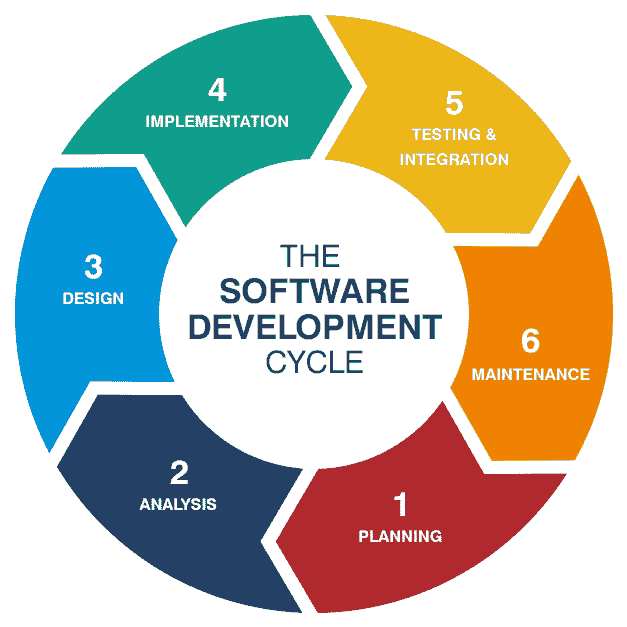
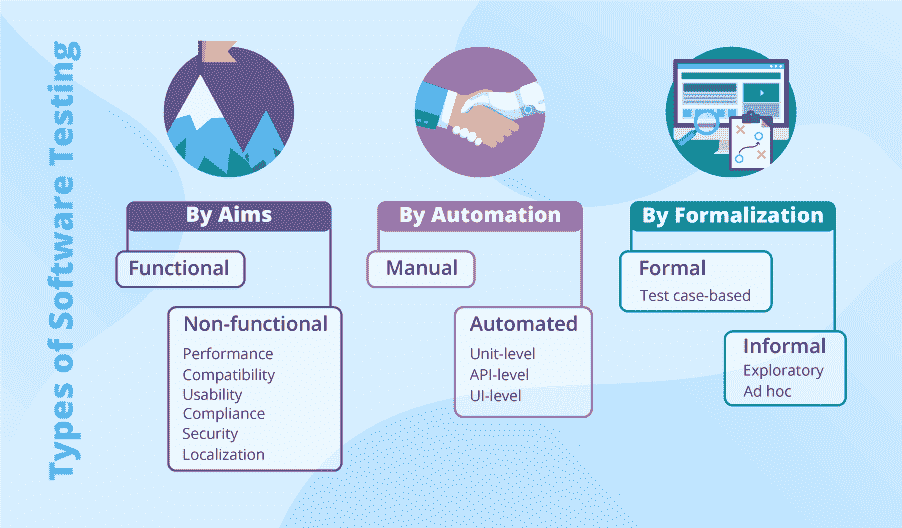

# 测试方法类型介绍

> 原文：<https://medium.com/geekculture/introduction-to-the-types-of-testing-methods-67b151410027?source=collection_archive---------16----------------------->

在当今世界，我们使用的软件会定期收到新开发或改进的更新。因此，软件测试在软件开发生命周期中具有非常重要的作用。

# 0.什么是软件测试？

测试是分析软件项目的过程，以检测现有条件和要求条件之间的差异(即缺陷/错误/错误)并评估软件项目的特性

[— ANSI/IEEE 1059](https://www.tutorialspoint.com/software_testing/software_testing_overview.htm)

[软件测试](https://www.geeksforgeeks.org/types-software-testing/)是为了向利益相关者提供关于被测服务或产品质量的信息而进行的研究。软件测试也是对软件进行独立和客观的检查，以了解软件应用程序的风险。

如果我们希望我们的程序是稳定的，它不应该有任何缺陷或错误。如果像[自动化回归测试](https://www.perfecto.io/blog/automated-regression-testing)这样的软件测试任务成功完成，它将从程序中移除所有的错误和缺陷。

# 1.为什么软件测试如此重要？

软件测试是重中之重，因为它确保了程序的稳定运行。在实现和部署软件之前对其进行测试可以避免重大损失。在软件测试过程之后，我们需要确保最终产品或服务符合预期。因此，我们可以说软件测试的主要目标是定义缺陷和错误，维护产品和服务质量，促进增长，检查产品需求，以及响应业务需求。

# 2.软件测试的好处

## 低成本

有许多方法可以降低软件开发过程的成本。一种方法是正确地测试程序。通过在部署之前测试程序，您可以大大节省成本。运行不准确的软件会让你损失大量投资、用户和客户。此外，测试确保您的软件不需要定期修复，并从长远来看节省资金。

## 高质量

软件测试的目的是修复软件中的缺陷和错误，以确保稳定和准确的运行。因此，您可以确保向客户提供高质量的软件。除此之外，它在塑造品牌形象方面也起着重要的作用。借助这个品牌形象，你的产品可以吸引更多的顾客和更高的支出。

## 最终用户体验

最终用户的体验是决定软件运行是否顺畅的关键。用户希望使用简单易用的应用程序。如果最终用户体验不好，那么软件可能太复杂或难以使用。该软件需要简单，直接，易于使用。因此，严格测试软件至关重要。无错误的用户体验让你获得正面推荐，增加你的业务。

## 增加利润

测试对盈利至关重要。它可以帮助您提高投资回报，使您能够提供良好的质量，并确保良好的用户体验和客户满意度。此外，它还可以帮助您留住现有客户并获得新客户。因此，它以利润最大化为目标。此外，调试的长期投资也减少了，因为软件测试允许您在开发的早期阶段修复尽可能多的错误。

## 业务需求优化

根据您的业务需求进行优化，可以让用户满意、留住客户、降低服务成本、增加利润、提高质量和树立卓越的品牌形象。这些积极的结果依赖于你提供给用户的软件的质量，这只有通过仔细和持续的软件测试才能保证。不准确的产品还会干扰公司内部的沟通，造成不必要的问题和低效率。在测试的帮助下，可以避免 bug 和错误的负面影响。

# 3.软件测试方法的类型

软件测试方法是用于确保应用程序按预期工作的各种方法。如下所述，我们可以根据目标、自动化和形式化对软件测试方法进行分类。

## 功能测试

这是一种黑盒测试，不需要任何代码知识。这样做也是为了测试软件的功能。因此，软件按照客户的预期工作。功能测试按以下顺序进行:

1.  单元测试
2.  集成测试
3.  系统试验
4.  验收测试

## 非功能测试

它包括根据非功能性需求测试应用程序。例如，如果没有对添加到应用程序中的新功能进行测试，产品上线时会变得太慢而无法工作，客户会因此受到负面影响。它可以是性能测试、安全测试、可用性测试、兼容性测试。

## 人工测试

仅由人类对产品/软件进行测试被称为[手工测试](https://www.guru99.com/manual-testing.html)。需求在验证现有条件中扮演着重要的角色，测试可能包括详细的分步测试用例。手动测试的一些优势是它的成本效益和灵活性。

## 自动化测试

通过自动化工具测试产品被称为自动化测试。不同的工具可以帮助您在软件上执行自动化测试，比如 Selenium WebDriver、Appium 和 Cucumber。自动化测试的一些优点是任务调度的能力、回归测试的易用性和节省时间。

# 4.结论

没有一种产品/服务开发得非常顺利。产品总是需要一个改进的过程。在这一点上，软件测试承担了有效无误地交付产品的重要角色。通过确保您为软件测试创建的团队使用最准确的工具和方法，您可以确保产品毫无问题地交付给您。