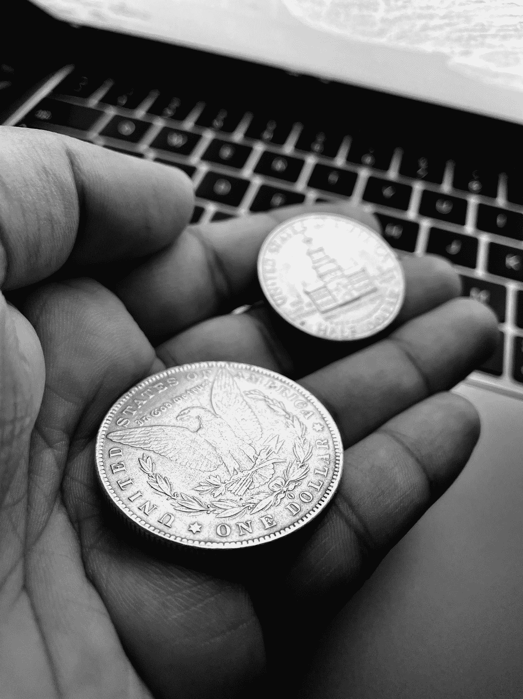

# 金融世界导论

> 原文：<https://medium.com/geekculture/introduction-to-the-world-of-finance-9eeddf6d64b?source=collection_archive---------14----------------------->

## 股票市场和投资可能看起来令人生畏，但相信我，它不是！在这篇博客中，我分解了基本的投资术语。

Photo by [Badhan Ganesh](https://unsplash.com/@badhanganesh?utm_source=medium&utm_medium=referral) on [Unsplash](https://unsplash.com?utm_source=medium&utm_medium=referral)

最近，我参加了一个金融数学课程，特别是投资组合优化。基本上，仍然是一个学生，阅读最近的新闻，股票市场上涨和…