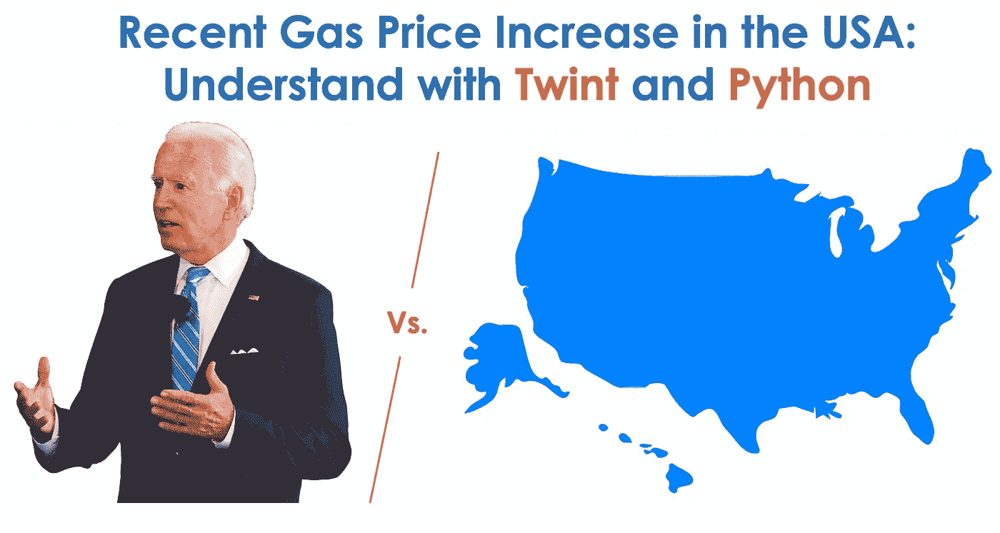

# Twint 简介:告别 Twitter 速率限制——也不需要 Twitter API！

> 原文：<https://medium.com/geekculture/introduction-to-twint-say-goodbye-to-twitter-rate-limitations-also-no-need-for-a-twitter-api-b632084db0ba?source=collection_archive---------1----------------------->

不使用任何 Twitter 的 API 从 Twitter 收集数据！

Image modified by Author (Joe Biden Image from [The Spokesman Review](https://www.spokesman.com/stories/2020/oct/14/where-president-donald-trump-and-challenger-joe-bi/) and the US map on [Pixabay](https://pixabay.com/vectors/alaska-alaska-silhouette-hawaii-1293278/))

# 动机

对于那些之前一直在使用 [tweepy](https://docs.tweepy.org/en/latest/) 的人来说，你可能已经遇到了与*注册开发者账户*和*获得认证证书*相关的不可避免的步骤。实际上…