# Unity 动画师简介

> 原文：<https://medium.com/geekculture/introduction-to-unitys-animator-baac57eccc8a?source=collection_archive---------22----------------------->

## 了解如何在 Unity 中控制动画

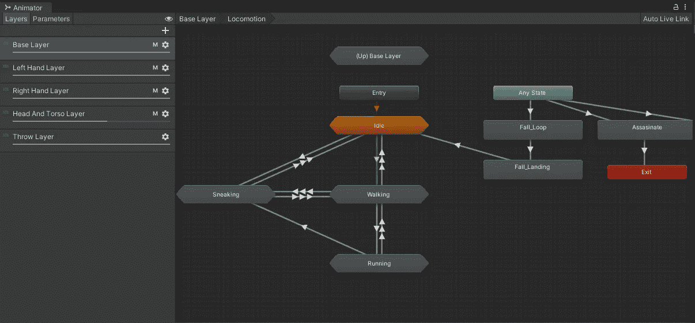

Animator 是 Unity 的主要可视化工具，用于基于 [**状态机**](https://docs.unity3d.com/Manual/StateMachineBasics.html) 方法处理游戏对象中的多个动画(每层只能有一个状态处于活动状态，如果满足特定条件，状态可以在它们之间转换)。

在本文中，我将只关注这个工具的基本用法，向您展示 Animator 状态机如何工作，如何创建新参数，如何创建过渡，以及如何通过代码修改现有参数。

# 如何开始

前往`Window > Animation > Animator`打开动画窗口。

正如你在图像中看到的，它完全是空的。那是因为它需要一个**动画师控制器**来配合工作。您可以在项目窗口中右键单击任意位置来创建一个。一旦你创建了一个，把它拖到你想要制作动画的游戏对象上。一个 Animator 组件将被添加到你的游戏对象中，现在你可以开始添加动画了。

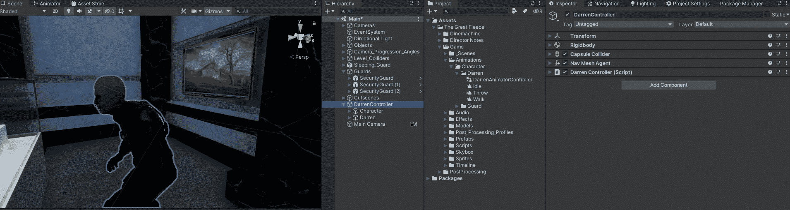

In my case, I will drag it to my protagonist 3D model.

# 了解动画师

这一节讨论一个比较高级的话题。它将帮助您快速掌握状态机的概念，并正确理解 Animator 的核心，也许会在将来为您的项目或游戏提供某些功能。如果你只是想开始使用它，你可以跳过这一部分。

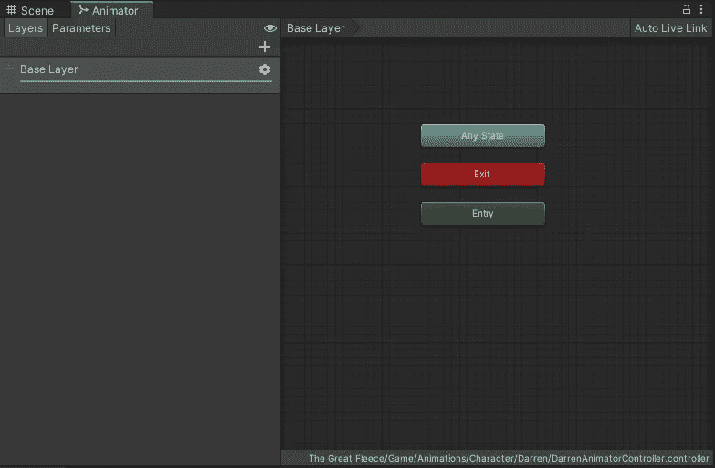

前面我已经说过，Animator 是一个基于 [**状态机**](https://docs.unity3d.com/Manual/StateMachineBasics.html) **的工具。**这是一个系统，它拥有一组“状态”(或解耦行为)，其中只有一个状态被更新或保持活动，并且在状态之间存在多组指令，这些指令定义了从活动状态转换到不同的非活动状态的方式。

然而，Animator 与标准状态机有其自身的不同之处，它们是:

*   **状态是动画剪辑**。您可以修改一些动画设置，但它们不包含任何代码功能(有一种方法可以添加功能，但这超出了本文的范围)。

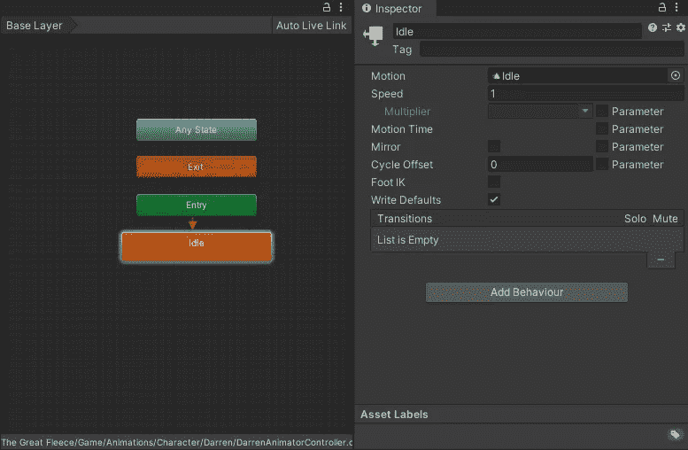

*   **动画师有层次**，这意味着在一个动画师控制器(或状态机)中有多个不同机器的实例在运行。如果您需要覆盖某些动画(例如，一个角色可以用一只手臂指向一个方向，同时仍然保留行走周期动画)，这将非常有用。

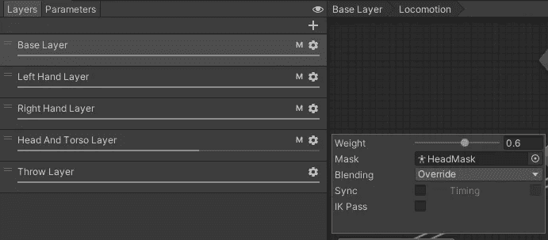

*   **每一层都有一个“任意状态”事件。**有时候，无论机器当前状态如何，都会需要播放一些动画。在给定的条件下，该事件将转移到其他状态。(通常通过该事件处理跳跃动画)。

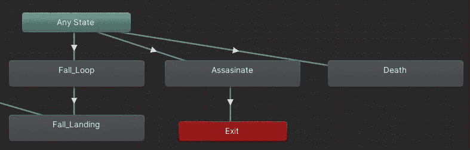

*   **转场的设置不仅仅是条件**。因为动画师处理动画，所以可以修改一些值来适当地调整动画过渡。(下一节将详细介绍过渡)。

# **使用动画师**

拖动或创建自己的动画到动画师。我将拖动两个剪辑:闲置和行走。

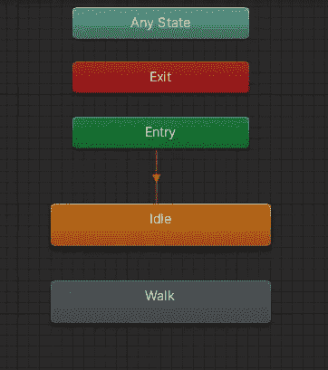

其中一个动画将被设置为默认动画，它将首先开始播放。如果你想改变默认动画，右击**条目，设置状态机默认状态，并点击想要的默认动画。**

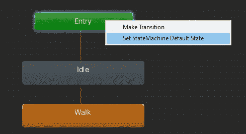

现在动画已经在动画师里面了，我需要创建它们之间的过渡。为了创建一个，我右击动画并选择**制作过渡**。

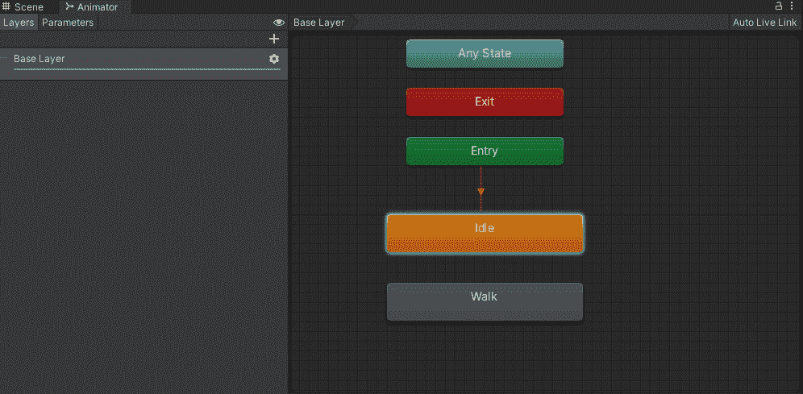

现在，我必须更改两个过渡的一些设置，以避免两个问题:

*   有一个“退出时间”设置，在动画达到完成百分比之前不允许过渡。我不想等待几乎整个空闲或行走动画的持续时间来允许过渡发生。在两个过渡上取消该设置将使动画更具反应性。

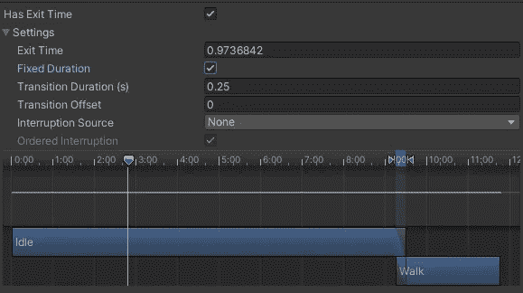

*   没有任何条件，这意味着它将不断地从一种状态转换到另一种状态。为了解决这个问题，我创建了一个名为“ControllerSpeed”的新浮点参数，并将条件设置为高于或低于某个值。

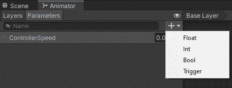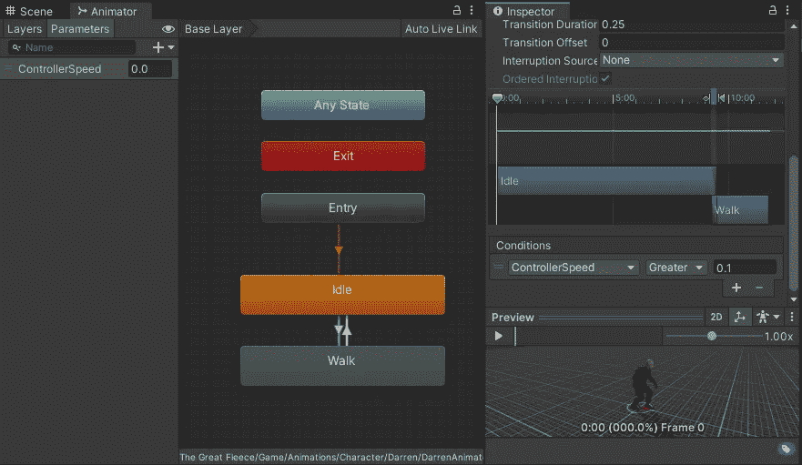

Idle To Walk: ControllerSpeed > 0.1 | Walk To Idle: ControllerSpeed < 0.1

最后，为了让一切正常工作，创建一个新脚本，引用 Animator 组件，声明一个新字符串来写入参数名，并通过代码更新该值。

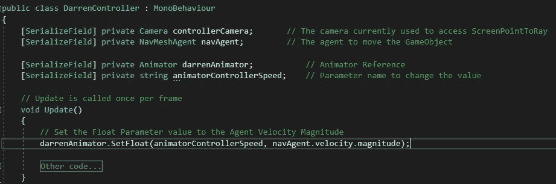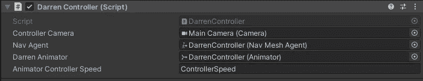

# 结果

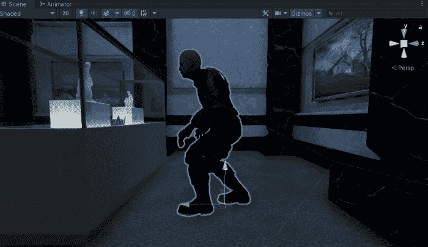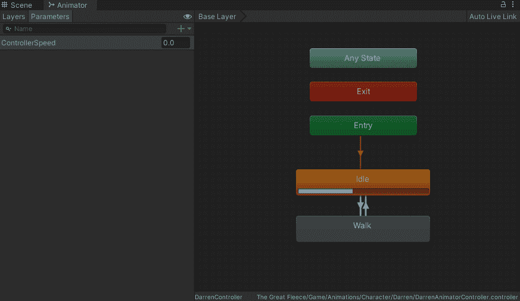

Behind the scene