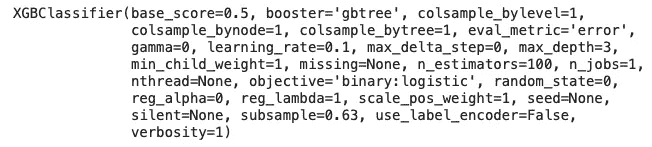
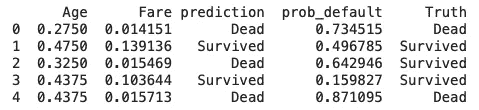
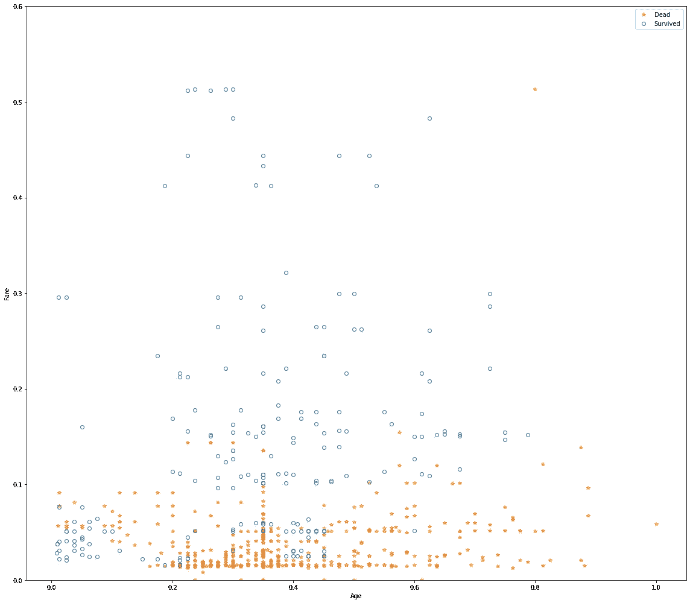
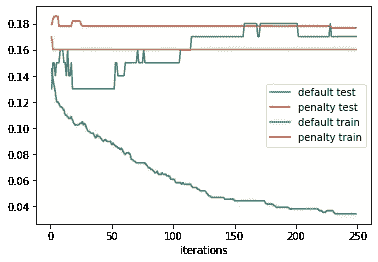
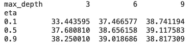

# XGBoost 简介—使用 Python

> 原文：<https://medium.com/geekculture/introduction-to-xgboost-with-python-f654b41baf3b?source=collection_archive---------22----------------------->

XGBoost 作为使用最广泛的公有领域 boosting 软件之一，是数据科学家必备的技能。

集合模型已经成为预测建模的标准工具。*增强*是一种创建模型集合的通用技术[1]。*增压*方法几乎与*装袋*同时开发。像装袋一样，boosting 通常用于决策树。与需要很少运行的装袋相反，增压在应用中需要非常小心。打个比方，装袋就像丰田凯美瑞一样可靠且维护成本低廉，而增压就像波尔琪一样动力强劲但维护成本高昂。


boosting 背后的哲学就像其他集成学习算法一样:利用许多模型，并使用所有输出的平均值作为最终的预测输出，以获得更高的准确性。在线性回归模型中，通常会检查残差以查看是否可以改进拟合度。Boosting 进一步发展了这一概念，并适用于一系列模型，其中每个后续模型都试图最小化前一个模型的误差。增强的一些变体有: *Adaboost、梯度增强、随机梯度增强* [1]。

# XGBoost

最广泛使用的公共领域 boosting 软件是 XGBoost，这是一种随机梯度 boosting 的实现，最初由华盛顿大学的陈天琦和 Carlos Guestrin 开发[1]。

调节 XGBoost 涉及许多参数，但最重要的参数是`subsample`和`eta`，前者决定每次迭代中用于训练模型的样本分数，后者决定 boosting 算法中应用于权重的收缩因子。`eta`越小，模型过度拟合的可能性就越小。

## 个案研究

为了演示 XGBoost 在实践中的应用，我们使用 python 来实现使用 XGBoost 的二进制分类。我们将使用来自`xgboost`库的`XGBClassifier` 。我们将使用[泰坦尼克号数据集](https://www.kaggle.com/azeembootwala/titanic)将乘客分类为死亡或幸存。此外，还增加了 4 栏，从姓名栏重新设计为标题 *1 到标题* 4，表示男性&女性，取决于他们是否结婚(先生、夫人、主人、小姐)。一项额外的分析旨在看看已婚人士或换句话说有社会责任感的人是否有更多的生存本能，这一趋势在两性中是相似的。该数据集由 15 个预测因子组成，如*性别、票价、p_class、家庭规模、…。*目标响应是*幸存。*请注意，取值有限的因子变量已经通过一键编码进行了转换。这篇文章的完整代码可以在[这里](https://colab.research.google.com/drive/1GPgmq2h9MNTVyccRhas00_Zgpg23xckG?usp=sharing)找到。

为了形象化的目的，我们将只使用两个预测器来预测乘客的状态:`Age` 和`Fare`。作为第一步，我们加载 dat 并应用分类器。下面的代码就是为此而编写的:

```
train_df = pd.read_csv('train_data.csv')
predictors = ['Age', 'Fare']outcome = 'Survived'X = train_df[predictors]
y = train_df[outcome]xgb = XGBClassifier(objective='binary:logistic', subsample=.63, use_label_encoder=False, eval_metric='error')print(xgb.fit(X, y))
```

输出将是



可以看出，`objective`参数指定了学习任务和相应的学习目标或要使用的自定义目标函数(见下面的注释)。这里，由于我们将目标函数设置为`binary:logistic.` ，XGBoost 将使用相应的函数进行优化。子样本设置为 0.63，这意味着 63%的训练数据用于优化。通过设置`eval_metric=’error’`，我们迫使 XGBoost 根据二进制分类错误率优化目标函数。对于`use_label_encoder=False`，使用 *scikit-learn* 中的标签编码器对标签进行编码。对于新代码，我们建议您将此参数设置为 False。

为了评估预测模型的性能，我们获取训练数据并将其应用于模型。下面的代码根据两个预测值预测乘客的状态。`Truth`栏反映数据中的地面实况。

```
xgb_df = X.copy()xgb_df['prediction'] = ['Survived' if p == 1 else 'Dead' for p in xgb.predict(X)]xgb_df['prob_default'] = xgb.predict_proba(X)[:, 0]xgb_df['Truth'] = ['Survived' if p == 1 else 'Dead' for p in y]print(xgb_df.head())
```

输出如下所示:



可以看出，在前五个记录中，我们有一个错误分类。为了更好地显示乘客状态的`Age`和`Fare`范围，我们

```
fig, ax = plt.subplots(figsize=(16, 14))xgb_df.loc[xgb_df.prediction=='Dead'].plot(x='Age', y='Fare', style='*', markerfacecolor='none', markeredgecolor='C1', ax=ax)xgb_df.loc[xgb_df.prediction=='Survived'].plot( x='Age', y='Fare', style='o', markerfacecolor='none', markeredgecolor='C0', ax=ax)
ax.legend(['Dead', 'Survived']);ax.set_ylim(0, 0.6)
ax.set_xlabel('Age')
ax.set_ylabel('Fare')plt.tight_layout()
plt.show()
```

输出将是



预测值通过蓝色和橙色标记表示。

## 正则化:避免过度拟合

盲目应用 xgboost 会导致模型不稳定，因为*过度拟合*训练数据。为了避免过度拟合，可以应用正则化来考虑复杂性。

在 xgboost 中，可以通过添加一个度量模型复杂性的项来修改成本函数。xgboost 中有两个参数来正则化模型:alpha 和 lambda，分别对应于曼哈顿距离(L1 正则化)和平方欧几里德距离(L2 正则化)[1]。我们将在 xgboost 中设置`reg_lambda` ,以应用 L2 规则。

```
test_df = pd.read_csv('test_data.csv')predictors = ['Sex', 'Age', 'Fare', 'Pclass_1','Pclass_2', 'Pclass_3', 'Family_size', 'Title_1', 'Title_2', 'Title_3', 'Title_4', 'Emb_1', 'Emb_2', 'Emb_3']outcome = 'Survived'train_X = train_df[predictors]
train_y = train_df[outcome]valid_X = test_df[predictors]
valid_y = test_df[outcome]xgb_default = XGBClassifier(objective='binary:logistic', n_estimators=250, max_depth=6, reg_lambda=0, learning_rate=0.1, subsample=1, use_label_encoder=False, eval_metric='error')xgb_default.fit(train_X, train_y)xgb_penalty = XGBClassifier(objective='binary:logistic', n_estimators=250, max_depth=6, reg_lambda=1000, learning_rate=0.1, subsample=0.63, use_label_encoder=False, eval_metric='error')results = []for ntree_limit in range(1, 250):train_default = xgb_default.predict_proba(train_X, ntree_limit=ntree_limit)[:, 1]train_penalty = xgb_penalty.predict_proba(train_X, ntree_limit=ntree_limit)[:, 1]pred_default = xgb_default.predict_proba(valid_X, ntree_limit=ntree_limit)[:, 1]pred_penalty = xgb_penalty.predict_proba(valid_X, ntree_limit=ntree_limit)[:, 1]results.append({'iterations': ntree_limit,'default train': np.mean(abs(train_y - train_default) > 0.5),'penalty train': np.mean(abs(train_y - train_penalty) > 0.5),'default test': np.mean(abs(valid_y - pred_default) > 0.5),'penalty test': np.mean(abs(valid_y - pred_penalty) > 0.5),})results = pd.DataFrame(results)ax = results.plot(x='iterations', y='default test')
results.plot(x='iterations', y='penalty test', ax=ax)
results.plot(x='iterations', y='default train', ax=ax)
results.plot(x='iterations', y='penalty train', ax=ax)
plt.show()
```



可以看出，随着迭代的增加，训练数据的误差减少，测试增加。这可能是由于正则化参数的错误调整。我们可以通过交叉验证来解决这个问题。

## 超参数和交叉验证

我们可以迭代超参数的不同值，并选择具有最小验证误差的值。下面的代码将用于此目的:

```
idx = np.random.choice(range(5), size=len(X), replace=True)error = []for eta, max_depth in product([0.1, 0.5, 0.9], [3, 6, 9]):xgb = XGBClassifier(objective='binary:logistic', n_estimators=250, max_depth=max_depth, learning_rate=eta,
use_label_encoder=False, eval_metric='error')
cv_error = []for k in range(5):
fold_idx = idx == ktrain_X = X.loc[~fold_idx]; train_y = y[~fold_idx]
valid_X = X.loc[fold_idx]; valid_y = y[fold_idx]xgb.fit(train_X, train_y)pred = xgb.predict_proba(valid_X)[:, 1]cv_error.append(np.mean(abs(valid_y - pred) > 0.5))error.append({'eta': eta,'max_depth': max_depth,'avg_error': np.mean(cv_error)})print(error[-1])
errors = pd.DataFrame(error)
print(errors.pivot_table(index='eta', columns='max_depth', values='avg_error') * 100)
```

不同超参数值的输出如下



从上表可以看出，`eta=0.1`和`max_depth=3`的误差最小。

# 参考

[1]布鲁斯、彼得、安德鲁·布鲁斯和彼得·格德克。*数据科学家实用统计学:使用 R 和 Python 的 50 多个基本概念*。奥莱利媒体，2020。