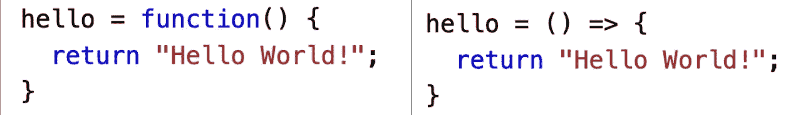
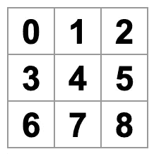
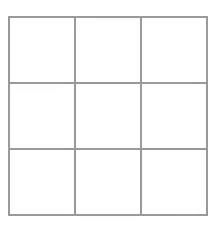
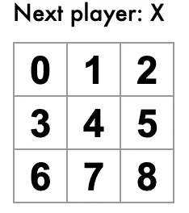

# React 入门教程:第 1 部分

> 原文：<https://medium.com/geekculture/introductory-tutorial-to-react-part-1-3468f37bea5a?source=collection_archive---------20----------------------->

本教程旨在为 React (Javascript)编程提供清晰而实用的介绍，假设没有任何先验知识。


如果你是第一次接触 **React (Javascript)** 编程，这篇教程应该可以帮助你通过自己编写一个简单的示例任务来培养直觉和实践技能(这是记住你所学内容的最好方法！).它基于 React 网站的[官方介绍教程和这篇](https://reactjs.org/tutorial/tutorial.html#overview)[博客文章](/@tombowden_8885/tutorial-intro-to-react-with-hooks-89b331f54b50)。

与官方教程有什么不同(希望更好)？

**通用代码结构化，功能组件**带**箭头功能**和 [**挂钩**](https://reactjs.org/docs/hooks-intro.html) 。为什么？这使得代码更加清晰，可重用和可伸缩。

> (免责声明:本教程由 React 编程新手编写，供其他初学者使用。它一点也不完美。请随时与任何可能受益的人分享，如果您发现任何错误、低效或有待改进的地方，请评论/发电子邮件给我。然后我会更新。)

# 我们在创造什么？

一款互动井字游戏(见[官方教程](https://codepen.io/gaearon/pen/gWWZgR?editors=0010)最终结果)。

# 设置

在本教程中，有两种方法可以让你参与进来并编写代码。

1.  在您的笔记本电脑上本地使用文本编辑器(如 Visual Studio 代码)。我推荐这个，因为从长远来看这是更好的选择。它包括几个额外的步骤，这些步骤在 [React 网站](https://reactjs.org/tutorial/tutorial.html#setup-option-2-local-development-environment)的以下章节中有清晰的概述:“设置选项 2:本地开发环境”
2.  在单独的浏览器标签中使用这个 [CodePen 链接](https://codepen.io/gaearon/pen/oWWQNa?editors=0010)并删除现有的代码，但是只在 JS (Babel)域中，这样你就可以在那里添加你自己的代码。

如果是 1，不要忘记将它添加到 index.js 文件的顶部:

```
import React from 'react';
import ReactDOM from 'react-dom';
import './index.css';
```

对于选项 1 和 2，分别将其添加到 index.js 或 JS (Babel)字段的末尾:

```
ReactDOM.render(<Game />,document.getElementById(‘root’))
```

# 重要概念

## 一些重要的概念

JavaScript 中的新变量使用三个关键字之一来声明: [let](https://developer.mozilla.org/en-US/docs/Web/JavaScript/Reference/Statements/let) 、 [const](https://developer.mozilla.org/en-US/docs/Web/JavaScript/Reference/Statements/const) 或 [var](https://developer.mozilla.org/en-US/docs/Web/JavaScript/Reference/Statements/var) 。我们将主要使用 [const](https://developer.mozilla.org/en-US/docs/Web/JavaScript/Reference/Statements/const) ，它有所谓的块范围。*这意味着我们只能从同一个代码块中或者更下面的代码中访问它。*

每次您*调用*或*调用*时，函数都会执行一个任务。**箭头函数**简单地允许我们编写更短的函数语法(在这里阅读更多关于它们的内容):



你会在本教程中看到很多 [JSX](https://www.w3schools.com/react/react_jsx.asp) ，它是 JavaScript 的语法扩展，允许我们在 Javascript 中指定 HTML 元素(例如<div>/div>)。

另外一件我们在本教程中会用到很多的东西是**功能** [**组件**](https://www.w3schools.com/react/react_components.asp) **。它们是独立的、可重用的代码，基本上是返回 JSX 元素的 JS 函数。在花括号内，这些组件需要返回 JSX，所以总是添加 return 和 html 语法，如< div > < /div >。**

```
e.g., *const App = () => {}*
```

另一种设置组件的方法是使用类([见官方 react 教程](https://reactjs.org/tutorial/tutorial.html#overview))。在本教程中，我们将不使用类组件。

```
e.g., *class App extents React.Component{}*
```

虽然熟悉 HTML 和 JavaScript 很有帮助，但是即使你不熟悉，也应该能够理解本教程。每当你不熟悉某个术语或语法时，试着用谷歌搜索。如果你想投入时间，也可以利用网上所有的免费资源。我推荐这个[指南](https://www.w3schools.com/REACT/DEFAULT.ASP)获得全面概述，推荐[这个](https://www.youtube.com/watch?v=ABQLwlE8MUA&t=8343s) youtube 视频获得 React 中一些重要概念及其用例的实用介绍。对自己有耐心，你正在学习另一种语言，这很难。

# 检查/创建代码结构

与其编辑现有代码(这是 react 官方教程所做的),我更喜欢**一步一步从头开始创建代码**,以便真正理解逻辑并建立信心，最终从头开始编写自己的项目。

第一步是永远仔细思考你想要创造什么。我个人认为非常有帮助的是使用组件的概念来指导我的计划，并根据其各个部分来考虑我想要实现的最终结果。我还使用父组件和子组件的概念作为概念指南，来规划各个部分之间的层次结构和信息流。

具体来说，对于我们的例子，我认为最终产品(父组件)是游戏，有一个 3 行的棋盘作为主游戏场(游戏的子组件)，它依次由单独的方块(棋盘的子组件)组成。

我首先创建父组件，我称之为游戏。我使用 const，组件游戏的名称和一个 arrow 函数，它包含(props)来返回浏览器上的 divisions，div，我给它一个 class name“Game ”,它包含“game-board ”,现在只包含`<Board />.`

```
const Game = (props) => { return ( <div className="game"> <div className="game-board"> <Board /> </div> </div>)}
```

这个`<Board />`是我指定的下一个组件。我再次使用相同的，现在基本上是空的结构。这一次，我想返回到浏览器的 3 个不同部门的董事会行，现在是空的。

```
const Board = (props) => { return ( <div> <div className="board-row"> /* TO BE FILLED IN */ </div> <div className="board-row">

       /* TO BE FILLED IN */ </div> <div className="board-row"> /* TO BE FILLED IN */ </div> </div> )}
```

最后，我创建了棋盘的子组件，并将其命名为 Square。它将返回 react 元素按钮，而不是 division，我将这个按钮的类名命名为“square ”,现在保留为空。

```
const Square = (props) => { return ( <button className="square"> /* TO BE FILLED IN */ </button>)}
```

查看这个初始代码结构，您可以看到 Square 组件将如何返回一个`<button>`，并且棋盘将返回 9 个正方形。然后游戏组件返回一个我们稍后修改的棋盘。

注意:您在浏览器中还看不到任何东西，因为我们仍然需要指定 3 个“电路板-行”分区的显示内容，并且我们仍然需要从父组件电路板中返回`<Square/>`，否则不会向其传递任何信息。这是我们接下来要做的。

# 通过道具传递数据

## 在组件之间传递数据是您在所有未来的 react 项目中最需要做的事情。

您的第一个任务是传递一个名为 **value** 的道具，该道具将在**板**组件中指定的从 0 到 9 的值作为输入，并将其传递给 Square 组件。记住将道具从“父”组件(本例中为**板**)传递到“子”组件(本例中为**方块**)的规则。

一种方法是使用**板**组件中现有的 **renderSquare** 函数

```
const **Board** = (props) => {
  const **renderSquare** = i => {
    return <Square value={i} />;
  };
  return (
    <div>
      <div className="board-row">
        {**renderSquare**(0)}
        {**renderSquare**(1)}
        {**renderSquare**(2)}
      </div>
      <div className="board-row">
        {**renderSquare**(3)}
        {**renderSquare**(4)}
        {**renderSquare**(5)}
      </div>
      <div className="board-row">
        {**renderSquare**(6)}
        {**renderSquare**(7)}
        {**renderSquare**(8)}
      </div>
    </div>)}
```

并将`{**props.value**}`添加到**方形**组件的`return`表达式中的按钮上，来描述你想在浏览器上看到的内容。这将创建一个类名为“square”的按钮元素，该元素从上面的父组件(Board)中为每个 render square(0–8)返回一个值。

```
const **Square** = (props) => {
  return (
    <button className="square">
      {**props.value**}
    </button>
  )}
```

这很好，但是同样的事情可以通过简单地在板组件中创建另一个组件*来实现。*

在**板**组件中，创建另一个名为**tictactoesquard**的组件(或任何您喜欢的名称),并使用箭头函数创建一个名为 value 的属性，该属性从 tictactoesquard 获取索引属性(0–8 ):

```
const **Board** = (props) => {
   const **TicTacToeSquare** = (props) => {
     return(<Square value={props.index} />)} return ( <div> <div className="board-row"> <**TicTacToeSquare** index={0} /> <**TicTacToeSquare** index={1} /> <**TicTacToeSquare** index={2} /> </div> <div className="board-row"> <**TicTacToeSquare** index={3} /> <**TicTacToeSquare** index={4} /> <**TicTacToeSquare** index={5} /> </div> <div className="board-row">      <**TicTacToeSquare** index={6} /> <**TicTacToeSquare** index={7} /> <**TicTacToeSquare** index={8} /> </div> </div>)}
```

并以与上述相同的方式将它们传递给子组件**方块**

```
const **Square** = (props) => {
  return (
    <button className="square">
      {**props.value**}
    </button>
  );
};
```

当您现在保存文件并重新加载浏览器时，您应该会看到以下内容:



要了解发生了什么，您可以在浏览器中摆弄您的代码并查看由此产生的变化。例如，您可以从 Square 组件中删除 **props.value** 。

```
const **Square** = (props) => {
  return (
    <button className="square">
      {**props.value**}
    </button>
  );
};
```

这使得数字消失，因为来自 Board 组件的值不再由 Square 组件作为属性返回。当您现在保存文件并重新加载浏览器时，您应该会看到以下内容:



现在让我们添加以下文本作为对棋盘组件的**状态**更新，并将其显示在棋盘第一行的上方"**下一个玩家:X** "

```
const Board = (props) => {
   const TicTacToeSquare = (props) => {
     return(<Square value={props.index} />)} **const status = "Next player: X"** return ( <div> **<div className="status">{status}</div>** <div className="board-row">

       .... </div>);}
```

在此阶段，您的浏览器输出应该如下所示:



# 制作互动组件

## 现在我们要做的是每当我们点击它的时候用一个“X”填充上面的方块。

为此，我们利用了 **onClick{}** ，这是一个现有的 [React 事件](https://www.w3schools.com/react/react_events.asp)，它导致一个基于用户事件(在本例中是用户点击)的动作(我们指定的)。在{}中指定在事件发生时作为道具应该执行的功能。例如，当点击按钮时，我们希望在浏览器中显示字符串“clicked”作为警告。我们可以在 Square 组件和按钮的 onClick 函数中做到这一点

```
const Square = (props) => {return (<button className="square" onClick={() => {alert("clicked")}}> {props.value} </button>)}
```

或者创建另一个在 onClick 上调用和执行的函数。这更方便，尤其是对于较长的函数。

```
const Square = (props) => {const click = () => {alert("clicked")} return (<button className="square" onClick={click}> {props.value}</button>)}
```

下一步，我们希望 Square 组件“记住”它被点击了，并用“X”标记填充它。为此我们需要使用 [React 钩子](https://reactjs.org/docs/hooks-intro.html) **useState** 。这是一个非常有用和重要的概念，所以如果你愿意的话，请[仔细阅读。我们使用 const 在功能组件内部指定并调用 **useState** 。它返回一个包含 2 个内容的数组:当前状态和一个函数，我们稍后会调用该函数来更新当前状态(您可以随意命名这些内容，只需使用 camelcase)。它还采用 1 个参数:初始状态(例如，0)。](https://reactjs.org/docs/hooks-overview.html)

```
const [currentState, updateStateFunction] = useState(0)
```

> *如果您正在跟随代码笔，请在 JS 窗口的顶部添加一行* `*const useState = React.useState;*` *。*
> 
> *如果您是从自己的编辑器(如 VS 代码)跟随，请在顶部添加* `*import React, { useState } from 'react';*` *到* `*index.js.*`

## 现在，我们如何在游戏中实现这一点呢？

首先，我们在 Square 组件中添加我们自己的 useState 挂钩，因为我们希望将这个交互式组件应用于游戏中的每个方块。

```
const Square = (props) => {
const [currentValue, updateValue] = useState()
```

现在更困难的部分是弄清楚如何整合**当前值**和**更新值**来实现我们想要的。

为此，我鼓励你想一想我们到底想要更新什么(例如，在我们的例子中，当前值 *是什么以及在哪里)？答案是，我们想要更新每个方块中显示的**的值。接下来问问你自己如何，那么我们想通过什么方法来更新这个(例如，*我们什么时候更新，我们想显示什么来代替*)？答案是，当我们**在方块上点击**时，我们想要显示一个 **X 而不是**。***

现在自己试一试，或者使用下面的和

```
const Square = (props) => {
   const [currentValue, updateValue] = useState()
   const click = () => {**updateValue**("X")} return (
     <button className="square" onClick={click}> 
   **  {currentValue}** 
     </button>
)}
```

想想我们刚刚做了什么。我们将方块内的{props.value}与 **{currentValue}、**进行了交换，现在它们将显示在浏览器的方块内。我们将更新当前值的函数 **updateValue** 放在 click 函数中。这意味着只有当用户*点击*时，方块内的值才会更新。在 **updateValue** 中，我们放置了字符串“X ”,在执行时显示。我们做的最后一件事是让 **useState()** 为空，这样在我们点击它之前不会显示任何东西(也就是说，我们用空方块开始游戏。

> 请注意，只有返回表达式中的内容才会真正显示在浏览器上。

确保继续本教程的第 2 部分，点击此处的 [**。**](https://sarahkatharinabuehler.medium.com/introductory-tutorial-to-react-part-2-b176db2496a8)