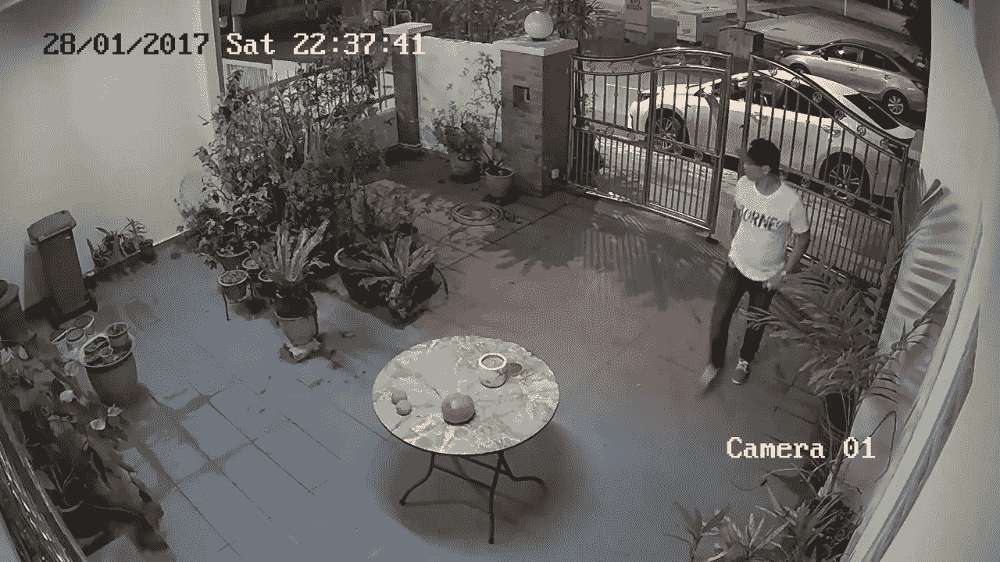
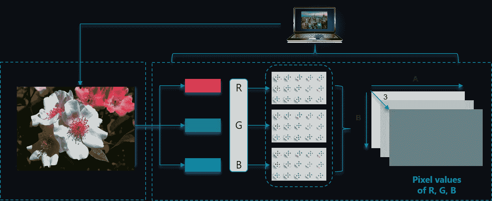
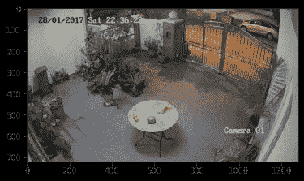
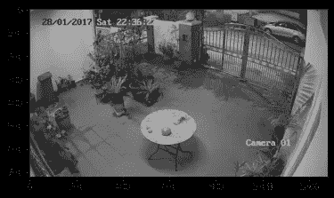
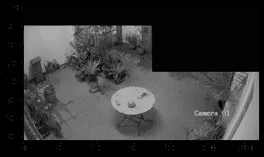
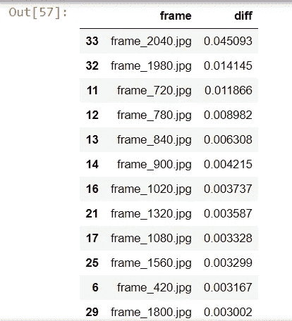
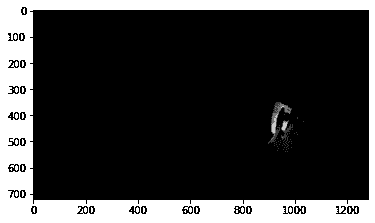
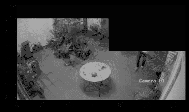
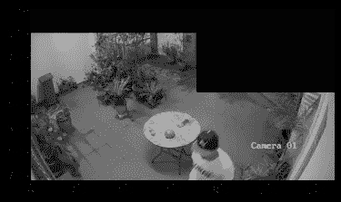

# 使用 Python OpenCV 进行入侵检测

> 原文：<https://medium.com/geekculture/intrusion-detection-using-python-opencv-515fad19cf2?source=collection_archive---------6----------------------->

## 分析闭路电视视频以检测入侵



# 问题陈述

在这个简单的演示中，我们将看到如何分析和识别视频中的对象。下面的视频捕捉入侵者，我们将了解基本的处理技术来检测这一点。

## OpenCV 是什么？

OpenCV 是一个 Python 库，旨在解决计算机视觉问题。这是一个非常受欢迎的图像/视频处理库。

OpenCV Python 只不过是用于 Python 的原始 C++库的包装类。使用这种方法，所有 OpenCV 数组结构都可以与 NumPy 数组相互转换。

## 计算机如何读取图像？

任何神经网络的输入都应该是数字，幸运的是，图像自然地被表示为数字数组。

*   图像由像素组成。
*   0-255 之间的数字代表每个像素的颜色强度。
*   彩色图像中的每个像素是一个代表红、蓝、绿强度的阵列。红色、绿色和蓝色(RGB)被称为通道。
*   灰度图像(黑白图像)只有一个通道。



## **读取灰度和彩色图像**

将使用 OpenCV(cv2)读取图像，并使用 matplotlib 绘制图像。

*   “imread”命令将从“文件”目录中读取图像
*   cv2。“read gray”将用于读取灰度图像

```
import numpy as np
import cv2
import matplotlib.pyplot as plt
import pandas as pd## Reading a gray scale image
img = cv2.imread("files/sachin_gray_scale.jpg",cv2.IMREAD_GRAYSCALE)
plt.imshow(img,cmap='gray')
```


Sachin gray scale image

*   OpenCv 读取 BGR 颜色空间的彩色图像，而 matplotlib 需要 RGB 颜色空间的图像。为了显示图像，我们必须使用 cv2 将颜色从 BGR 转换为 RGB。COLOR_BGR2RGB。

```
## Reading a color image
img = cv2.imread("files/sachin_color.jpg")
img = cv2.cvtColor(img, cv2.COLOR_BGR2RGB)
```


Sachin Color image

灰度图像的形状为(206，160)，彩色图像的形状为(206，160，3)。最后一个数字显示频道。

## **视频分析**

视频基本上是一系列帧，每一帧都是一幅图像。我们将看到 OpenCV 是如何被用来处理一系列图像(即视频)的。

首先加载视频，找出总帧数。我们还将显示一系列帧中的一幅图像。

```
# Open a sample video available in sample-videos
vcap = cv2.VideoCapture(r'files/sample_video.mp4')
count = 0#total number of frame in the video
vcap.get(cv2.CAP_PROP_FRAME_COUNT)Out[32]: 2053.0
```

这个视频总共有 2053 帧。下面语法中的“ret”返回二进制值(0/1 ),而“frame”返回视频中的一帧。

```
ret,frame = vcap.read()
frame = cv2.cvtColor(frame, cv2.COLOR_BGR2RGB)plt.imshow(frame)
```



要将视频转换为一系列帧，请读取示例视频文件，并在本地文件夹中每隔 60 个时间步长保存一次图像/帧。循环将继续，直到 vcap.read()返回一帧。将每一帧保存在。jpg '格式。

```
# Open a sample video available in sample-videos
vcap = cv2.VideoCapture(r'files/sample_video.mp4')# read every nth frame
count=0
frame_num = []
while vcap.isOpened():
    ret, frame = vcap.read()
    if ret:
        frame_count = "frame_" + str(count) + ".jpg"
        cv2.imwrite(os.path.join('frames', frame_count), frame)
        frame_num.append(frame_count)
        count += 60
        vcap.set(1, count)
    else:
        vcap.release()
        break# change color space from BGR to RGB
all_imgs = [cv2.cvtColor(cv2.imread(os.path.join("frames",x)), cv2.COLOR_BGR2GRAY) for x in frame_num]# total number of frame saved
len(all_imgs)Out[40]:35
```

*   根据上面的代码，在“os.path.join”提供的路径中保存了 35 个图像。
*   计数是我们从视频中保存图像的步骤。我们现在将显示图像列表中的第一幅图像。
*   注意，彩色图像在这个分析中没有任何区别。所以我们将处理灰色的图像。

```
# show first image from the list. 
plt.imshow(all_imgs[0],cmap='gray')
```



*   我们的目的是查明是否有人从大门进入。
*   如果有人进入，后续帧将显示不同于前一帧。
*   但仔细观看视频后，我们可以看到汽车在道路上移动，即帧随时间变化。还有，CCTV 视频中显示的时间戳是不断变化的。
*   我们将遮蔽这两个区域，以便可以比较每一帧剩余区域来检测任何变化。

```
## masking the rectangular area near gate and timestamp for all imagesfor i in range(len(all_imgs)):
    all_imgs[i][0:350,700:1280] = 0
    all_imgs[i][0:100,0:700] = 0plt.imshow(all_imgs[0],cmap='gray')
```



现在，我们将遍历所有图像，找出两个连续图像之间的差异。为此，我将使用大小为(10，10)的内核/过滤器。如果我们使用更小的内核，它也会显示出细微事物的图像差异(比如风引起的变化)。此外，应用腐蚀(形态学操作)。

```
# find the difference between consecutive image and save in a list. diff_from_ref = []
for i in range(1,len(all_imgs)):
    diff = all_imgs[i-1] - all_imgs[i]
    kernel = np.ones((10,10),np.uint8)
    diff_dilated = cv2.erode(diff,kernel,200)
    diff_from_ref.append(np.sum(diff_dilated != 0)/(diff.shape[0]*diff.shape[1]))
```

在字典中转换上面的列表(diff_from_ref)并按升序排序

```
# create dictionary
res = pd.DataFrame({"frame":frame_num[1:],"diff":diff_from_ref}) res.sort_values(by="diff",ascending=False)
```



第 33 帧和第 34 帧显示的差异最大。让我们看看第 33 帧图像。

```
img_id = 33
diff = cv2.subtract(all_imgs[img_id-1],  all_imgs[img_id])
kernel = np.ones((5,5),np.uint8)
diff_dilated = cv2.erode(diff,kernel,12)
plt.imshow(diff_dilated,cmap="gray")
```



```
# to confirm check the 33rd and 34th image
plt.imshow(all_imgs[33],cmap="gray")
plt.imshow(all_imgs[34],cmap="gray")
```



我们可以看到在第 33 帧检测到入侵。