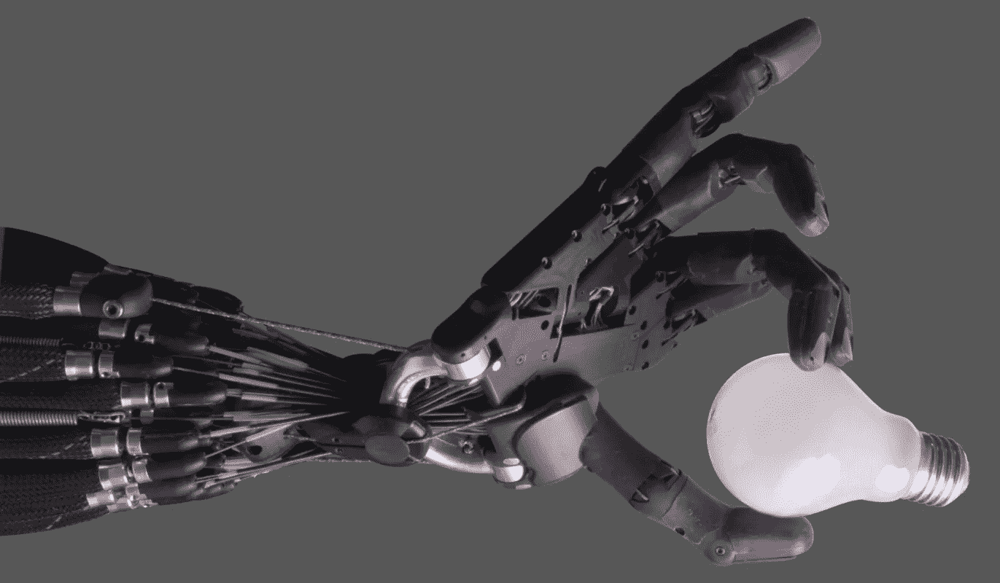

# InventorBot:利用人工智能在任何领域产生新想法

> 原文：<https://medium.com/geekculture/inventorbot-using-ai-to-generate-new-ideas-in-any-field-9345f9042df?source=collection_archive---------1----------------------->

## 在美国专利数据库上训练的神经网络如何产生新的和可能有用的发明。

**Photo** by Richard Greenhill and Hugo Elias from [wikimedia.org](https://commons.wikimedia.org/wiki/File:Shadow_Hand_Bulb_large_Alpha.png)

2019 年 7 月，一位名为斯蒂芬·泰勒(Stephen Thaler)的发明家为一种警告信标申请了专利，这种警告信标以一种特殊的方式闪烁，以引起人们的注意。在专利申请表上，泰勒列出了自己…