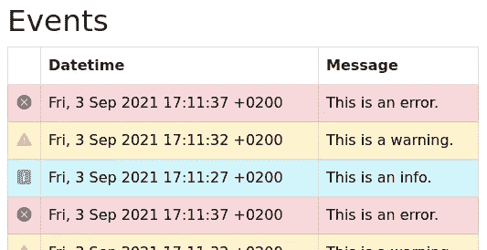
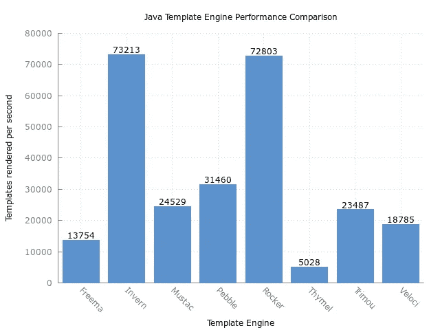

# 用于高效数据渲染的 Inverno 反应式模板

> 原文：<https://medium.com/geekculture/inverno-reactive-template-for-efficient-data-rendering-b0cf7a10d40f?source=collection_archive---------45----------------------->

Inverno Reactive Template

Java 中已经有许多模板引擎，从古老的 Java 服务器页面开始，还有许多其他的，如 Velocity、Freemarker、Mustache、thyme leaf……不幸的是，这些都不适合反应式编程范式，特别是 [Inverno 框架](https://inverno.io)，这是我决定创建 Inverno 反应式模板模块的基本原因。

简而言之，反应式模板引擎允许以非阻塞方式呈现反应式数据流。这不仅完全符合 Inverno 框架，而且还提供了优于传统方法的几个优点，传统方法通常在单个分块操作中处理完整的数据集，最终返回结果文档。另一方面，反应式模板引擎优化了处理，因为没有线程被阻塞来等待数据，并且内存使用也减少了，因为不必将整个数据集加载到内存中。例如，这使得非常大的数据集可能太大而不适合内存。

Inverno Reactive Template 模块定义了一种类似于函数式语言的语法，如 [XSL](https://en.wikipedia.org/wiki/XSL) 或 [Erlang](https://www.erlang.org/) ，用于定义带有 Java 表达式的动态部分模板。模板可以被看作是一个函数，它匹配特定类型的输入，并指定它应该如何呈现。然后将模板*应用*到特定类型的数据上，并且可以*将其他模板应用*到子数据上。

不仅仅是文字，让我们看看它在实践中是什么样子的。让我们考虑下面的`Event`类:

src/main/java/io/inverno/example/app_irt/model/Event.java

我们想要在一个 HTML 文档中呈现一个潜在的大事件列表，这可以通过在包`io.inverno.example.app_irt.templates`中创建下面的`Events.irt`模板集文件来有效地完成:

src/main/java/io/inverno/example/app_irt/templates/Events.irt

前面的文件定义了两个模板:一个呈现单个`Event`对象，另一个呈现一个作为`Publisher<Event>`对象的反应式事件流。

这个例子实际上演示了 Inverno Reactive 模板语言的多个特性及其对应的语法，比如*条件*语句:`{@if...}`， *value-of* 语句:`{@...}`或 *pipes* : `{...|...}`。这些都在 [Inverno 框架参考文档](https://inverno.io/docs/release/reference/html/index.html#reactive-template)中有详细描述，所以我只关注第一个模板中的一个特定语句:

apply-templates statement

这个简单的语句主要用于将匹配的模板应用到`events`反应流的每个元素。

在我们的示例中，呈现过程从第一个模板开始，将静态内容呈现到这个特定的语句。此时，处理器订阅`events`反应流。然后每次发出一个事件时，调用第二个模板并呈现该事件。最终，反应流完成，第一个模板中剩余的静态内容被呈现。

这种说法其实是极其有力的。首先，进程从来不会被阻塞，因为是模板本身订阅了反应流，所以它可以根据某些条件控制何时获取数据。这可以被看作是一种惰性加载的形式，在某些情况下可以节省资源。

当在一个列表或数组上使用时，由于完整的数据集是可用的，所以该过程变得同步，因此它与常规的 for-loop 语句没有什么不同。

因此，该语法不需要提供任何 for-loop 语句，因为所有事情实际上都可以通过这条 *apply-templates* 语句来实现。

> 注意，在许多函数式语言中，也没有显式的 for-loop 语句，Erlang 就是一个典型的例子。

编译后，模板集可以按如下方式使用:

Inverno Reactive Template blocking rendering

如您所见，`render()`方法返回一个`CompletableFuture<String>`，因为这是一个非阻塞操作。通过将`CompletableFuture<String>`转换为`Mono<String>`，上述方法可以完全反应，如下所示:

Inverno Reactive Template reactive rendering

如果运行此示例，您应该会获得以下结果:

有很多可用的特性，我会让你在[文档](https://inverno.io/docs/release/reference/html/index.html#reactive-template)中发现。简而言之:

*   可以生成一个模板集，以各种形式输出结果:作为默认的`CompletableFuture<String>`、`CompletableFuture<ByteBuf>`、`CompletableFuture<OutputStream>`、`Flux<String>`或`Flux<ByteBuf>`。
*   Pipes 允许在 *apply-templates* 语句中转换流，或者在 *value-of* 语句中转换值。管道基本上是可以链接的 Java 方法，典型的例子是文本格式，如日期、对象映射或过滤。
*   可以命名模板，为特定类型提供不同的呈现方式。命名模板可以在 *apply-templates* 语句的目标部分显式应用。
*   也可以在 *apply-templates* 语句中指定保护表达式，以便根据对要呈现的元素评估的条件表达式选择要应用的特定模板。
*   条件语句。
*   也可以组合多个模板集，因此可以创建可以包含在其他模板中的通用模板，或者拆分复杂模板以使它们更易于维护。

Inverno 模板在性能方面也很出色，Inverno 模板集被编译成 Java 代码，因此性能与普通 Java 相同。生成的代码是静态类型的，这可以防止大多数运行时错误，高度优化的静态部分使用有限的内存副本进行渲染，从而获得非常高的性能。

下面的[基准](https://github.com/jkuhn1/template-benchmark)结果显示了将库存项目列表以字符串形式呈现在 HTML 文档中时模板引擎的性能比较。正如你所看到的，Inverno 反应模板优于大多数竞争对手一个数量级。

请注意，这种性能比较虽然完全相关，但必须在特定的背景下进行评估。并不是因为某些模板引擎在特定测试中表现不佳，就不应该考虑它，因为它可能解决不同的问题。Inverno 反应模板模块的主要问题是反应和性能，它目前缺乏有用的功能，如热重装。有可能实现这样的功能吗？由于模板是编译生成的 Java 代码，这可能有点棘手，但完全可行。

请随意浏览 [Inverno 框架文档](https://inverno.io/docs/release/reference/html/index.html)以全面了解这个伟大的模块，并看看如何使用它来满足您的需求。