# C++中的反向运动学求解器

> 原文：<https://medium.com/geekculture/inverse-kinematics-solver-in-c-e999f1b7f353?source=collection_archive---------1----------------------->

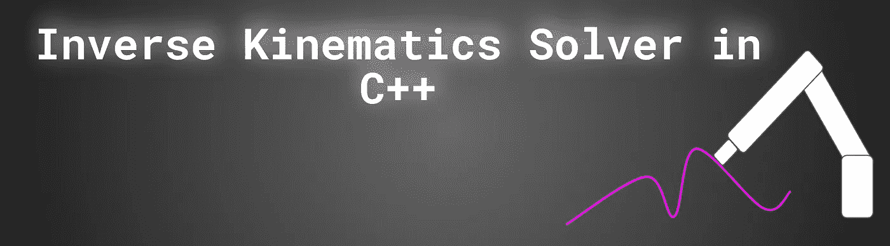

by author

在这篇文章中，我将向你展示如何解决机械手(工业机器人)的逆运动学问题。演示将使用两种简单的机器人:XY 空间的 2R 机器人和 XYZ 空间的 3R 机器人。已经用 C++实现了。源代码你会在我的 [**Github**](https://github.com/markusbuchholz/Inverse_Kinematics_Solver_in_CPP) 里找到。
对于矩阵计算，我使用了 C++ **特征库**。我相信理解所描述的概念(特别是针对 3R 提出的)将会给你一个极好的机会来解决任何机械手的逆运动学问题。
演示的解决方案基于数值计算。我们的方法(算法)将解决方案收敛到某个错误，从而终止“函数调用”(程序)。
在接下来的文章中，我不打算用[**dena vit-harten Berg**](https://en.wikipedia.org/wiki/Denavit%E2%80%93Hartenberg_parameters)**变换(DH 参数)**、机器人奇点、优化(与可实现的机器人轨迹的计算相关)和障碍物回避来穷尽这个问题。
以下文章必须被视为您研究和原型制作的模板。

为了使用 [Eigen C++库](https://eigen.tuxfamily.org/index.php?title=Main_Page)，请访问网站。将 eigen repo 下载到机器上您最喜欢的位置，并(对于 Linux 用户)创建软链接。

```
git clone [https://gitlab.com/libeigen/eigen.git](https://gitlab.com/libeigen/eigen.git)sudo ln -s /usr/include/eigen3/Eigen /usr/local/include//usr/include/eigen3/Eigen  -- location of your clone library
```

# 介绍

让我们假设，我们有一个 3R 机械手(具有 3 个旋转关节的机器人。我们决定，我们的机器人(末端执行器— EE)必须完全按照 XYZ 空间中的特定路径(路径的数学描述是已知的)行进。
现在我们需要知道如何设置电机或旋转关节(我指的是角度位置)，以保证机器人的 ee 遵循路径。注意我们需要同时调整所有的关节。这个问题通过[](https://en.wikipedia.org/wiki/Inverse_kinematics)****逆运动学解决。****

**对于简单的机器人，如下面的文章 2R(在 XY 空间)计算，正向运动学 FK 和反向运动学都很简单。更复杂的机器人，如 6R (6 个旋转关节)计算不是直截了当的。**

**有几种技术，有助于这种机器人的 IK 计算。首先，我们可以应用快速方法并解析地计算 IK(使用几何关系)。然而，另一种方法是使用数值方法，如果逆运动学方程不满足解析解，可以应用该方法。除了解析解之外，数值方法也经常被用来提高这些解的精度。**

**正向运动学和反向运动学之间的关系如下图所示。记住正向运动学定义了机械手(机器人)末端效应器或机器人的其他某个点在笛卡尔空间 XYZ 中的位置。逆运动学给出了如何“操纵”机器人关节(马达)的信息，以便通过 EE(或其他机器人点)实现某个位置。**

**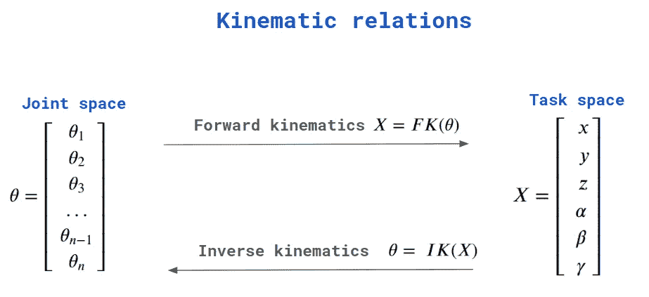**

**by author**

**机械手 [**雅可比矩阵**](https://en.wikipedia.org/wiki/Jacobian_matrix_and_determinant) 是将机械手关节(关节空间)之间的关系映射到机械手末端执行器速度— EE(任务空间)的矩阵。**

**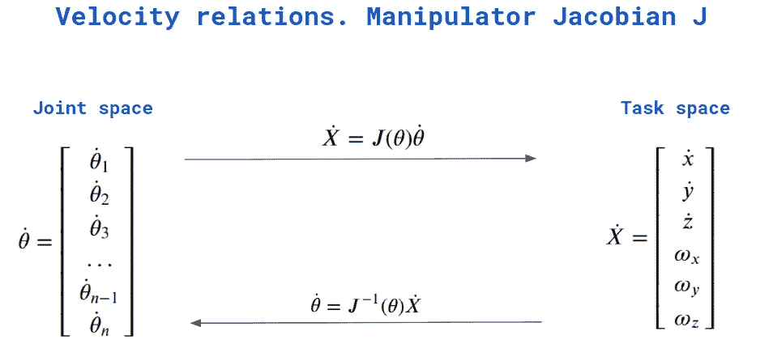**

**bu author**

**对于 2R 机器人，[**雅可比矩阵**](https://en.wikipedia.org/wiki/Jacobian_matrix_and_determinant) 和 IK 可以推导如下:**

**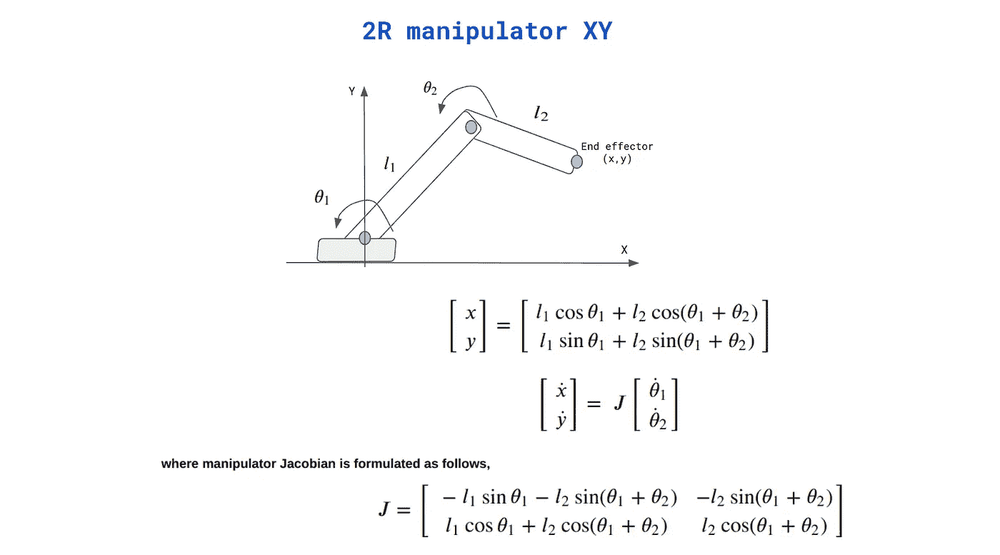**

**by author**

**逆运动学解算器 2R XY 的完整实现已经在 C++中完成。GitHub 上的源代码。代码使用 matplotlibrary 编译(以便绘制机器人)，因此您必须首先下载 header 并相应地编译您的代码，如下所示:**

**[头文件](https://github.com/lava/matplotlib-cpp)(用于绘图库)必须与你的 cpp 在同一个文件夹中。你的程序可以编译如下:**

```
//compile
g++ my_prog.cpp -o my_prog -I/usr/include/python3.8 -lpython3.8// //run
./my_prog//folder tree
├── my_prog
├── my_prog.cpp
├── matplotlibcpp.h
```

**在本文中求解逆运动学(在我的 Github repo 中 2R 和 3R 机器人的 C++实现) [**牛顿—拉夫森**](https://en.wikipedia.org/wiki/Newton%27s_method) 方法已被使用。**

**2R 操纵器如上所示。XYZ 空间中的 3R 可以表示如下:**

**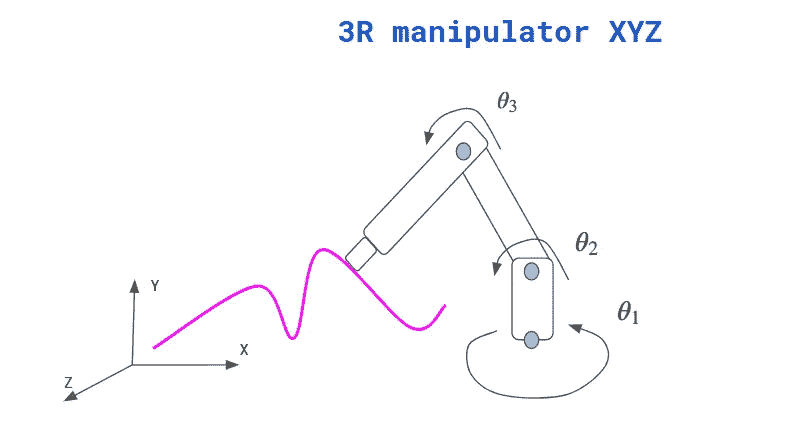**

**by author**

**为了理解部署方法，让我们考虑下图。xd 是期望的、已知的目的(机器人位置/机器人路径的点)。这个点可以与一个未知的机械手关节构型 **qd** 和当前 EE 姿态 **xi** 相关联，与
当前关节构型 **qi** 相关联，使得 **xi = f (qi)** 。其中 **f** 是机械手的正向
运动功能。**

**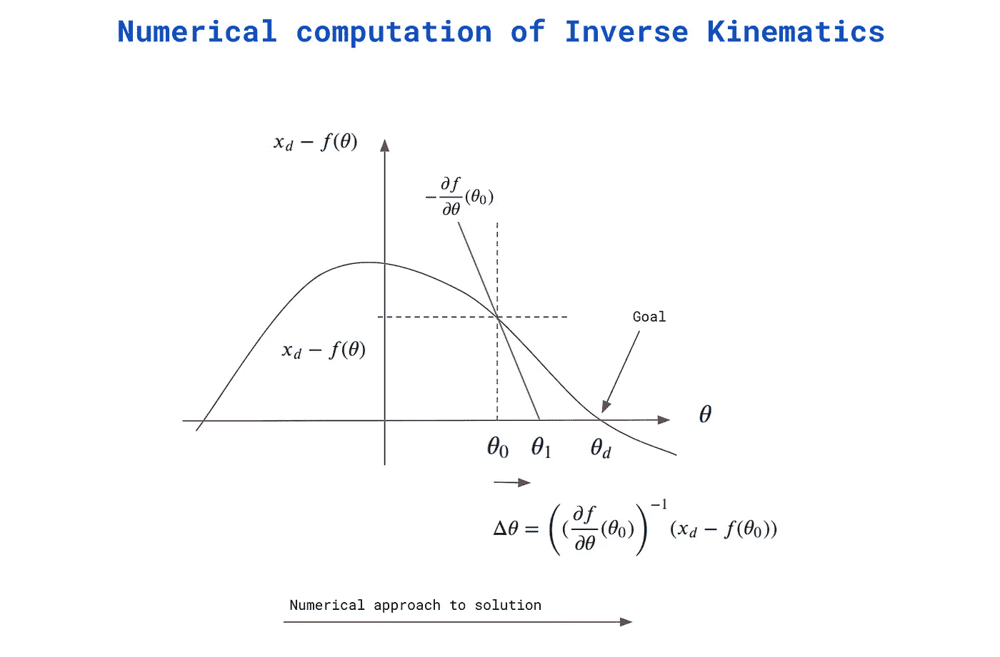**

**by author**

**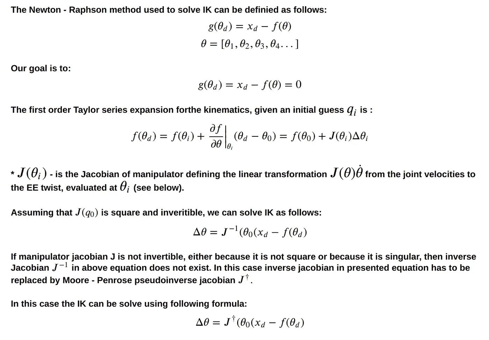**

**使用所描述的算法，我们可以为任何种类的机械手求解 IK，具有逆[雅可比](https://en.wikipedia.org/wiki/Jacobian_matrix_and_determinant)或 [**伪逆**](https://en.wikipedia.org/wiki/Generalized_inverse) 。
两种类型的机器人雅可比矩阵都可以通过使用特征库来计算(参见 C++)。**

# **IK 方法**

**正如我之前提到的，为了解决 IK 问题，我们可以使用解析方法或使用数值方法的逼近解(达到一定的误差值);这里我使用了牛顿-拉夫森方法(考虑下图)。**

**解决 IK 的方法如下图所示。**

**已部署的算法实现如下**

**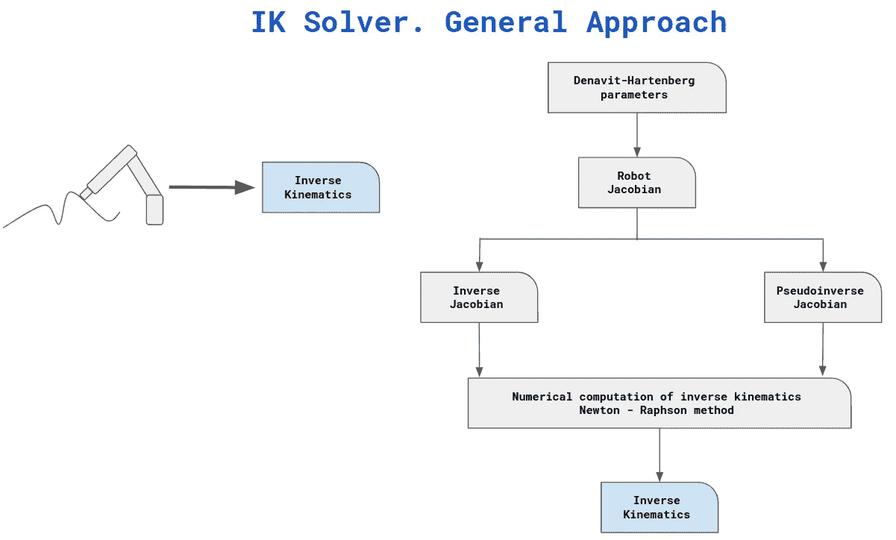**

**by author**

**除了计算逆雅可比或伪逆雅可比(这两种方法在 Eigen、MathLab 或 Numpy 中都可用)的挑战之外，以下方法中最关键的部分(必须手动完成)是计算 DH 参数。
如果你不熟悉 DH 改造，我真的推荐你去看激动人心的 [Youtube 频道](https://www.youtube.com/watch?v=BkMQ5Rek_vM&list=PLT_0lwItn0sAfi3o4xwx-fNfcnbfMrXa7&ab_channel=AngelaSodemann)作者**安吉拉·索德曼**。**

**下图描述了创建 DH 表的一般方法。对于每个关节，您只需要评估两个帧 N 和 N-1(关节“操作”的坐标系)之间的旋转角度和距离(平移)。**

**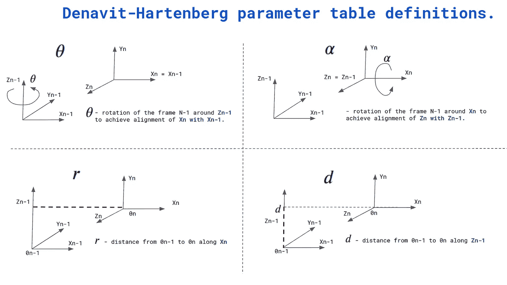**

**by author**

**使用给定的定义，3R XYZ 机器人的 DH 表可定义如下:**

**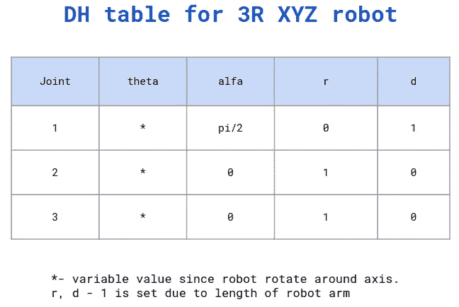**

**by author**

**提取主要特征，我们可以将 DH 变换总结如下(考虑该图)。**

1.  **完整的 DH 参数列表通常显示在 DH 表中。其中两个首先给出关于旋转的信息，最后两个给出关于位移的信息。**
2.  **对于每个关节，你需要决定框架(OXYX 坐标系统)。帧数很简单。它是机器人的数量(关节+ 1)。增加了一个，因为它表示机器人的底座。**
3.  **z 轴是关节旋转(旋转)或线性运动(对于棱柱形关节)的轴。**

**有了完整的 DH 表，我们就能够找到每个关节的位置，因为我们知道所有先前关节的位置。
我们正在使用转换矩阵。对于每个关节，给出了最终变换(详细信息见此处的)。**

**变换矩阵(将一个点从帧 n 变换到帧 n-1)可以如下导出。**

****注意:记住上面显示的 DH 表(DH 参数),每个关节的变换矩阵是计算机。请考虑 C++实现。****

**变换矩阵定义如下:**

**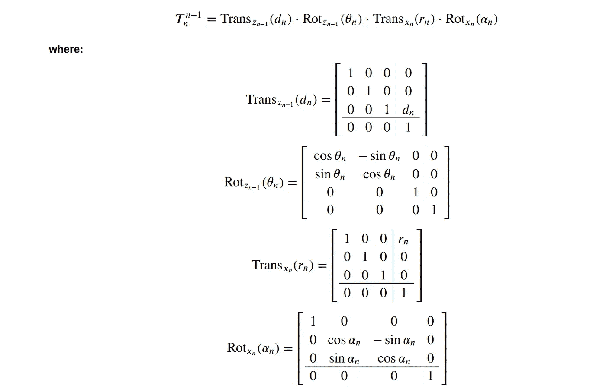**

**最终转换矩阵可定义如下:**

**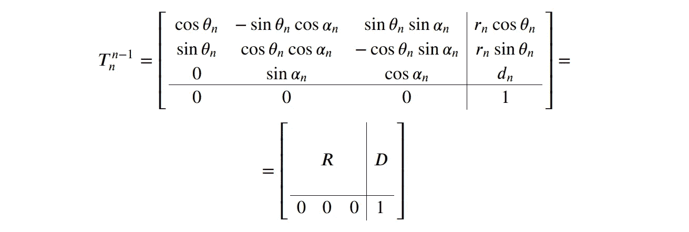**

**如你所见，DH 变换矩阵是 4x4 的，由与旋转(R)、位移(D)和透视(1)相关的“部分”组成。**

**请考虑在我的 C++实现中是如何做到的。我还推荐查看以下[**链接**](https://motion.cs.illinois.edu/RoboticSystems/InverseKinematics.html) (作者克里斯·豪泽教授 **)** 以熟悉细节。**

**最后的任务是计算雅可比矩阵。寻找机器人雅可比矩阵的一般方法可以规定如下。**

**对于每个关节(旋转或棱柱)，我们必须定义一个“关节”雅可比矩阵— **我们简单地重复使用先前计算的关系，但是我们以其他形式应用它们。****

**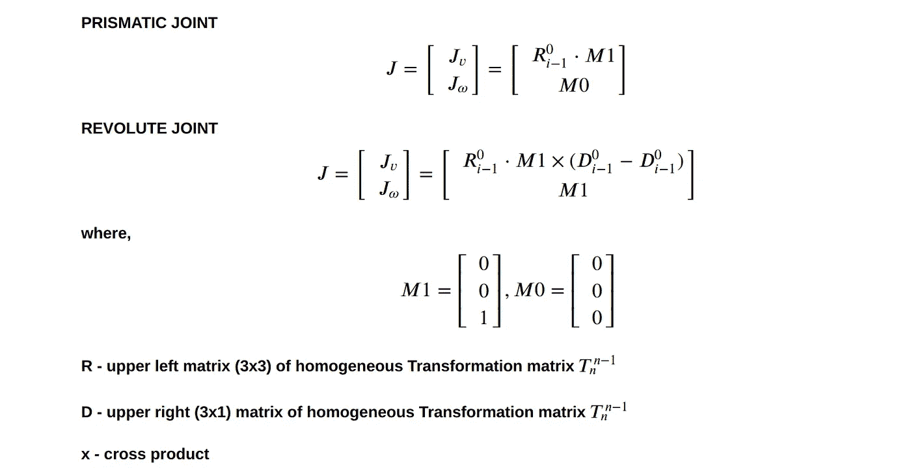**

**对于 3R 机器人，我们使用 3 个旋转关节，因此雅可比矩阵可以指定如下:**

**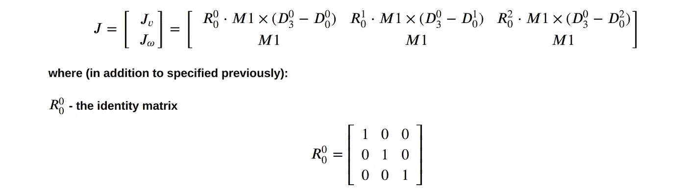**

**由于我们只关心 x、y 和 z 方向的线速度，我们可以将雅可比矩阵改写成以下形式(用 C++实现)。**

****

**将所有这些结合在一起，我们准备执行我们的最后一步(IK 解算器算法)，可以描述如下，(源代码在我的报告中):**

```
MatrixXf applyAlgorithm(){
//initial valuesi_theta(0, 0) = M_PI / 6;
i_theta(1, 0) = M_PI / 9;
i_theta(2, 0) = M_PI / 10;//calaculate initial values of forward kinematics
MatrixXf FWD = FWD_Kinematics(i_theta(0, 0), i_theta(1, 0), i_theta(2, 0));// GOAL
Xd(0, 0) = 0.544895;
Xd(1, 0) = 0.943786;
Xd(2, 0) = 2.63099;//consider "initial" error
e = Xd - FWD;//solve IK numerically
while ((std::abs(e(0, 0)) > 0.00001) || (std::abs(e(1, 0)) > 0.00001) || (std::abs(e(2, 0)) > 0.00001))
{MatrixXf invJ = computePseudoInverse(i_theta(0, 0), i_theta(1, 0), i_theta(2, 0));//update
i_1_theta = i_theta + invJ * e;//calulate new posion of EE
FWD = FWD_Kinematics(i_1_theta(0, 0), i_1_theta(1, 0), i_1_theta(2, 0));//compute error to be evaluated
e = Xd - FWD;i_theta = i_1_theta;
}
return i_theta;
}
```

# **如何测试**

**程序评估(对于 2R 和 3R 机械手)可按如下方式进行。首先使用正向运动学(设置关节位置并验证 EE : XYZ 的位置)并调用 main() only FWD_Kinematics()。注意输出。其次，通过设置目标(您之前计算的 EE)运行完整的 IK 解算器(程序)，并将您计算的结果与第一步中使用的机器人的初始位置(关节空间)进行比较。**

**感谢您的阅读。**