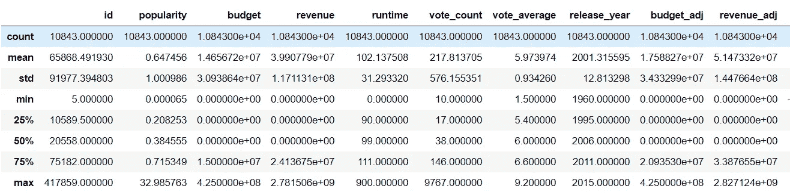
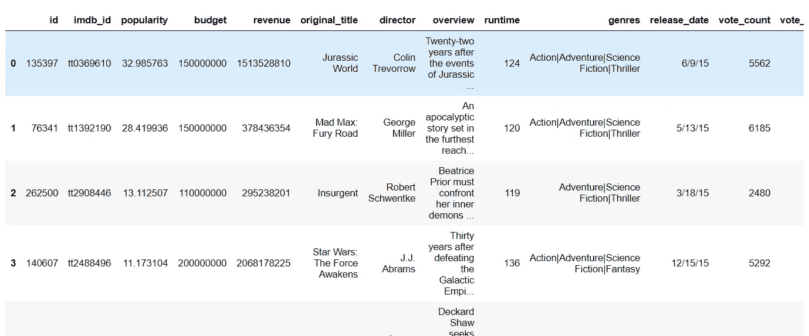
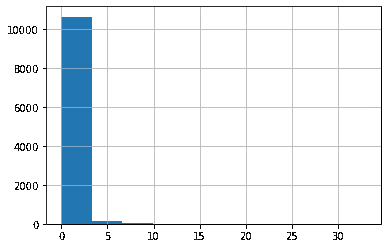
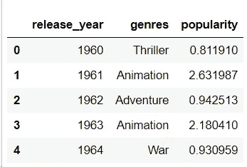
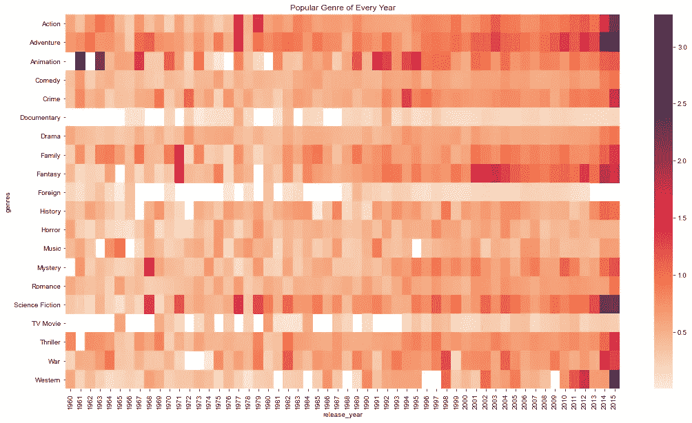
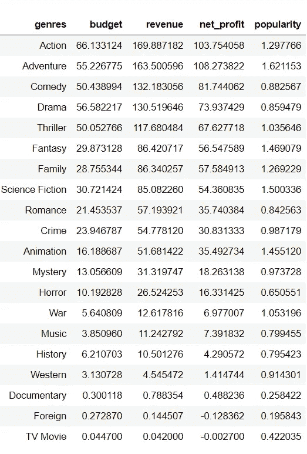
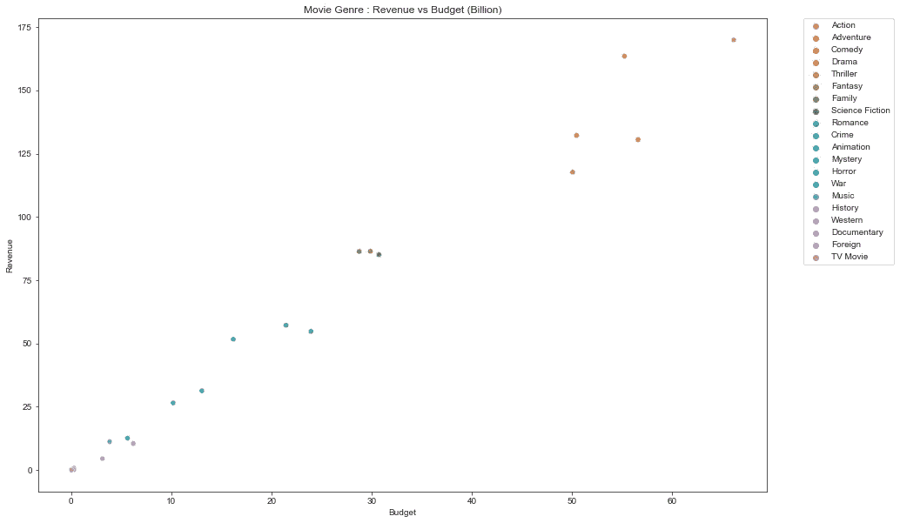
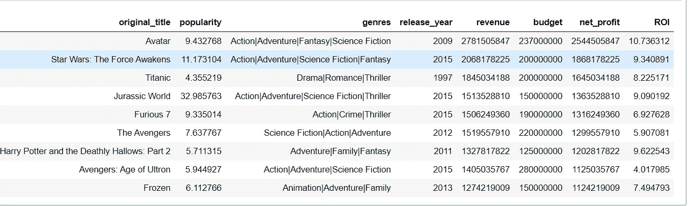

# 调查 TMVB 电影数据集

> 原文：<https://medium.com/geekculture/investigate-tmvb-movie-dataset-28a27b1f3912?source=collection_archive---------4----------------------->

数据集来自 Udacity 数据分析师 Nano Degree，最初来自 [kaggle](https://www.kaggle.com/tmdb/tmdb-movie-metadata) 。该数据集包含从电影数据库(TMDb)收集的大约 10，000 部电影的信息，包括用户评级和收入。它包含 10866 行和 21 列。

我们有兴趣了解更多关于

1.  哪种流派每年都最受欢迎？
2.  什么样的财产与高收入的电影有关？
3.  最赚钱的 10 部电影有哪些？
4.  哪个导演制作的电影最多？

使用的工具:Python ( Pandas，Seaborn，Matplotlib)

在本节中，我们将探索、检查和清理数据。点击[这里](https://github.com/HockChong/Udacity-Data-Analyst-NanoDegree/blob/main/Project%20%232%20TMDb%20Movie%20Analysis/TMVB%20Movie.ipynb)查看完整的 python 代码。

```
#loading the package and import the data
import pandas as pd
import matplotlib.pyplot as plt
import seaborn as sns
%matplotlib inline
df = pd.read_csv('tmdb-movies.csv')
df.info()<class 'pandas.core.frame.DataFrame'>
RangeIndex: 10866 entries, 0 to 10865
Data columns (total 21 columns):
 #   Column                Non-Null Count  Dtype  
---  ------                --------------  -----  
 0   id                    10866 non-null  int64  
 1   imdb_id               10856 non-null  object 
 2   popularity            10866 non-null  float64
 3   budget                10866 non-null  int64  
 4   revenue               10866 non-null  int64  
 5   original_title        10866 non-null  object 
 6   cast                  10790 non-null  object 
 7   homepage              2936 non-null   object 
 8   director              10822 non-null  object 
 9   tagline               8042 non-null   object 
 10  keywords              9373 non-null   object 
 11  overview              10862 non-null  object 
 12  runtime               10866 non-null  int64  
 13  genres                10843 non-null  object 
 14  production_companies  9836 non-null   object 
 15  release_date          10866 non-null  object 
 16  vote_count            10866 non-null  int64  
 17  vote_average          10866 non-null  float64
 18  release_year          10866 non-null  int64  
 19  budget_adj            10866 non-null  float64
 20  revenue_adj           10866 non-null  float64
dtypes: float64(4), int64(6), object(11)
memory usage: 1.7+ MB*#create new column ---- calculate net profit for each movie*df['net_profit'] **=** df['revenue'] **-** df['budget'] 
```

让我们看看数据中缺失的值。

```
# inspect the missing data in %
x = df.isna().sum()*100/len(df)
x
id                       0.000000
imdb_id                  0.092030
popularity               0.000000
budget                   0.000000
revenue                  0.000000
original_title           0.000000
cast                     0.699429
homepage                72.979937
director                 0.404933
tagline                 25.989324
keywords                13.740107
overview                 0.036812
runtime                  0.000000
genres                   0.211669
production_companies     9.479109
release_date             0.000000
vote_count               0.000000
vote_average             0.000000
release_year             0.000000
budget_adj               0.000000
revenue_adj              0.000000
net_profit               0.000000
dtype: float64
```

我们将删除不会用于分析的列，删除“流派”列中缺少的值，检查任何重复的行。

```
# Drop columns that won’t be used in our analysis
df.drop(columns = [‘tagline’,’homepage’, ‘cast’, ‘production_companies’, ‘keywords’], inplace=True)# Drop the missing value at genres columns
df.dropna(how='any', subset=['genres'], inplace=True)# No duplicated row
df.duplicated().sum()
1df.describe()
```



```
# count the budget columns have value less than 0
***#* There are 5674 columns less than 0 in budget columns**
(df['budget'] <= 0).sum()5674
```

预算中超过一半的记录已经丢失，这将降低我们在探索预算、收入和净利润之间的关系时的结果准确性。当我们需要使用预算信息时，我们将在分析过程中排除它们。

# 探索性数据分析

# 问题 1:每年最受欢迎的流派有哪些？

我们注意到流派列有不止一个流派，我们需要考虑所有的流派，找出最受欢迎的流派。如果我们只从每部电影中选择一种类型，我们的分析就会有失偏颇。

在这里，我们将使用每部电影的所有类型进行分析。



我认为为我们的分析复制一个新的数据框是一个很好的做法，以防我们可能需要原始数据框进行其他分析。为了找出每年更多的流行流派，我们将使用[流行度指标](https://developers.themoviedb.org/3/getting-started/popularity)。

```
# take a look popularity distribution
# the major popularity fall below 1
df.popularity.hist();
```



```
df['popularity'].describe()
count    10843.000000
mean         0.647456
std          1.000986
min          0.000065
25%          0.208253
50%          0.384555
75%          0.715349
max         32.985763
Name: popularity, dtype: float64
```

从直方图和统计汇总。我们可以看到电影的受欢迎程度大于 1 被认为是受欢迎的。让我们进一步探索。

正如我之前提到的，我们注意到流派栏有不止一个流派。例如，《侏罗纪世界》有 5 种类型，分别是动作片、冒险片、科幻片、科幻片和惊悚片。它也有最高的受欢迎程度是 32.98。

为了整理数据，我们将拆分流派列，为每个流派创建每一行并执行计算。

```
# split the genres string
df1.genres = df1.genres.str.split('|')# create genre list( create each row for each gen) using explode 
df1 = df1.explode('genres')# groupby year again and get the largest value
df1.groupby(['release_year','genres'])['popularity'].mean().groupby(level='release_year').nlargest(1)# tidy up the data by removing extra row index by reset index
data = df1.groupby(['release_year','genres'])['popularity'].mean().groupby(level='release_year').nlargest(1).reset_index(level=0, drop=True)# change the pandas series to pandas dataframe
data = data.reset_index()
```

查看我们得到的最终表格:

```
data.head()
```



绘制一个散点图和热图，直观显示每年最受欢迎的流派。



```
# Popular of genres summary
new.genres.value_counts()Adventure          14
Animation          10
Fantasy             9
Crime               5
Action              3
War                 3
Family              3
Science Fiction     2
Mystery             2
Western             2
Music               2
Thriller            1
History             1
Name: genres, dtype: int64
```

***没有哪个流派持续称霸一年的显著趋势。根据总年数，最受欢迎的类型是冒险，其次是动画和幻想。***

# **问题 2:高收入的电影有哪些属性？**

```
#we know budget can't be less than 0, so filter out the dataframe
rev = df1[df1['budget'] > 0]# calculate the correlation
rev.corr() **budget     revenue     net_profit   popularity
budget     1.000000    0.989509     0.972983   0.571577
revenue    0.989509    1.000000     0.996130   0.634417
net_profit 0.972983    0.996130     1.000000   0.666141
popularity 0.571577    0.634417     0.666141   1.000000**# group the genre 
rev = rev.groupby('genres', as_index =False).agg({'budget':'sum','revenue':'sum','net_profit':'sum','popularity':'mean'})# sort by highest revenue
rev = rev.sort_values(by='revenue', ascending=False)#convert revenue in 1 billion unit
rev['revenue'] =rev['revenue']/1000000000# convert net profit in 1 billion unit
rev['net_profit'] =rev['net_profit']/1000000000# convert budget in 1 billion unit
rev['budget'] =rev['budget']/1000000000rev
```



```
# set chart dimension
plt.figure(figsize=(15,10))# set plotting style
sns.set_style('ticks')# set title
plt.title('Movie Genre : Net Profit vs Revenue (Billion)')
plt.xlabel('Revenue')
plt.ylabel('Net Profit')#draw scatter plot
sns.scatterplot(x="revenue", y="net_profit", hue="genres", data=rev);#move the legend outside the chart
plt.legend(bbox_to_anchor=(1.05, 1), loc='upper left', borderaxespad=0.);
```


*收入与预算之间强正相关，0.996130。*

```
# set chart dimension
plt.figure(figsize=(15,10))# set plotting style
sns.set_style('ticks')# set title
plt.title('Movie Genre : Revenue vs Budget (Billion)')
plt.xlabel('Budget')
plt.ylabel('Revenue')# draw scatter plot
sns.scatterplot(x="budget", y="revenue", hue="genres", data=rev);# move the legend outside the chart
plt.legend(bbox_to_anchor=(1.05, 1), loc='upper left', borderaxespad=0.);
```



*收入与预算之间强正相关，0.996130。*

# 它表明，电影类型有更高的收入，与更高的预算和更高的净利润相关联。

# 问题 3:最赚钱的前 10 部电影是什么？

```
profit = df.groupby(['original_title', 'popularity','genres', 'release_year', 'revenue','budget'])['net_profit'].sum()
profit = profit.reset_index().sort_values(by='net_profit', ascending=False)[:9]# calculate return in investment - ROI
profit['ROI'] = profit['net_profit']/profit['budget']
profit
```



***我们可以看到，与较高人气相关的前 10 部盈利电影，投资回报率最低 400%，最高 1073%。投资回报相当诱人。***

问题 4:哪个导演拍的电影最多？

```
df['director'].value_counts().head(n=10)Woody Allen          45
Clint Eastwood       34
Martin Scorsese      29
Steven Spielberg     29
Ridley Scott         23
Steven Soderbergh    22
Ron Howard           22
Joel Schumacher      21
Brian De Palma       20
Barry Levinson       19
Name: director, dtype: int64
```

***伍迪·艾伦的电影产量最高，为 43 部。***

# ***该数据集的数据限制:***

1.  几乎每部电影都有多个流派，我们在计算时已经包括了所有的流派。
2.  缺少关于如何计算 vote_count 和 vote_average 的详细信息。
3.  预算列中有 **5674** 列小于 0。
4.  请注意，我使用不同的数据框架来回答不同的问题。我创建了一个新的数据框架来回答 Q1 和 Q2。剩下的问题使用原始数据框。
5.  数据中的缺失值会影响我们分析的准确性，如果需要进一步的调查，我们可以进行统计检验来确定我们的结果是否具有统计显著性。统计检验可以帮助我们确定我们的数据结果是否不是由偶然因素决定的。

# 结论:

在我们的分析中，我们发现收入较高的电影类型有较高的受欢迎程度、较高的预算和较高的净利润。当我们观察收入较高的单部电影时，我们发现了同样的发现。我们可以得出结论，制作电影愿意在流行电影流派上投入更多资金。根据数据，更高的预算将允许公司生产高质量的电影，从而产生更高的收入和净利润。我们可以从最赚钱的 10 部电影中看到，投资回报率是他们预算的 4 倍到 10.73 倍。