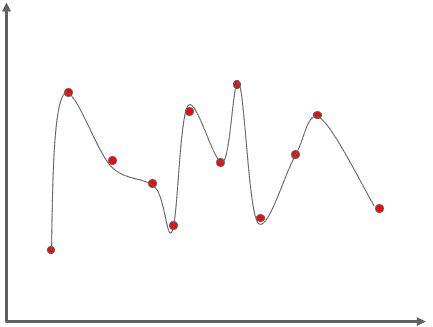
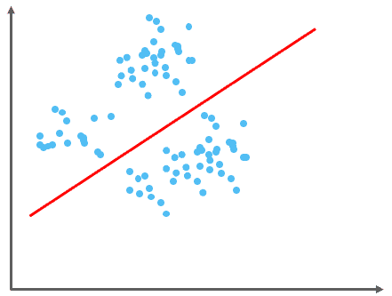
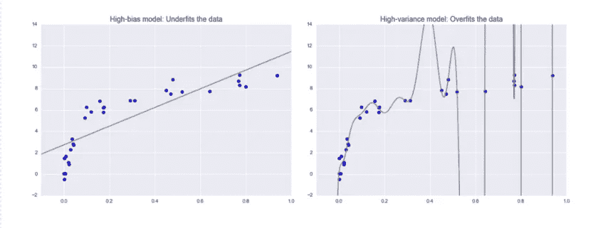
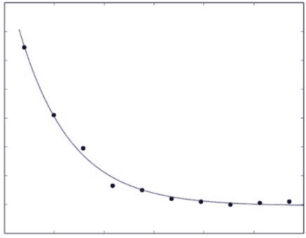
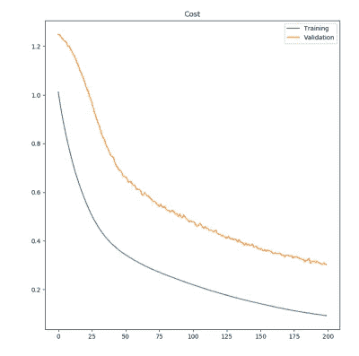

# 调查欠拟合和过拟合

> 原文：<https://medium.com/geekculture/investigating-underfitting-and-overfitting-70382835e45c?source=collection_archive---------14----------------------->

在机器学习中，如果模型能够适合训练数据，并不意味着它会在测试数据上表现良好。训练和测试数据上的性能之间的这种差异被称为泛化差距。在机器学习问题中，观察训练和测试性能之间的差距是常见的。

通常，增加模型复杂性有助于减少训练错误，但也会增加过度拟合的风险，从而导致更大的泛化差距。 ***那么什么是过拟合呢！***

## 过度拟合

过度拟合是监督机器学习中的一个基本问题，它阻止我们完美地概括模型，以很好地拟合训练数据上的观察数据以及测试集上的看不见的数据。

> 机器学习模型尝试从数据以及数据中存在的噪声中学习，并尝试拟合曲线上的每个数据点。

由于该模型的灵活性很小，它无法预测新的数据点，因此该模型在预测过程中拒绝每个新的数据点。在过度拟合中，模型具有非常低的偏差，但是具有高的方差。

## 过度拟合的原因

*   用于训练的数据未经清理，其中包含噪音(垃圾值)
*   该模型具有很高的方差
*   使用的训练数据的大小是不够的
*   模型太复杂了

## 避免过度拟合的方法

*   交叉验证
*   使用更多数据进行培训
*   移除冗余特征
*   提前停止
*   正规化
*   组装

## 欠拟合

为了避免过度适应，我们可以在早期停止训练。但这也可能导致模型无法从训练数据中学习到足够的知识，从而难以捕捉主导趋势。这就是所谓的欠拟合。

> 一种情况，机器学习模型既不能学习数据中变量之间的关系，也不能预测或分类新的数据点。

由于模型没有完全学习模式，它在预测过程中接受每个新的数据点。欠拟合模型具有低方差和高偏差。

## 不适合的原因

*   用于训练的数据未经清理，其中包含噪音(垃圾值)
*   这个模型有很大的偏差
*   使用的训练数据的大小是不够的
*   模型太简单了

**考虑下面的情节，**

很明显，这两个模型都不是特别适合这些数据，但它们以不同的方式失败了。

*左边的型号*

*   试图通过数据找到直线拟合。因为数据本质上比直线更复杂，所以直线模型永远无法很好地描述该数据集。
*   这种模型被认为是数据不足；也就是说，它没有足够的模型灵活性来适当地考虑数据中的所有特征。
*   另一种说法是模型有很高的偏差。

*右边的型号*

*   尝试通过数据拟合高次多项式。这里，模型拟合具有足够的灵活性，几乎完美地解释了数据中的细微特征，但是即使它非常准确地描述了训练数据，其精确形式似乎更能反映数据的特定噪声属性。
*   这种模型据说会过度拟合数据；也就是说，它具有如此大的模型灵活性，以至于模型最终会考虑随机误差以及底层数据分布。
*   另一种说法是模型有很高的方差。

> [阅读以下文章，了解偏差和方差](https://arunaddagatla.medium.com/bias-variance-trade-off-f777d430cc55)

## 那么什么才是最合适的呢？

最符合数据的直线或曲线既不过度拟合也不欠拟合模型，而是恰到好处。

您可能想知道我们如何知道一个模型是否会在看不见的数据上执行。我们不能在真正看不见的数据点上测试模型，但我们可以在训练期间隐藏一部分数据，并根据隐藏的数据评估模型。

通常，我们可以将我们的数据分成三组:*训练*、*验证*和*测试*组。

通常的做法是将 80%的数据用于训练，10%用于验证，10%用于小型或中型数据集的测试。但是对于具有数百万个样本的大型数据集，即使 1%的数据也可能足够用于验证和测试集，只要它们以无偏见的方式进行划分。

对于无偏分割，最好在分割前随机洗牌。

我们可以在训练集上训练我们的模型，并使用验证集来配置涉及超参数调整的模型。

**那我们为什么需要测试集呢？**

嗯，我们并不严格需要测试集。在某些情况下，只有训练集和验证集也是可以的。

测试集的目的是帮助我们获得泛化性能的无偏估计。特别是当我们有很多超参数需要优化时，可能会有过度适应验证集的风险。

尽管模型从来不会看到验证集，但是我们会看到，并且我们已经相应地调整了参数。因此，模型最终可能会被过度调整，以在验证集上表现良好，但不能很好地推广到真正看不见的数据。

这就是为什么一旦我们完成了模型的训练和配置，拥有一个单独的测试集是有益的。

## 摘要

过拟合是监督机器学习中的普遍问题，无法完全避免。这是因为训练数据的限制，它可能具有有限的大小或包含大量噪声，或者模型的复杂性。

但是我们仍然可以减少过度拟合的影响。一方面，为了处理训练集中的噪声，基于*提前停止*策略的算法帮助我们在学习噪声之前停止训练。

另一方面，针对需要大量数据来微调其超参数的复杂模型，提出了一种*数据扩展*策略。此外，*正则化*帮助我们区分噪音、意义和无意义的特征，并为它们分配不同的权重。

*感谢你阅读这篇文章！如果你有任何问题，请在下面留言。请务必关注*[*@ arunadagatla*](https://arunaddagatla.medium.com/)*，获取关于数据科学和深度学习的最新文章通知。*

> *可以在*[***LinkedIn***](https://www.linkedin.com/in/arun-addagatla/)*[***Github***](https://github.com/arun2728)*[***Kaggle***](https://www.kaggle.com/arun2729)*上与我联系，或者通过访问*[***【Medium.com***](https://arunaddagatla.medium.com/)*。***