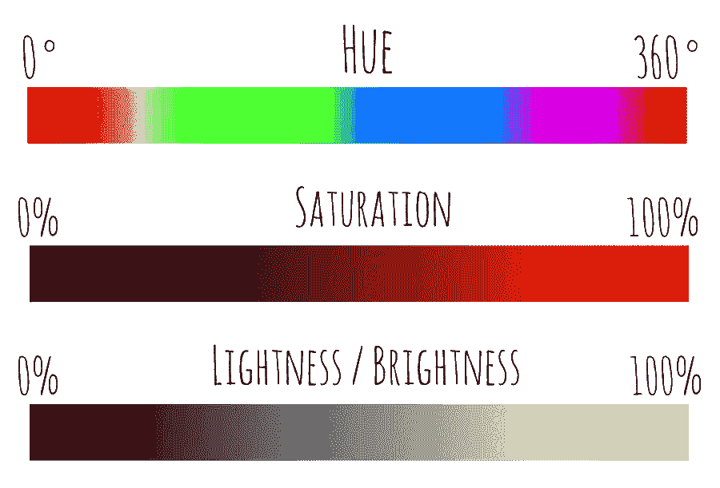
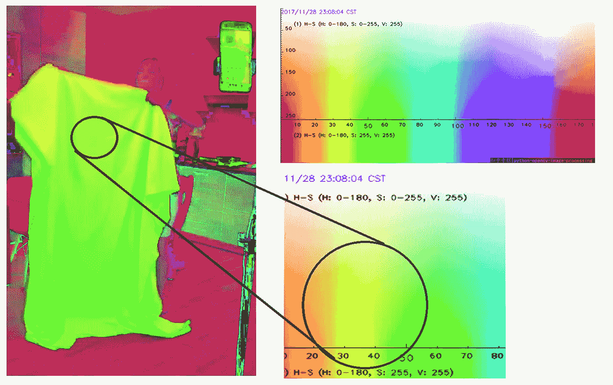

# 不可见性和更多——openCV c++

> 原文：<https://medium.com/geekculture/invisibility-and-more-opencv-c-a37580e66cdd?source=collection_archive---------57----------------------->

谁不喜欢魔术？“霍华德，容我插一句。你真的想把时间花在魔术上吗？”谢尔登·库珀说。但在这里我用了一个更符合逻辑的技巧，谢尔顿应该能弄明白。

但是让我也简单地介绍一下我的工作。首先我们需要一个视频源。正如我们所知，视频是一系列随时间移动的图像——因此有了电影。你也知道图像是由像素构成的。因此，如果我们像疯狂的猴子一样改变和篡改这些像素，我们就可以做出简单的把戏。

我们可以像这样轻松地获取视频源！

```
VideoCapture cap(0);
```

但是如果你想在没有网络摄像头的情况下拍摄视频呢？天哪！你疯了吗？然后，让我们给你一个消息说“不，你不能这样做，因为你没有视频饲料！”

```
if(!cap.isOpened()){ 
cout << “No you can’t do this because you don’t have a video feed” << endl; 
return -1; }
```

然后呢？是的。你需要声明你需要欺骗人们的图像，以及视频中的每个图像。让我们分别称它们为*背景*和*形象*。然后，我们需要获得我们从视频饲料捕捉，并把它作为基础层的背景。

```
Mat img;
Mat background;
for (int i = 0; i < 60; i++)
{ 
cap >> background;
}
```

现在我们有了它们，让我们取另一个变量，把视频中的每一个图像分配到 HSV 中。HSV 是色调-饱和度-值。


Photo by [Robert Katzki](https://unsplash.com/@ro_ka?utm_source=medium&utm_medium=referral) on [Unsplash](https://unsplash.com?utm_source=medium&utm_medium=referral)

这里有一个这些颜色如何工作的解释。色调是你需要的可见光谱中的哪种颜色。饱和度就是你需要多少光彩(低饱和度是沉闷，高饱和度是壮观！)而价值基本上就是你需要什么样的色调——要么很暗，要么很亮。



我们图像的红色、绿色和蓝色将如何转换成 HSV。

那我们需要面具。这些遮罩将帮助我们从转换为 HSV 的图像中提取我们需要的颜色，以使它们不可见。基本上，它所做的是获取我们要求的特定范围，并与我们达成协议，它将获取这些范围，并使用 openCV 的内置函数对其进行处理。

我们需要的颜色有上限和下限。例如，您可以将值放入一个数组中，查看 HSV 分布，如下图所示。圆圈内的颜色大部分位于所示的范围内。



然后我们将变形两个面具，并创建一个内核。那么让我们，把掩码 2 作为输入，把掩码 2 作为输出，因为它不是或者正好相反。然后，我们将在帧的两个掩码之间放置一个 AND 运算符，并将其称为 resolution1。然后将背景之间的 AND 运算符作为输入，称之为 resolution2。这两个 AND 运算都是按位的。

将两个分辨率值作为输入数组，然后我们将添加的权重，并说明显示什么、隐藏什么以及最终输出是什么。这发生在 openCV 函数 a *ddWeighted* 内部

然后就是显示视频馈送和发布窗口的问题了。维奥拉。

```
while (true)
{
Mat frame;
cap >> frame;
if (frame.empty())
break;Mat hsv;
cvtColor(frame, hsv, COLOR_RGB2HSV);Mat mask1, mask2;inRange(hsv, Scalar(30, 120, 70), Scalar(50, 255, 255), mask1);
inRange(hsv, Scalar(50, 120, 70), Scalar(75, 255, 255), mask2);mask1 = mask1 + mask2;
Mat kernel = Mat::ones(3, 3, CV_32F);morphologyEx(mask1, mask1, MORPH_OPEN, kernel);
morphologyEx(mask1, mask1, MORPH_DILATE, kernel);bitwise_not(mask1, mask2);Mat res1, res2, final_output;bitwise_and(frame, frame, res1, mask2);
bitwise_and(background, background, res2, mask1);addWeighted(res1, 1, res2, 1, 0, final_output);
imshow("Magic !!!", final_output);
char c = (char)waitKey(20);if (c == 27)
break;
frame.release(), hsv.release(), mask1.release(), mask2.release(), res1.release(), res2.release(), final_output.release();
}
```

现在，我做了这个让绿色看不见。如果您需要使用其他颜色，请检查您的 HSV 图像，并根据需要选择下限和上限。

我把代码上传到 github 这里:[https://github . com/MadaraPremawardhana/Invisibility-coast-C-/commit/1 ab 72 C2 f 5c 92d 03246 C 79 C 7 ea B9 e 3f 377173252 C](https://github.com/MadaraPremawardhana/Invisibility-Cloak-C-/commit/1ab72c2f5c92d03246c79c7eab9e3f377173252c)

这是最基本的。发疯吧！