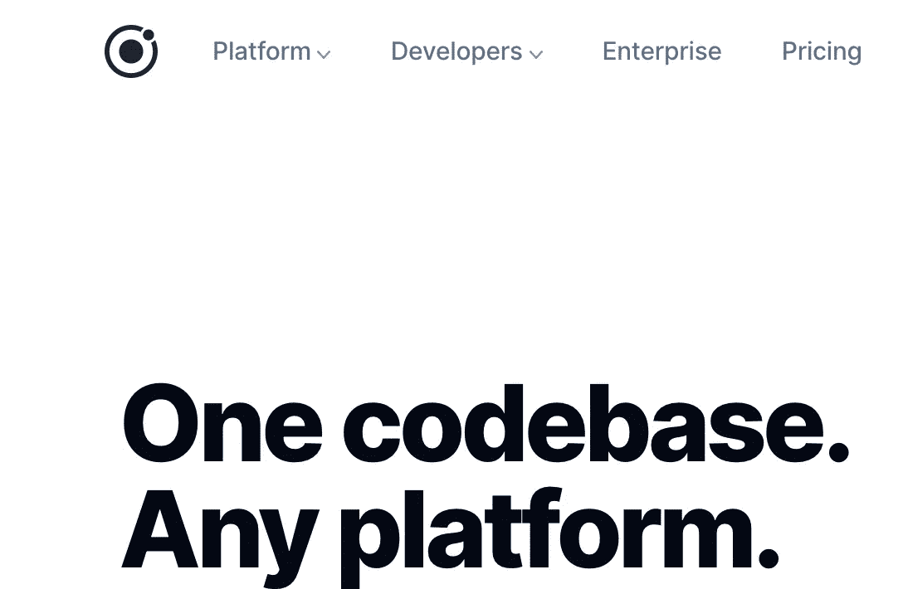
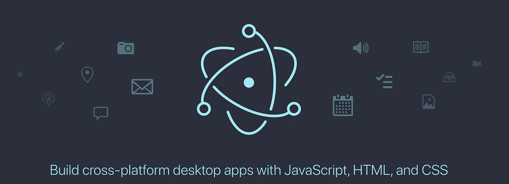
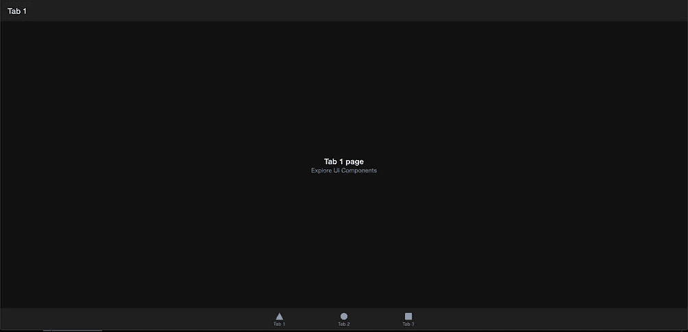
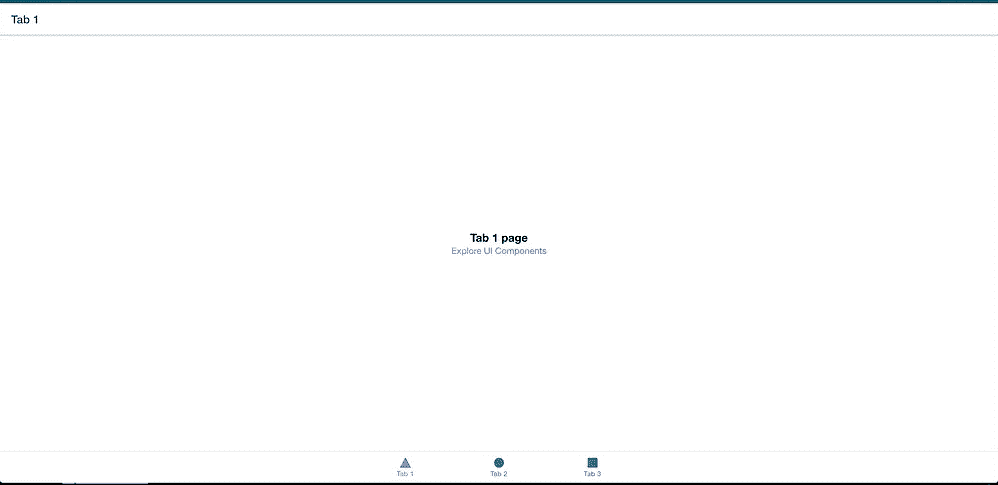
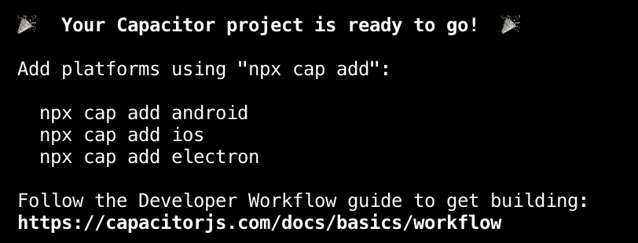
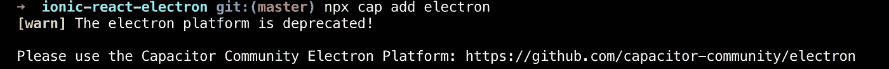
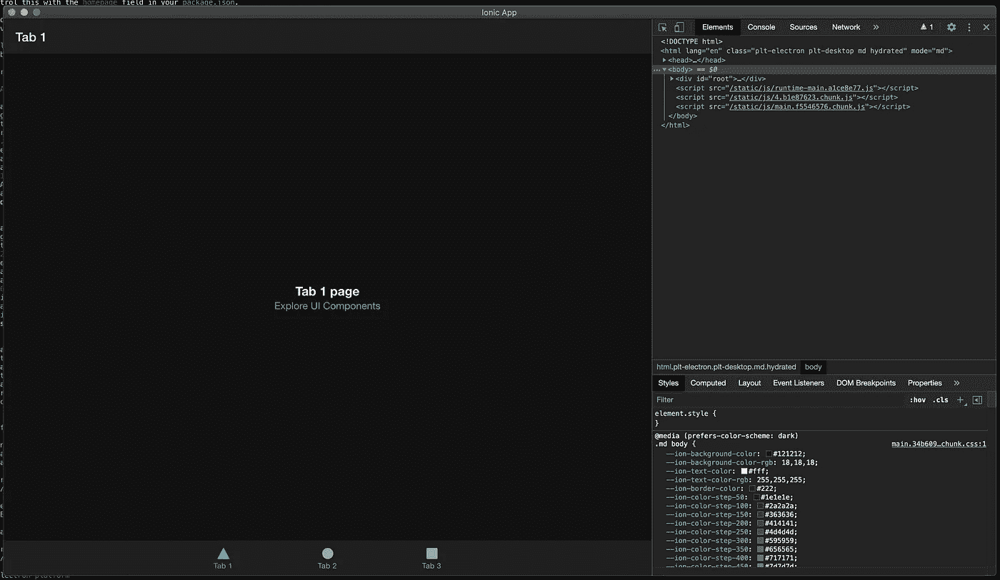

# 适用于 Windows 和 macOS 的 Ionic 应用

> 原文：<https://medium.com/geekculture/ionic-apps-for-windows-and-macos-3a1c5b5be1b9?source=collection_archive---------1----------------------->

## Ionic everything: Android、iOS、Web、Windows、macOS 等等。

虽然有两个阵营一直在争论我们是否需要选择原生移动应用程序或走混合道路，但 Ionic 提供了另一种选择，Ionic everything，就像字面上一样！

# 离子框架

我希望你一定听说过[离子框架](https://ionicframework.com/)。对于初学者来说，下面是[爱奥尼亚团队](https://medium.com/u/231a083a1e9?source=post_page-----3a1c5b5be1b9--------------------------------)网站对它的描述:



One codebase. Any platform.

它从 [angular.js](https://angularjs.org/) 开始，然后团队向前迈进，加入了 [Angular](https://angular.io/) 的潮流。我们大多数人会认为他们接受了 angular 框架，并使用它来创建他们的框架，以帮助我们开发新的 iOS 和 android 混合移动应用程序，但是….. ***没有*** ！ionic 团队并没有就此止步，v5 允许你使用 [Angular](https://medium.com/u/3f111935211b?source=post_page-----3a1c5b5be1b9--------------------------------) 、 [Vue.js](https://medium.com/u/9b930cf6db26?source=post_page-----3a1c5b5be1b9--------------------------------) 、 [React.js](https://medium.com/u/862877d46027?source=post_page-----3a1c5b5be1b9--------------------------------) 和 Vanilla [JavaScript](https://medium.com/u/bc49fc9f030d?source=post_page-----3a1c5b5be1b9--------------------------------) 。事情还没有停止，Ionic 允许你创建 macOS 和 Windows 应用程序。耶！没错！但是，。。。。。不完全是！

爱奥尼亚帮你创造一个[电子. js](https://www.electronjs.org/) 建筑。下一部分的魔力掌握在电子手中。什么是电子？

# 电子

电子允许你使用 HTML、CSS 和 JS 为大多数桌面操作系统创建混合应用程序。以下是他们网站上的内容:



Build cross-platform desktop apps with Javascript, HTML, and CSS

没听说过？多亏了 Electron，你一直在使用的许多桌面应用程序仍以目前的形式存在，例如 Skype、VS Code、Whatsapp、MS Teams 等。这里有一个[列表](https://www.electronjs.org/apps)中的几个。

# 它是如何与爱奥尼亚一起工作的？

很简单。

**两步(流程)。**

**离子**给你一个电子建造。

**Electron** 让你为 Windows 或 macOS 打造。让我们试一试，好吗？

# 让我们为你的 Ionic 应用程序开发一个电子版本

在开始创建你的应用之前，你需要安装 [node.js](https://nodejs.org/) 。

1.  现在，要开始创建你的 Ionic 应用程序，让我们先安装 Ionic(废话！).

`npm install -g @ionic/cli` (-g 代表全局)

如果您没有全局安装软件包的权限，可以跳过这一步。

2.创建您的 Ionic 应用程序(我们将在此使用 Ionic 团队定义的模板)

```
ionic start ionic-react-electron-app tabs --type=react --capacitoror if you don't have access to install packages globallynpx ionic start ionic-react-electron-app tabs --type=react --capacitor
```

在这里，我们使用 react.js 和 capacitor 创建了一个 Ionic 应用程序。

让我们试着运行这个应用程序，看看使用`tabs`模板我们能得到什么。要运行您的应用程序，请进入应用程序目录并运行:

```
ionic serve
```

> 一旦你的应用程序启动，它将为你打开一个浏览器窗口，默认打开应用程序的 URL(通常是 [localhost:8100](http://localhost:8100) 用于基于 react 的应用程序)。您的应用程序将如下所示。(取决于你的操作系统的主题)。



“tabs” template-based ionic app

3.接下来我们需要做的是使用`npx cap add <*platform*>`来添加我们希望我们的应用程序支持的平台，例如。



npx cap add <platform>

对于 Android: npx cap 添加 Android

对于 iOS: npx cap 添加 iOS

f̶o̶r̶̶e̶l̶e̶c̶t̶r̶o̶n̶:̶̶n̶p̶x̶̶a̶d̶d̶̶a̶d̶d̶̶e̶l̶e̶c̶t̶r̶o̶n̶

问题就在这里！当你创建你的应用程序时，你会得到上面的输出，但当你实际上试图添加电子作为平台时，Ionic 会给你一个警告，因为……它已经被*否决了。*



Ionic error: capacitor’s electron platform is deprecated

那怎么办呢？使用基于社区的电子平台插件？耶！让我们试一试。

安装电子插件

```
npm i [@capacitor](http://twitter.com/capacitor)-community/electron --save-dev
```

二。然后将它添加到您的 ionic 应用程序中

```
npx cap add @capacitor-community/electron
```

三。一旦你添加了电子，你应该试着运行你的应用程序离子应用程序的电子构建运行…

```
npx cap open @capacitor-community/electron
```

…你的应用程序将作为一个单独的应用程序加载，这要感谢 electron(以及它用来创建你的应用程序的 [Chromium](https://www.chromium.org/) )。



Electron build of ionic app

# 让我们创建你的电子应用程序的 windows 和 macOS 包(构建)

1.  在你的项目目录中，进入名为***‘电子’的文件夹。*** *(耶！你猜对了)。*
2.  此文件夹包含您几分钟前刚刚运行的电子构建应用程序。

## Windows 包

这实际上太简单了，你需要做的就是运行下面的命令

```
npm run electron:build-windows
```

> 这将下载电子，电子建设者为你和创造一个 *exe 文件*你的窗口建设。

## macOS 软件包

这也太简单了，事实上，和上面的太相似了。

```
npm run electron:build-windows
```

> 这将下载苹果电脑的达尔文版本，并创建一个你的 mac 版本的 dmg 文件

## 以上两个构建文件都在您的电子目录的“dist”文件夹中。

框架代码库的 URL 位于[https://github.com/psharneja/ionic-react-electron-app.git](https://github.com/psharneja/ionic-react-electron-app.git)

> 免责声明:
> 
> 所有的应用程序名称，框架名称是其各自所有者的财产，他们拥有所有的权利。(如果希望我删除任何姓名，请发表评论)
> 
> 这不是一个赞助的职位。
> 
> 在 ionicframework.com 的[阅读更多关于爱奥尼亚的信息](https://ionicframework.com/)
> 
> 在 https://www.electronjs.org/的[阅读更多关于电子的信息](https://www.electronjs.org/)
> 
> 您需要 mac for macOS 和 iOS build！

下次再见！