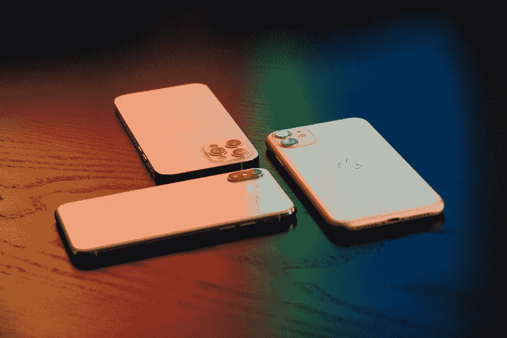

# iOS 15:7 App Store 和 Play Store 之间的重大 A/B 测试差异

> 原文：<https://medium.com/geekculture/ios-15-7-profound-a-b-testing-differences-to-expect-between-app-store-play-store-131520f26596?source=collection_archive---------14----------------------->

## 及时做好准备，让您的 ASO 经得起未来考验

Image by [Martin Sanchez](https://unsplash.com/@martinsanchez) ([Unsplash](https://unsplash.com/photos/gmKtdh9HfAU))

在 [WWDC 2021](https://developer.apple.com/wwdc21/) 上，苹果宣布发布*产品页面优化*，这款工具可以实现我们很多人对 iOS 应用商店优化(ASO)的一个梦想: **A/B 测试**。最后，应用商店的转化率优化(CRO)过程将…