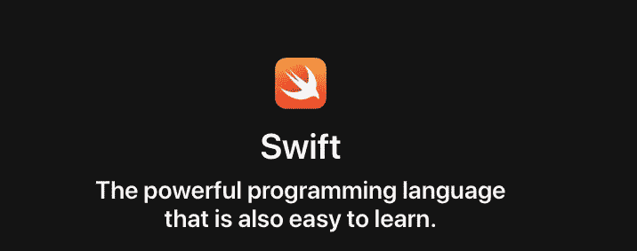
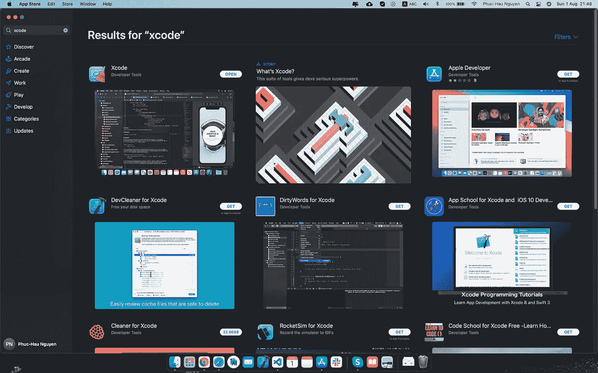
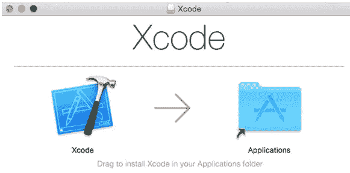
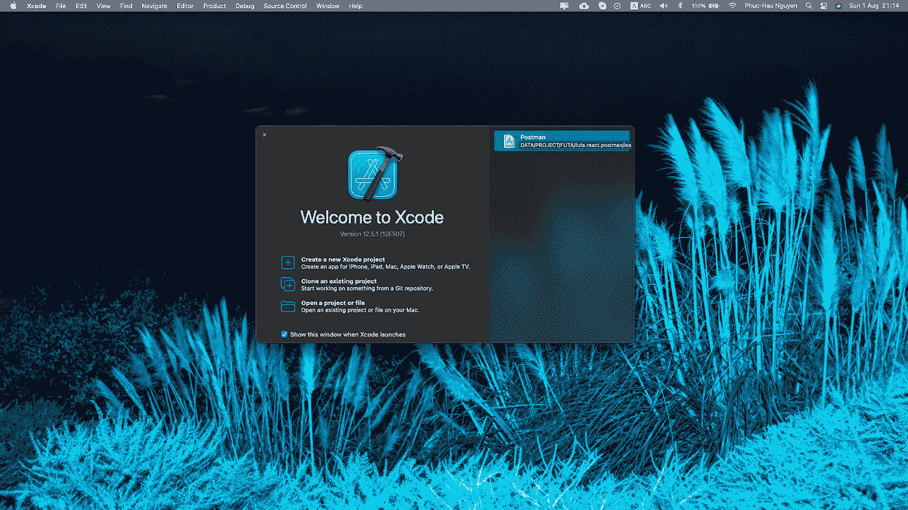
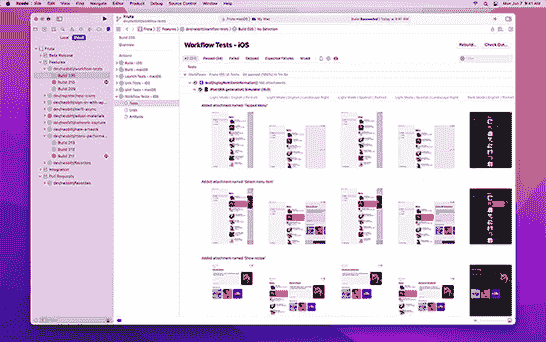
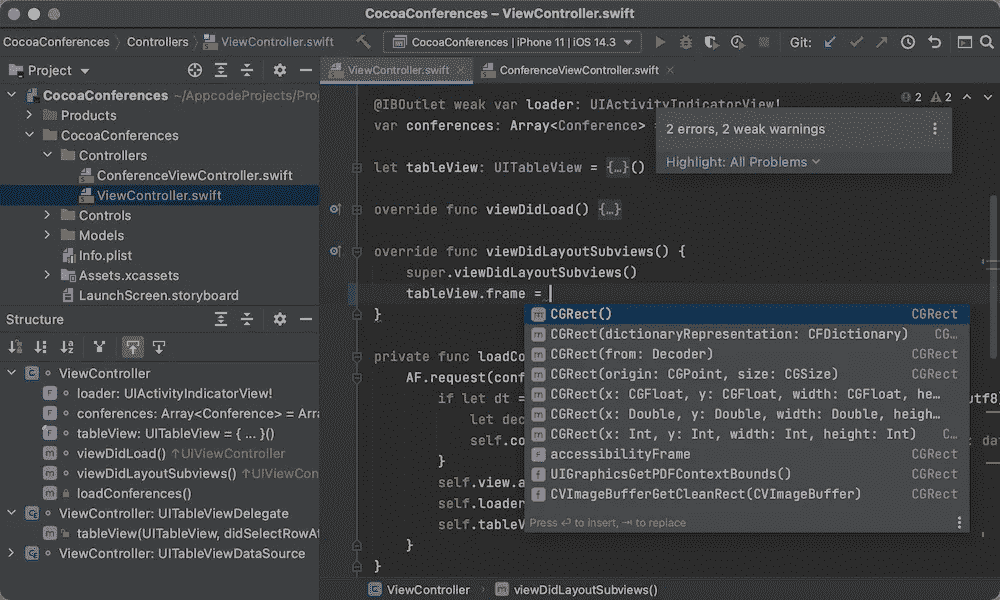
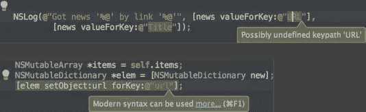
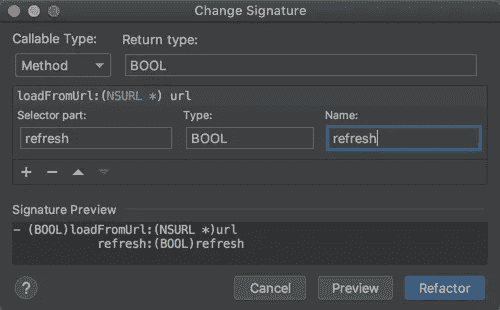
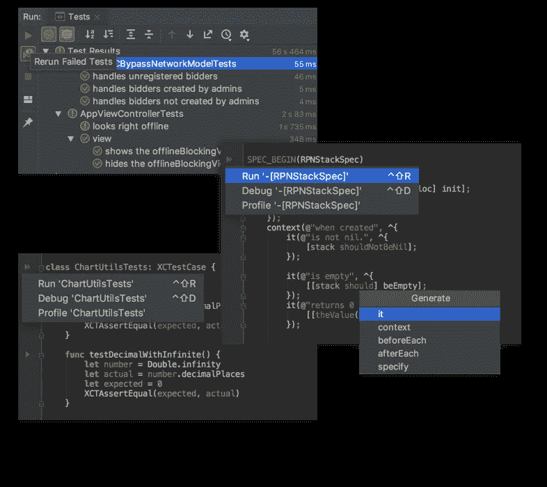

# iOS/Swift 系列:[#00]设置开发环境

> 原文：<https://medium.com/geekculture/ios-swift-series-00-setup-development-environments-825f976e4029?source=collection_archive---------29----------------------->

[https://developer.apple.com/swift/](https://developer.apple.com/swift/)

# 1.第一种方式:下载 XCODE

Xcode 结合 Swift 编程语言使得开发应用程序变得简单而有趣。

## 从 Apple Store 下载 Xcode

下载后点击 **Xcode.dmg** 文件，只需拖动 **Xcode** 并放入**应用**文件夹，如下图所示，我们的 Xcode 安装将需要 2 到 3 分钟。

[https://developer.apple.com/xcode/](https://developer.apple.com/xcode/)

使用 Apple 的集成开发环境构建、测试和提交您的应用程序。Xcode 由一套工具组成，开发人员使用这套工具为 Apple 平台构建应用程序。使用 Xcode 来管理您的整个开发工作流程，从创建应用程序到测试、优化和提交到 App Store。Xcode 可以启动它的开发工具，或者您可以从 Xcode >打开开发者工具菜单中单独启动它们:

*   当真实设备不可用时，在模拟环境中使用 Simulator 进行快速原型开发和测试应用程序。模拟器为具有不同设置、文件和操作系统版本的 iPhone、iPad、Apple Watch 和 Apple TV 设备提供了环境。更多信息，参见[模拟器帮助](https://help.apple.com/simulator/mac/current/)。
*   使用仪器来描述和分析您的应用程序，提高性能，并找到内存问题。仪器使用不同的工具收集数据并显示结果，这些工具称为*仪器*。更多信息，参见[仪器帮助](https://help.apple.com/instruments/mac/current/)。
*   使用 Create ML 为您的应用程序创建和训练自定义机器学习模型。更多信息见[创建 ML](https://developer.apple.com/documentation/createml) 。
*   使用 Reality Composer 构建 3D 作品和增强现实(AR)体验。更多信息，请参见[使用 Reality Composer 创建 3D 内容](https://developer.apple.com/documentation/realitykit/creating_3d_content_with_reality_composer)。

要开始使用 Xcode，请参见[为应用程序创建 Xcode 项目](https://developer.apple.com/documentation/xcode/creating-an-xcode-project-for-an-app)。更多信息，参见 [Xcode 帮助](https://help.apple.com/xcode/mac/current/)。

# 2.第二种方式:下载 APP 代码

[https://www.jetbrains.com/objc/](https://www.jetbrains.com/objc/)

## 高效的项目导航

立即跳转到项目中的任何文件、类或符号，使用分层和结构视图在项目结构中导航。

## 智能完成

AppCode 提供了两种类型的代码完成:基本的随键入完成，以及更高级的 SmartType 完成，用于精确过滤建议。

## 可靠的重构

通过安全、准确和可靠的重构，随时修改和改进您的代码。

## 彻底的代码分析

AppCode 一直在监控你的代码质量。它会警告您错误和气味，并建议快速修复以自动解决它们。

AppCode 为 Objective-C、Swift、C/C++提供了大量代码检查，并为其他支持的语言提供了大量代码检查。所有代码检查都是动态运行的。

# 文档

*   [Swift 编程语言](https://docs.swift.org/swift-book/index.html)
*   [Swift 标准库](https://developer.apple.com/documentation/swift/swift_standard_library)
*   [Swift Playgrounds 创作文档](https://developer.apple.com/documentation/swift_playgrounds)
*   Swift Playgrounds 作者模板

# 录像

*   [来自 WWDC 的会议视频](https://developer.apple.com/videos/developer-tools/swift/)

# 苹果书籍和大学课程

*   [Swift 编程语言](https://books.apple.com/us/book/the-swift-programming-language-swift-5-4/id881256329)
*   【Swift 应用开发简介
*   [使用 Swift 开发应用](https://books.apple.com/us/book/app-development-with-swift/id1465002990)
*   [斯坦福大学 CS193p —开发 iOS 应用](https://cs193p.sites.stanford.edu/)
*   [普利茅斯大学:Swift 的 iOS 开发](https://itunes.apple.com/us/course/ios-development-in-swift/id950659946)

# 参考

*   [https://developer.apple.com/swift/](https://developer.apple.com/swift/)
*   [https://cocoacasts.com/](https://cocoacasts.com/)