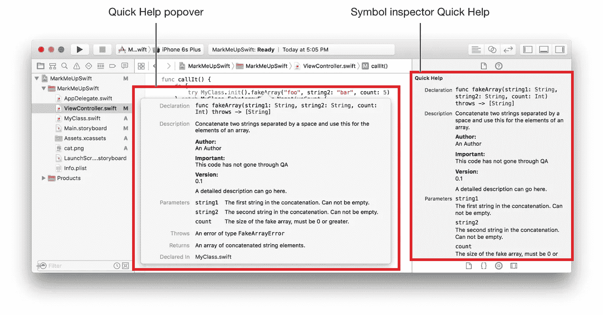

# iOS/Swift 系列:[#01]评论

> 原文：<https://medium.com/geekculture/ios-swift-series-01-comment-ec56e0ec9012?source=collection_archive---------34----------------------->

> 使用注释在代码中包含不可执行的文本，作为对自己的注释或提醒。编译代码时，Swift 编译器会忽略注释。

如果您是 Objective-C 开发人员，并且不熟悉 Python 或 Ruby 等现代语言，那么前面截图中的代码可能看起来非常奇怪。Swift 语言语法与 Objective-C 大相径庭，Objective-C 是……