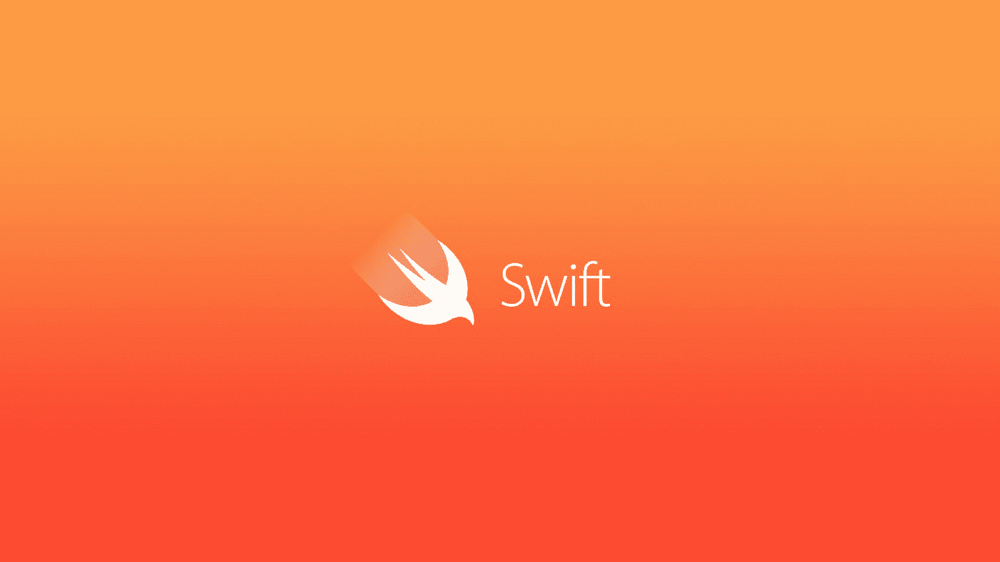

# iOS/Swift 系列:[#01]变量

> 原文：<https://medium.com/geekculture/ios-swift-series-01-variables-5bb07a7c05fc?source=collection_archive---------55----------------------->

[https://venturebeat.com/wp-content/uploads/2015/12/apple_swift.jpg?fit=1920%2C1080&strip=all](https://venturebeat.com/wp-content/uploads/2015/12/apple_swift.jpg?fit=1920%2C1080&strip=all)

> Swift 是编写软件的绝佳方式，无论是用于手机、台式机、服务器还是其他运行代码的设备。它是一种安全、快速、交互式的编程语言，结合了现代语言思维的精华、来自更广泛的 Apple 工程文化的智慧以及来自其开源社区的各种贡献。编译器针对性能进行了优化，语言针对开发进行了优化…