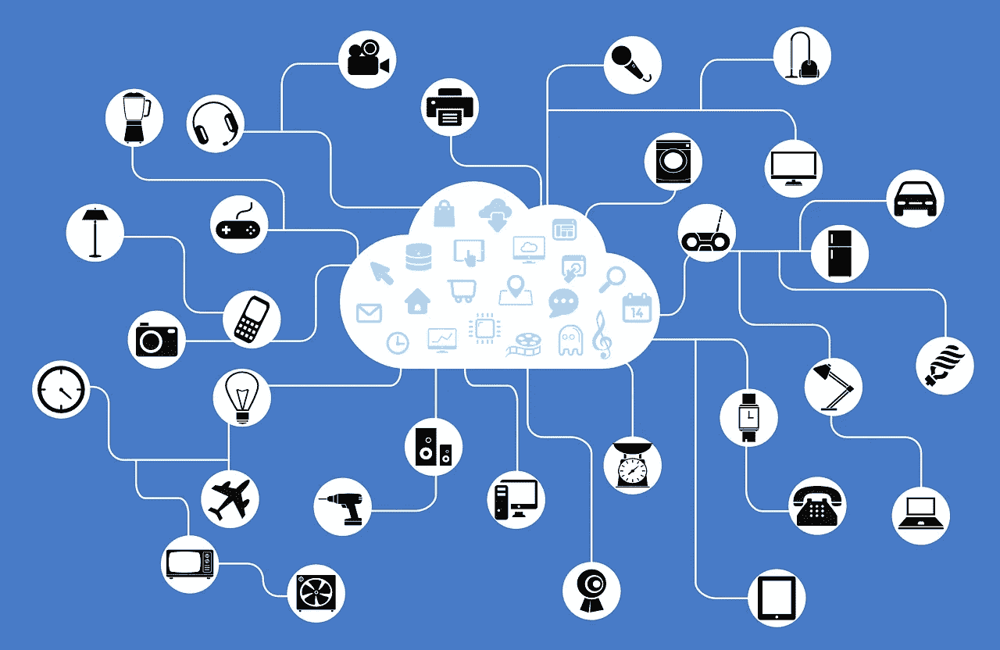

# 如今，物联网正在让人们的生活变得轻松，但依赖物联网安全吗

> 原文：<https://medium.com/geekculture/iot-is-easing-life-these-days-but-is-it-even-secure-to-rely-on-it-af89e0d7ea5a?source=collection_archive---------19----------------------->

众所周知，这是自动化的时代，*，还有 IoT(物联网)。企业已经改变了过去的经营方式，并准备好迎接数字化转型。新冠肺炎·疫情进一步推动企业采用数字化。这场数字化转型之旅为物联网设备及其大规模采用打开了大门。 [***物联网市场规模***](https://internetofthingsagenda.techtarget.com/post/How-to-secure-IoT-devices-and-protect-them-from-cyber-attacks) 的价值在 2016 年为 1150 亿美元，预计到 2023 年将上升至 1970 亿美元，从 2017 年到 2023 年以 7.5%的 CAGR 增长。*

*物联网设备的增长模式已经改变了企业收集、交换、检查和总结大量信息的方式。它用于从客户行为中获得洞察力，提高业务效率，从而降低运营成本并提高工作场所的安全性。毫无疑问，物联网让我们的生活变得更加高效和便捷。随着它们在我们的生活中找到了一席之地，我们必须意识到它们带来的安全威胁和网络攻击风险。事实上，物联网设备没有任何内置的安全性，这进一步使它们成为黑客的理想选择。由于许多物联网设备相互连接，如果黑客成功控制其中一个设备，就会危及其中许多设备的安全。*

# *为什么 IoT(物联网)安全至关重要？*

*让我们假设你买了一部智能手机，它收集关于你和你生活方式的信息。由于手机储存了你个人生活的数据，因此，你的信息安全是你首先应该担心的事情。不幸的是，我们只能估计这些设备像宣传的那样工作，因此可以保护您的个人信息。*

*数字化转型引领了个人信息在多种设备和硬件上的存储方式。鼓励个人对其个人数据的安全负责，并积极参与其中。尽管如此，在大多数情况下，客户与 [***网络安全***](https://shuftipro.com/blog/cybersecurity-vs-user-experience-knowing-the-art-of-balancing/) 之间的联系具体涉及计算机。与传统网络技术中围绕软件的问题相反，当数字和物理世界融合时，物联网安全事务就会出现。只有设备本身受到保护，这些解决方案才能得到保障。*

*物联网是一个由设备、电器和其他东西组成的网络，这些东西通过软件连接到互联网。这意味着，不仅仅是智能手机和计算机会向网络罪犯泄露您的个人数据，任何以数字方式交互的设备、车辆和系统都有能力泄露您的个人信息。不仅仅是财务数据，网络犯罪分子还可能访问链接的车辆来关闭安全功能。因此，可以说连接的设备越多，黑客控制你的安全的机会就越多。*

# *物联网—安全实践*

*从电器到智能手表，几乎每一个科技设备都可以连接到其他设备和互联网。物联网安全反映了广泛的方法、规划、工具和安全措施，旨在保护基于网络和互联网连接的设备免受操纵，从而应对可能的网络攻击。*

*安全专业人员鼓励个人层面的最佳实践来保护个人信息；然而，完全依赖它们是不够的。相反，建议侧重于加强技术，增强用户界面，以及技术方面的其他事情，以确保物联网的安全。*

*物联网开发人员可以利用 [***多种验证方法***](https://shuftipro.com/blog/identity-theft-protection-8-security-issues-every-business-needs-to-deal-in-2019/) 在其设备中建立信任:*

*   ***出生证明***

*开发人员可以在每台设备中建立一个特殊的标识符，如密钥或序列号(高级在线操作中使用的密码)。*

*   ***挑战-回应***

*必须教会设备以特定的方式响应请求。例如，当用公钥暗示时，提供一个被接受的私钥。*

*   ***设备指纹识别***

*部署设备的识别操作，以建立行为特征，并对照预测的结果进行验证。*

*   ***环境检查***

*根据前景(时间、IP 地址)衡量设备的工作环境。*

*   ***一次性信任场合***

*在设备生命周期的特定时间点观察信任度，并在条件保持不变的情况下维持更长时间。例如，如果设备在安全的环境中启动，并且仍然连接到互联网，那么它是可信的。*

*用 [***身份验证***](https://shuftipro.com/identity-verification) 对于个人来说，最好的方法不是仅仅依靠单一的方法。相反，将各种方法结合起来使用可以提供完美的安全模型。此外，降低风险的高级策略依赖于相关的威胁。核电厂的安全性与智能电视模块不同。开发人员需要考虑成本和风险因素，以确定所需的安全级别。*

# *总结一下*

*随着物联网设备的趋势不断上升，我们的周围将充满智能设备，这些设备正成为黑客的潜在目标。只有一种方法可以保护存储在智能设备中的个人信息，那就是首先保护物联网设备的安全。有多种方法可以用来保护物联网设备，例如设备指纹识别、挑战响应和一次性事件等。*