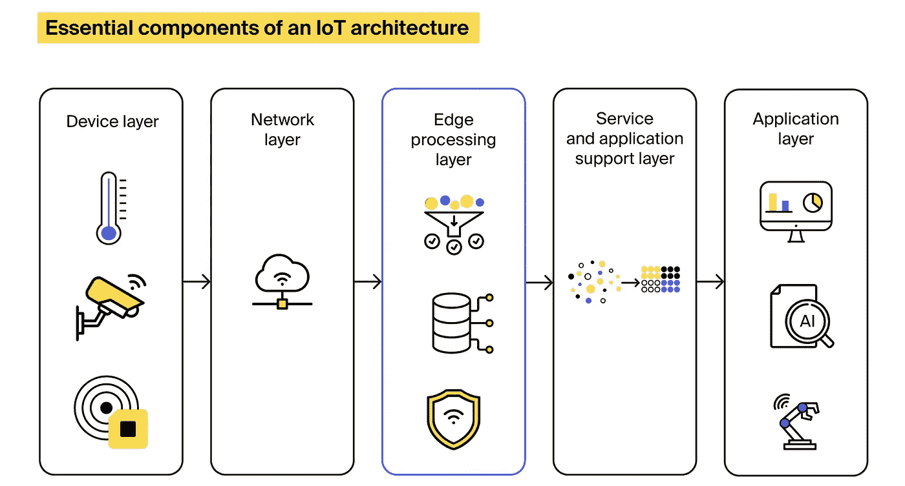
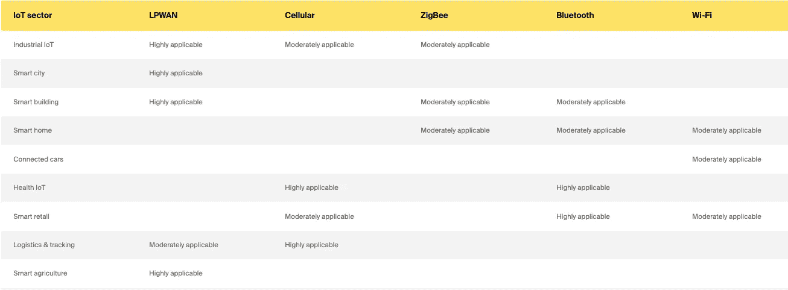
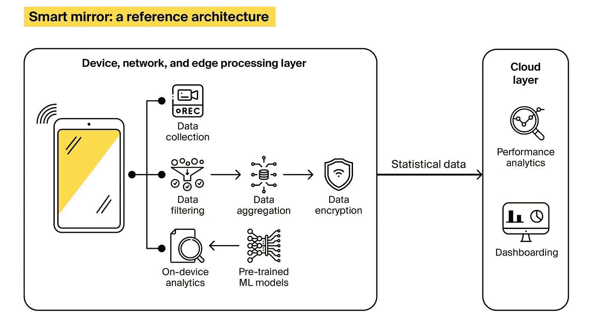

# 物联网解决方案架构:组件和设计技巧概述

> 原文：<https://medium.com/geekculture/iot-solution-architecture-an-overview-of-components-design-tips-60075f65d79c?source=collection_archive---------6----------------------->

企业正在继续追赶物联网的潮流，并转向物联网咨询公司。根据[最近的研究](https://www.globenewswire.com/news-release/2022/01/13/2366783/0/en/Global-Internet-of-Things-IoT-Market-Size-To-Hit-USD-1-842-Billion-by-2028-at-a-24-5-CAGR-Growth-with-COVID-19-Analysis-Facts-Factors.html)by Facts&Facts，全球物联网市场预计到 2028 年将达到 18，420 亿美元，CAGR 增长率为 24.5%。然而，推广物联网并不容易。Beecham Research 报告称，75%的物联网项目要么没有达到设定的预期，要么失败了。

一个常见的原因是缺乏规划和由此产生的技术挑战。有助于避免失败风险的是提前规划物联网架构的蓝图。在这篇博客文章中，我们揭示了物联网架构的基本组件，并使用 ITRex 产品组合中的一个项目示例展示了设计物联网架构在实践中可能的样子。

让我们直入主题，从最基本的开始。

# 什么是物联网架构？

物联网架构是硬件和软件组件的混合，它们相互作用，构成智能网络数字系统。这些组件相互操作，构成了构建物联网解决方案的基础。在我们深入细节之前，让我们先搞清楚:设计物联网架构没有一刀切的方法。尽管如此，不管解决方案如何，基本布局基本上保持不变。

# 标准物联网架构:引擎盖下是什么？

常见的数据驱动物联网应用依赖于跨越四层的标准物联网架构:

*   设备层
*   网路层
*   服务和应用支持层
*   应用层

然而，最近越来越多的连接系统开始将重点转向边缘处理，这导致在传统的四层架构中增加了一层。在边缘执行的活动的份额取决于特定的实现，但它通常包括启用连接，以及过滤、聚合、保护和处理传入的数据。因此，具有边缘分析功能的通用物联网解决方案的架构可能如下所示:

# 设备层

设备层包括所有种类的智能、连接的设备或非电子物体，它们通过相机和/或传感器以及可选的致动器得到增强。传感器从外部世界获取数据，并将其转换成电信号，以便计算机进行处理。物联网传感器的大小和用途各不相同。它们能够记录所有类型的信息——从温度到运动到湿度，等等。反过来，执行器使连接的设备根据处理中心发出的命令动作。一旦执行器收到命令，它就会让设备以特定的方式运行。例如，智能照明系统可以在检测到附近有运动时打开灯。

# 网路层

网络层包含连接设备层和物联网架构后续层的不同通信技术。根据所讨论的物联网解决方案，可以直接或通过网关实现设备连接。后者通常适用于无法直接连接或协议不匹配的传统设备。现代物联网解决方案依赖于以下通信技术:

*   低功耗广域网是专为支持大规模物联网解决方案而构建的。LPWAN 为深远的通信提供了机会，同时具有节能、持久和廉价的特点。缺点是 LPWANs 只能以相当低的速率传输少量数据，因此更适合对时间不敏感且不需要高带宽的用例，如智能建筑或工业物联网。
*   Zigbee 是一种短程无线通信标准，最适合节点均匀分布在附近的中程物联网应用，例如智能家居。与 LPWAN 相比，Zigbee 可提供更高的数据速率，但能效较低。
*   蜂窝网络(3G/4G/5G)提供可靠的宽带通信，因此非常适合支持联网汽车、交通路由、车队管理或高级驾驶辅助等用例。然而，蜂窝网络与电池供电的传感器网络不能很好地配对，并且会产生高昂的运营成本，这限制了它们的使用。
*   蓝牙提供短程通信，用于小型消费物联网设备，如运动或医疗保健可穿戴设备、[身体设备互联网、](https://itrexgroup.com/blog/internet-of-bodies-iob-definition-benefits-examples/)和智能家电。
*   Wi-Fi 支持高吞吐量数据传输。尽管如此，由于覆盖范围、可扩展性和能耗问题，Wi-Fi 通常不是扩展物联网网络或电池供电的物联网设备的可行选择。相反，它更适合连接到电源插座的智能设备，如智能家居设备、安全摄像头或数字信号。
*   RFID 使用无线电波将少量数据从 RFID 标签传输到附近的阅读器。这种通信技术广泛应用于物流和零售。

为了更好地了解哪种通信技术适合您的解决方案，我们编制了一个表格，总结了每种技术的首选用途:

# 边缘计算层

边缘处理层由网关、本地服务器或分散在网络中的其他边缘节点组成。引入边缘设备的想法是在靠近其来源的地方存储和处理数据，只将一部分生成的记录发送到云，或者以预设的间隔将数据批量上传到云，而不是实时传输。除了处理数据，边缘层还可以过滤、聚合和加密传入的信息。

在本地处理数据有助于节省将所有生成的记录传输到云所需的时间和资源。因此，这样做可以获得更好的延迟和更高的性能。对于需要实时分析数据并要求内置可扩展性和增强安全性的物联网用例，例如医疗物联网系统、CCTV 系统或智能汽车，添加边缘层是一个可行的选择。

# 服务和应用支持层

这是物联网设备收集的大部分数据的最终归宿。因此，服务和应用程序支持层用于积累、处理和存储数据。这里发生了两个基本过程:

*   数据积累物联网系统会产生海量数据，并非所有这些数据都需要立即付诸行动。因此，物联网架构可能会有一个数据湖来存储所有生成的信息，并且只将经过清理和过滤的记录发送到数据管理管道。因此，这一阶段的主要目标是将所有数据汇集在一起，确定某一特定信息是否与业务需求相关，并决定如何存储它——是存储在临时数据库中还是数据仓库中。
*   数据抽象在这个阶段，来自物联网设备的信息被来自相关外部来源的数据放大。这些可能包括 ERP、EMR 和其他企业系统。经过转换以匹配统一的格式后，数据被转移到集中存储，例如数据仓库，在那里可以方便地访问数据以获得洞察力。

# 应用层

在应用层，来自物联网设备和外部来源的累积、处理和集成数据通过分析算法运行，分析结果呈现给用户。应用程序的类型因物联网系统的业务需求而异。它们可能包括通过执行器、商业智能工具或依赖于机器学习和人工智能的高级分析解决方案向最终用户提供可视化见解或控制物联网设备的 web 或移动应用。

# 在实践中设计物联网架构:前方等待着什么？

现在，我们已经阐明了物联网架构的理论概念，让我们看看设计在实践中可能是什么样子。为了说明构建物联网解决方案的特点，我们将转向来自 ITRex 投资组合的一个项目。

我们的一个客户向我们求助，希望制造一个[智能健身镜](https://itrexgroup.com/case-studies/ai-powered-fitness-mirror-with-a-personal-coach-inside/)，帮助人们在家里像在健身房一样有效地锻炼。这种镜子将取代健身教练，“观察”一个正在锻炼的人，为训练课程提供反馈，并为未来的锻炼准备量身定制的训练计划。ITRex 的工程师接受了这一挑战，并为该解决方案设计了一个架构，涵盖了从硬件到固件到最终用户移动应用的所有内容。

我们最终设计的架构非常注重边缘计算。来自镜子传感器和摄像头的大部分数据在设备本身上处理，只有一部分统计信息被传递到云端。

[ITRex](https://www.linkedin.com/in/kstashevsky/)的首席技术官 Kirill Stashevski 解释了优先选择边缘计算而不是传统的基于云的模型:“我们测试了两种方法，边缘计算在提供更高性能方面取得了胜利。因此，来自镜子摄像头和附着运动传感器的数据会在产生数据的地方进行分析。这节省了大量时间，并有助于降低运营费用。这就是设计成功的物联网架构的问题——你必须做出选择并测试假设，选择最适合你的方案。”因此，该解决方案的高级架构如下所示:

镜子配备了人工智能网络，这些网络根据人们健身的大量视频片段进行预训练。当一个人进行锻炼时，他们会被镜子内置的摄像头记录下来，视频镜头会立即通过人工智能网络运行，将锻炼与参考模型进行比较。

因此，人工智能引擎会生成关于一个人的健身程序是否健康的实时建议，并建议所需的改进——无论是重量、技术还是强度。当受训者使用镜子时，视频画面被用来个性化本地部署的人工智能网络，因此建议的质量随着时间的推移而提高。

根据 Kirill 的说法，个性化是我们选择面向边缘架构的另一个原因。基于镜子实际使用环境中记录的视频在本地训练网络，产生的结果远远好于依赖通用内容在云中训练算法。选择以边缘为中心的架构的另一个原因是隐私，因为在靠近生成数据的地方处理数据可以省去通过网络传输镜头进行分析的需要。

尽管是面向边缘的，但该解决方案的架构也包含云部分。但是，它的主要目的是收集镜像使用和性能的统计数据。该解决方案的另一个组成部分是一个社交移动应用程序，供最终用户记录他们的表现，与朋友分享，并一起训练。

# 回顾一下，或者为什么提前设计物联网架构的蓝图至关重要

如果您打算采用物联网，那么尽早为未来的解决方案设计一个经过深思熟虑的架构是至关重要的。架构不佳的系统不可扩展，也无法应对复杂性，而设计良好的物联网架构可以让您规划未来，并保证:

*   可维护性。架构良好的物联网系统维护起来更容易、更便宜。因为包含所有组件、流程和集成的大图是清晰的，所以跳到较小的任务会更简单。当谈到项目外包时，架构良好的系统也有助于引进新的人才，并减少知识转移所需的时间。
*   可扩展性。规划好初始架构后，纵向和横向扩展物联网系统、引入新功能或添加更多终端节点变得更加简单。
*   性价比。花时间彻底设计您的物联网系统有助于做出更好的技术选择，从而降低物联网解决方案的开发和运营成本。
*   高性能。拥有清晰的架构愿景有助于构建更好的数据流，以及用适当的工具处理传入的数据，这有助于实现更高的系统性能。
*   互操作性。物联网架构可以跨越使用不同通信协议的多个设备，这些设备并不总是能够很好地配对。经过深思熟虑的物联网架构有助于确保不同的设备和组件能够顺畅地协同工作。
*   安全。通过将最初的努力投入到系统设计中，您可以避免安全漏洞并规划出必要的物联网安全机制。

如果您有任何未解答的问题，或者想在几乎没有风险的情况下加入物联网潮流，[请联系 ITRex 物联网开发团队](https://itrexgroup.com/contact-us/)。他们将帮助您设计可靠且可扩展的架构，为您未来的解决方案提供支持。

*原载于 2022 年 5 月 10 日*[*【https://itrexgroup.com】*](https://itrexgroup.com/blog/iot-architecture-components-design-tips/)*。*