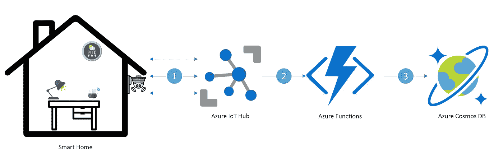

# 物联网解决方案—针对使用 Azure Cosmos DB 的智能家居遥测数据

> 原文：<https://medium.com/geekculture/iot-solution-smart-home-system-using-azure-cosmos-db-ae4fca275ec7?source=collection_archive---------8----------------------->

## 讨论如何为智能家居中的物联网设备发送的遥测数据选择和设计数据库。

Smart Home System using Azure Cosmos DB and IoT Hub

## 背景

智能家居不再是一个新概念，尤其是对那些热衷于技术的人来说。智能家居中最常见的智能设备可能是…