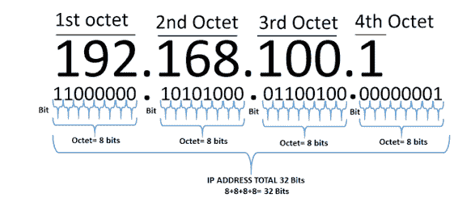
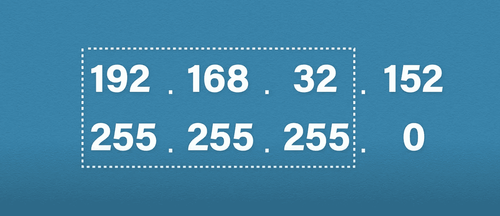

# IP 地址解释

> 原文：<https://medium.com/geekculture/ip-addresses-explained-8e8a9c976db4?source=collection_archive---------13----------------------->

你好。我想分享我在本周空闲时间学到的信息。那就是:IP 地址，或者被技术大神称为[TCP/IP 协议框架](https://sourcedaddy.com/windows-xp/the-tcp-ip-protocol-framework.html)。

> “TCP/IP 连接中的**客户端**是“拨打电话”的计算机或设备，**服务器**是“监听”来电的计算机。”
> 
> - [塔尔技术公司](https://www.taltech.com/datacollection/articles/a_brief_overview_of_tcp_ip_communications)

这个话题引起了我的注意，因为尽管我是 Z 一代的忠实成员，也是大多数社交网络的狂热用户，但我从未停下来了解我的设备如何在网络上相互通信。显然，我们大多数人都见过印在家用路由器背面的 IP 地址，甚至可能是在摆弄较小设备的设置时偶然看到的数字子集。但是这些数字代表什么呢？大家讨论一下。

# 首先要做的是…

我敢肯定，当你知道我们使用的互联网和网络不是通过我们给它们取的有趣和时髦的名字来识别我们的设备时，你不会感到震惊。计算机用数字进行通信，它们的 IP 地址被用作在表面下发生的真正的二进制编码的标识符。

“IP”代表“互联网协议”，是传输控制协议/互联网协议(TPC/IP)的一部分。简称“IP”。TCP/IP 是大多数网络用于通信的语言。

当涉及到我们的互联网兼容设备时，实际上涉及到几个 IP 地址。无论是公共的还是私人的。私有地址与整个互联网通信。这是您在家用路由器上看到的由互联网服务提供商(ISP)分配的号码。路由器处理来自设备的所有流量，并将其路由到互联网。(所以才叫路由器。)本质上，私有 IP 与公共 IP 进行通信。

早在该协议的早期，就决定将所有可用的地址分成组。这些组被称为类。想法是使地址分配可扩展。我们就来说说**主**三类。

*甲类*

A 类地址介于 1.0.0.0 和 126.255.255.255 之间，子网掩码为 255.0.0.0。单个 A 类网络可用的主机数量为 16，777，214 台。庞大的网络。

*B 类*

B 类地址介于 128.0.0.0 和 191.255.255.255 之间，子网掩码为 255.255.0.0。单个 B 类网络可用的主机数量为 65，534 台。还是大。

*丙类*

C 类地址介于 192.0.0.0 和 223.255.255.255 之间，子网掩码为 255.255.255.0。单个 C 类网络可用的主机数量为 254 台。这最常用于小型企业和家庭互联网连接。

> ….之后再也不想打‘255’了。

# 子网掩码

子网掩码总是与 IP 地址成对出现。它用于标识地址的网络部分和主机部分。最简单的形式是，只要你看到“255 ”,这就是网络的一部分。每当你看到一个零，这是地址的主机部分。

Example pictured

** * *在一个 IP 中，每组三个数字被称为一个* ***八位位组*** *。每个二进制八位数包含 8 位，因此整个地址的总数相当于 32 位。*

# 从 IPv4 到 IPv6

由于技术变得越来越普及，我们的地址越来越少，2012 年推出了新版互联网协议，其中包括一个减缓 IP 地址使用速度的系统。这叫 NAT。

NAT 代表网络地址转换。它从您的网络内部获取多个 IP 地址，并提供一个单一的 IP 地址，指向互联网，从而减少使用的 IP 地址数量。只有公共 IP 地址才能在互联网上使用。它必须是一个唯一的数字。

您的 ISP 向您发放您在互联网上使用的公共 IP。这有助于延长 IPv4 的寿命，因为我们只使用一个设备，而不是为我们拥有的每一个设备使用互联网兼容地址。

**我的公共 IP 是什么？**

打开浏览器，去谷歌，输入“我的 IP 是什么？”。然后它会显示你的公共 IP 地址。

# 关于私有知识产权的说明

私有地址的好处在于任何人都可以使用。例如，您的邻居也可能使用与您相同的 IP 地址。这很好，因为私有 IP 地址只需要在您自己的网络中是唯一的。

# **类比**

想想这个。

为了让美国邮政署​(USPS)发挥作用，一个*社区*(公共)中的每栋*房屋*(私人)都需要有自己唯一的地址。如果你要寄信，目的地地址会写在信封上，寄给*家*(私人)，这样邮递员就知道该把信送到*社区*(公共)的什么地方。如果地址不是唯一的，你的信可能会寄给别人，或者你可能会收到别人的邮件。

— — — -

嘿！如果你对这个描述有任何进一步的补充，解释我们的万维网是如何工作的，请不要犹豫，公开评论这个帖子或私下给我发消息。(看我在那里做了什么)。我知道我只知道这么多，我很乐意接受反馈。

感谢阅读。:)