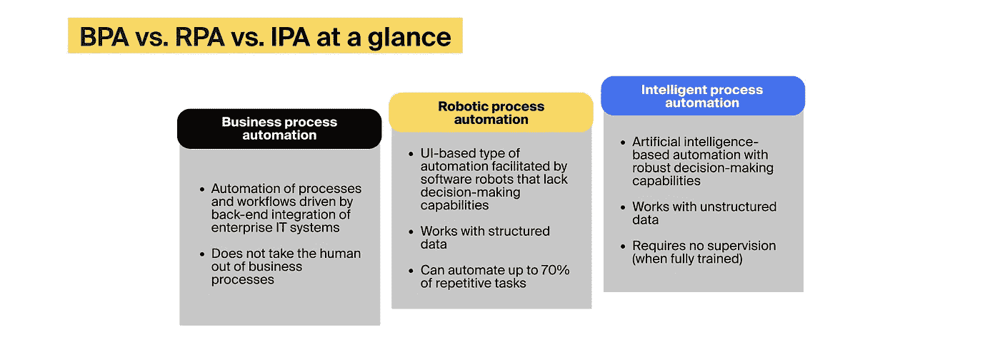
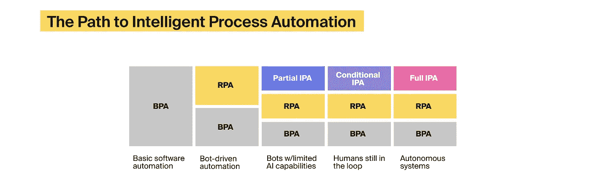

# IPA vs. BPA vs. RPA:你的公司应该选择什么

> 原文：<https://medium.com/geekculture/ipa-vs-bpa-vs-rpa-what-should-your-company-choose-1189e36c014f?source=collection_archive---------16----------------------->

业务流程自动化(BPA)、机器人流程自动化(RPA)和智能流程自动化(IPA)是属于更广泛的团队(业务流程管理(BPM ))的术语。BPM 概念围绕着通过审计、场景建模、监控和持续优化来改进业务流程。其结果可能涉及数字化和自动化，但总体而言，BPM 活动是以人为中心的。

另一方面，BPA、RPA 和 IPA 系统涉及一定程度的自动化。其复杂性可能包括从公司的 IT 基础架构和第三方服务中收集数据，到根据实时和历史销售数据补充库存。然而，商业人士经常将 IPA 与 RPA 和 BPA 混为一谈，这可能会在为您的公司评估自动化选项时带来混乱。

在本文中，我们将调查 IPA、BPA 和 [RPA 解决方案](https://itrexgroup.com/services/robotic-process-automation/)之间的主要差异和相似之处，分析业务中采用自动化的驱动因素，并提供为您的组织选择可行的自动化选项的专家提示。

# BPA vs. RPA vs. IPA:有什么区别？

IPA vs. RPA vs. BPA: key differences. Image source: custom (ITRex Group)

# 了解业务流程自动化

作为实现企业自动化的第一步，业务流程自动化依赖于由“如果-那么”编程和 API 集成驱动的现成或定制软件。

这些系统连接了公司 IT 基础设施中的其他应用程序，并促进了数据在 ERP、CRM、DMS 和项目管理解决方案之间的移动。

BPA 软件简化了客户账户管理、员工入职、报告生成和电子采购等日常工作。

例如，没有利用业务流程自动化的人力资源部门必须通过电话安排与候选人的面试，在相关部门之间手动传送他们的论文，通过跟进确保文档审查，并让新员工入职。

有了 BPA，候选人只需填写一份在线表格，该表格就会自动转发给公司的人力资源、会计和法律部门，从而消除了重复的文书工作。在审查过程中，由于自动通知，候选人可以随时了解情况。如果候选人被录用，在企业学习管理系统的帮助下，入职流程只需几个小时，而不是几天。

如果您的工作涉及以下内容，您的公司应该考虑投资业务流程自动化:

*   跨整个 IT 基础架构的数据聚合
*   广泛的服务台支持
*   员工出勤和项目时间跟踪
*   频繁的采购操作
*   多级审批工作流

# 了解机器人过程自动化

机器人过程自动化的目标是减少人类重复性任务的劳动强度。这项技术依赖于软件机器人，这些机器人在用户界面上模仿人类活动，像你的员工一样登录软件系统并与之互动。

RPA 仅适用于[结构化数据](https://itrexgroup.com/blog/your-unstructured-data/)，这些数据可以很容易地组织成表格。因此，RPA 机器人在 RPA 工程师指示的地方寻找特定信息。除非 RPA 工具增加了人工智能功能，否则它们无法对它们使用的数据或它们修改的流程做出判断。

专家认为 RPA 是一种快速、非侵入式的自动化形式，既不会中断您公司的业务流程，也不需要彻底检查 IT 基础架构。然而，如果您未能协调您的业务和 IT 团队或选择错误的自动化流程，您的 [RPA 项目很容易出错](https://itrexgroup.com/blog/top-rpa-challenges-and-ways-to-overcome-them/)。如果您的员工:

*   处理大量结构化数据
*   经常执行复制和粘贴操作
*   处理涉及多个利益相关方的流程
*   生成大量报告

## 业务流程自动化与机器人流程自动化

RPA 和 BPA 之间的主要区别源于自动化技术的本质。虽然业务流程自动化不会将人从流程中抽离出来，但高级 RPA 工具可以完全[自动化文档密集型行业中高达 70%](https://itrexgroup.com/blog/rpa-in-healthcare/) 的任务。

BPA 与 RPA 的其他显著特征包括:

*   技术架构。为了有效地运行，BPA 工具应该在后端级别与您公司的 IT 系统和第三方服务集成。机器人流程自动化结合了 API 和用户界面交互，作为企业软件的附加组件。
*   自动化水平。业务流程自动化依赖于员工在整个组织中验证和传递信息。例如，当 BPA 解决方案在 IT 系统中检测到丢失的数据时，它们会发出错误信号并通知人类专家。相反，RPA 机器人会尝试自己寻找丢失的数据。
*   开发成本。业务流程自动化解决方案的成本[可能在中间层软件系统的 10，000 美元到 100，000 美元之间](https://www.cmswire.com/information-management/bpa-vs-rpa-how-are-they-similar-how-are-they-different/)，相比之下，RPA 工具[的实施成本](https://itrexgroup.com/blog/robotic-process-automation-cost/)更低。

# 了解智能过程自动化

智能流程自动化将 BPA 功能和 RPA 机器人与人工智能的不同[子集相结合，如](https://itrexgroup.com/blog/ai-types-subsets-use-cases/)[计算机视觉](https://itrexgroup.com/services/computer-vision/)，自然语言处理[机器学习](https://itrexgroup.com/services/machine-learning-development/)。

IPA 技术建立在转移学习的概念之上，这意味着公司可以将针对特定任务训练的算法用于其他相关工作。

[IPA 解决方案](https://itrexgroup.com/services/intelligent-process-automation/)帮助公司执行[数据分析](https://itrexgroup.com/services/data-analytics/)并在单个业务部门或全公司范围内自动化决策。

虽然人类员工需要在智能自动化部署的早期阶段监控 IPA 系统的性能，但人工智能算法的准确性和自主性会随着时间的推移而提高。

ITRex 团队通常鼓励客户在以下情况下尝试智能过程自动化:

*   一个组织会产生大量的非结构化数据
*   它的工作流程是知识密集型的(比如信用评估)
*   公司的员工需要不断检查数据的不一致性和可能的欺诈

## 智能过程自动化与机器人过程自动化

机器人过程自动化与智能自动化有何不同？

RPA 与 IPA 的差异可以归结为三个基本特征:

*   与 RPA 工具不同，人工智能自动化解决方案可以分析非结构化数据，如纯文本、图像、视频、社交媒体帖子和传感器读数，或者将其转换为适合机器人流程自动化的格式
*   机器人过程自动化系统接管独立的任务，而 IPA 系统可以协调整个过程
*   虽然一些 RPA 机器人显示出有限的认知能力，但它们的逻辑是由软件工程师规定的。相比之下，训练有素的人工智能系统可以消耗新数据，变得更加智能，几乎不需要你的内部 IT 团队或第三方顾问的参与

# 为什么您的公司应该尽快摆脱 BPA 与 RPA 和 IPA 的困境

通过在特定部门或整个组织中采用自动化技术，企业可以防止员工流动，降低运营成本，并超越竞争对手。

麦肯锡在 2020 年调查的 66%的公司正在试验自动化业务流程的解决方案，而 31%的受访者至少有一项业务功能完全自动化。

不出所料，关于 IPA vs. RPA vs. BPA 的争论现在比以往任何时候都更加激烈。对业务流程管理技术日益增长的兴趣是由几个因素推动的:

*   数字化转型热潮。新冠肺炎疫情和随后的封锁成为现代史上最大的数字化刺激。今天，大型企业部署了超过 [175 个不同的应用程序，](https://www.okta.com/businesses-at-work/2021/)，而较小的公司平均使用 73 个应用程序。鉴于仅在美国，今年的 IT 支出就可能[超过 2 万亿美元](https://www.statista.com/statistics/821769/us-spending-it-products-services-staff/)，数字繁荣没有显示出放缓的迹象。
*   信息过载。为了有效地完成工作，现代员工必须经常在近 200 个应用程序之间切换！这反过来又会导致信息过载，使一家拥有 50，000 名员工的公司每年损失高达 10 亿美元！
*   员工短缺。虽然疫情对多个行业造成了影响，使美国经济收缩了 19.2%，但经济衰退对一些行业的影响比其他行业更严重，导致大量裁员。例如，美国合格护士的短缺可能很快就会达到 110 万，而医疗保健的劳动力成本已经超过疫情危机前水平的 12%。

# IPA vs. RPA vs. BPA:什么是适合您业务的自动化技术？

随着全球 IPA 市场明年将达到 137.5 亿美元，50%的公司[在至少一项业务职能中使用人工智能](https://www.mckinsey.com/business-functions/mckinsey-analytics/our-insights/global-survey-the-state-of-ai-in-2020)，智能过程自动化无疑是企业自动化技术的下一个化身和合理发展。

Why choose between BPA vs. RPA vs. IPA? Your company could use them all! Image source: [Gradient Flow](https://gradientflow.com/the-road-to-intelligent-process-automation/)

然而，通往成熟的 IPA 的道路是严格线性的，所以我们必须先学会走，然后才能跑。

虽然公司对业务流程自动化越来越有信心，但只有 53%的企业人工智能项目[从原型到生产](https://itrexgroup.com/blog/artificial-intelligence-challenges/)。尽管应用人工智能在麦肯锡的技术趋势列表中名列前茅，但机器人流程自动化很可能在未来几年引领企业自动化竞赛。

但是有一个问题。

为了主导自动化领域，RPA 系统需要能够处理更长、更复杂的流程，获得高级人工智能功能，并与其他业务流程管理技术无缝对接。

一个可能的场景是语义自动化解决方案的出现，即智能软件代理通过视觉观察而不是显式编程来学习执行任务。我们已经看到 UiPath、Automation Anywhere 和 Microsoft Power Automate 用这些功能增强了他们的平台。

要在 BPA 与 RPA 和 IPA 的对比中找到方向，并更快地获得自动化优势，您的公司应该:

*   评估您的运营数据的性质和质量，以及它可以提供的价值
*   执行全面的 IT 基础架构审计，以衡量贵公司的数字化成熟度，并确定流行的技术体系
*   检测需要改进的工作流和流程
*   与公司的利益相关者和外部顾问进行深入访谈，以评估自动化试点的可行性
*   使用 SMART 标准设定自动化目标
*   与您的 IT 部门和/或外部自动化顾问合作选择合适的自动化技术
*   不要把事情过分复杂化；当您的公司需要几个 RPA 机器人时，为什么要训练和部署机器学习模型？
*   建立自动化卓越中心(COE ),并设计自动化治理、安全和质量保证的框架
*   创建自动化实施计划，涵盖概念验证(POC)、初始自动化部署、持续的用户反馈分析，以及跨其他业务部门并最终在公司范围内逐步推广

最后，值得一提的是，许多公司通过战略性地结合这三种技术而不是使用单一的自动化选项来解决 IPA vs. RPA vs. BPA 之谜。事实上，大多数 BPA 和 RPA 平台现在正沿着 IPA 的轨迹前进，这进一步证明了我们的观点:业务流程管理的未来在于企业 IT 系统的更大融合。

> 您是否希望自动化重复性任务，同步 IT 基础架构中的数据，并促进严格监管的审查和批准流程？我们的 IPA 专家随时为您提供帮助！[联系 ITRex](https://itrexgroup.com/contact-us/) 讨论您的自动化需求，明智地在 BPA、RPA 和 IPA 之间做出选择。

*原载于 2022 年 4 月 13 日*[*【https://itrexgroup.com】*](https://itrexgroup.com/blog/ipa-vs-rpa-vs-bpa/)*。*