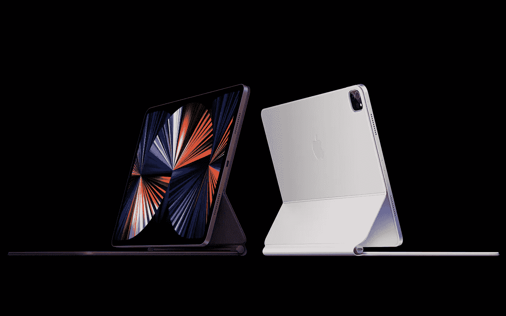

# iPad Pro 2021:有史以来最便携的 Mac

> 原文：<https://medium.com/geekculture/ipad-pro-2021-the-most-portable-mac-ever-8fe0d7665c6?source=collection_archive---------17----------------------->

## 会聚路径

## 苹果实际上是在消除平板电脑和电脑之间的界限，让人们现在就做出决定

It’s no coincidence that the new iPad Pros look a lot like MacBooks in some of Apple’s promo shots: the former have been closing on the latter for a while and now, sharing the same M1 hardware, they might just replace them in many cases. (Image credit: Apple)

苹果证明了它仍然可以在工厂级信息泄露和社交媒体狂热的世界里保守秘密，它让所有人大吃一惊，也让整个行业陷入风暴，宣布…