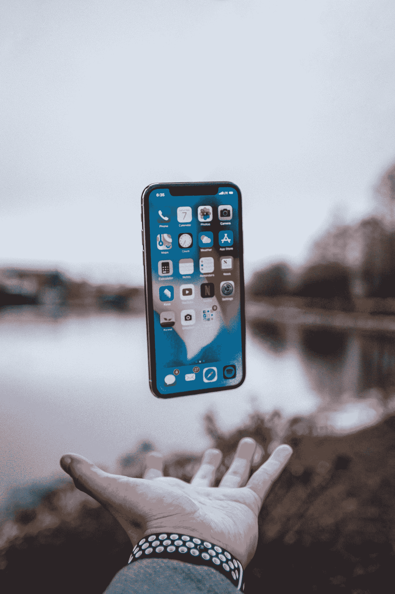

# iPhone 14

> 原文：<https://medium.com/geekculture/iphone-14-9a0142db9196?source=collection_archive---------7----------------------->

Photo by [Neil Soni](https://unsplash.com/@neilsoniphotography?utm_source=medium&utm_medium=referral) on [Unsplash](https://unsplash.com?utm_source=medium&utm_medium=referral)

## 发售日期:2022 年 9 月 6 日，内存存储:128gb，起售价:$799 ~$899，首销日期:2022 年 9 月 16 日

> 如果你觉得我为你贡献了价值，请支持我！

T2:上个月，我感觉我的收入几乎立刻就减少了。我越来越难获得我想要的收入，但是…