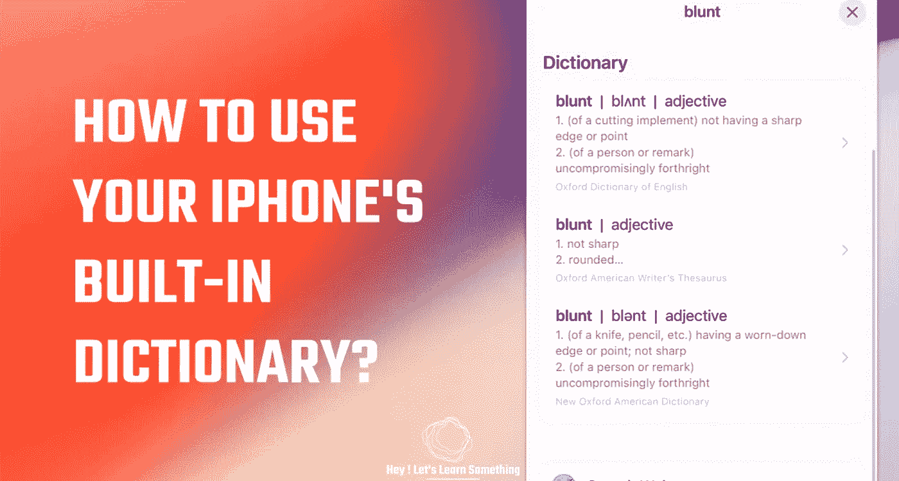

# iPhone 有免费词典——怎么用？

> 原文：<https://medium.com/geekculture/iphone-has-a-free-dictionary-how-to-use-it-89cfc2a8e8b4?source=collection_archive---------21----------------------->

不需要安装第三方应用程序

不用说，iPhone 是一款很棒的手机，内置了许多功能，更重要的是，iPhone 还附带了一个免费的字典。在 safari 浏览器上阅读文章或博客时，这本字典会非常有用，而不必搜索单词的意思。此外，你也可以用这本字典来查找一个单词的意思…