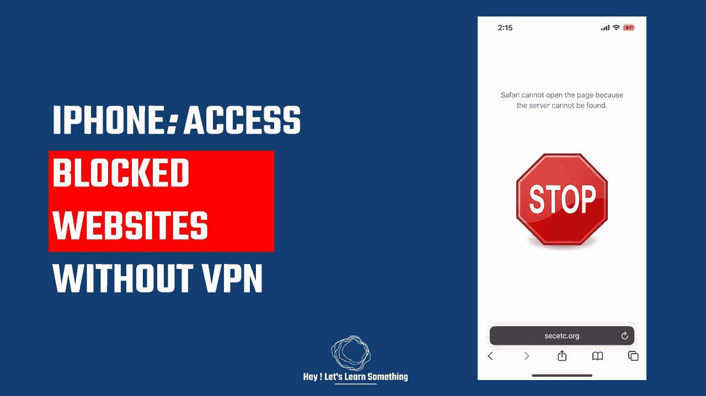

# iPhone:没有 VPN 怎么打开被屏蔽的网站？

> 原文：<https://medium.com/geekculture/iphone-how-to-open-blocked-websites-without-vpn-80be7cfde805?source=collection_archive---------4----------------------->

这可能是访问任何被阻止网站的最简单方式

无需安装任何应用程序或使用 VPN，您可以在 iPhone 设备上轻松访问被阻止的网站。这个过程非常简单，而且绝对免费。你所要做的就是做一些 DNS 更改，为了可靠性，我们将使用谷歌公共 DNS。对 DNS 进行必要的更改后，您…