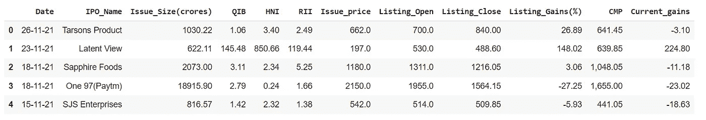
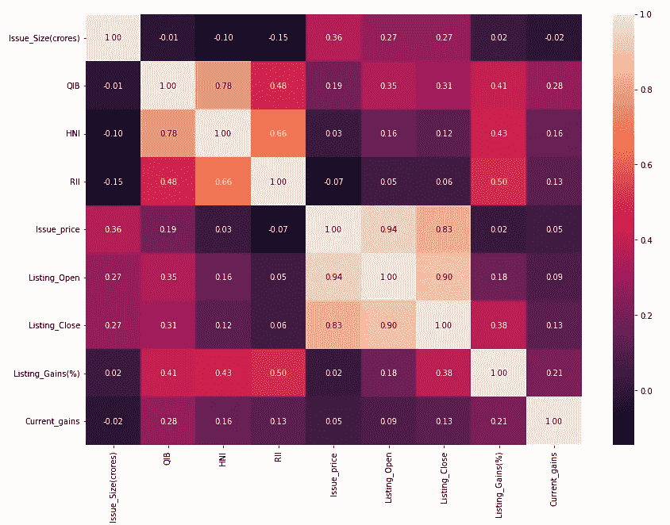
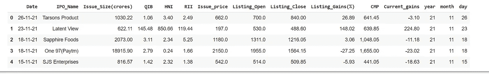
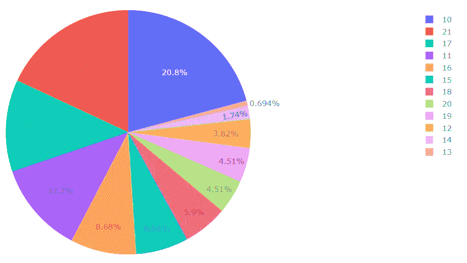
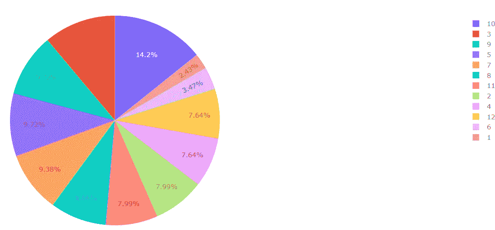
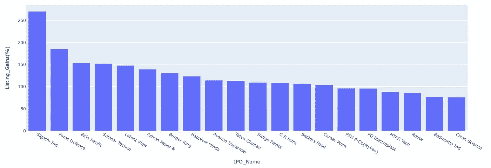
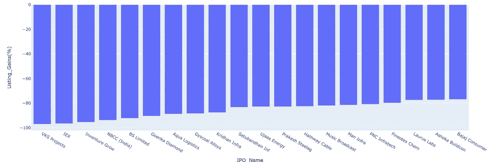
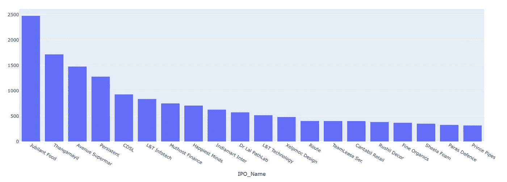

# 印度股票市场的首次公开募股(2010–2021)数据可视化和 Python 分析

> 原文：<https://medium.com/geekculture/ipos-of-indian-stock-market-2010-2021-data-visualization-and-analysis-in-python-1a680f466a42?source=collection_archive---------6----------------------->

## IPO 涨幅居前。IPO 买入月。2021 年首次公开募股。哪个 IPO 板块正在蓬勃发展？


Data Analysis and Visualization Of IPO

数据科学家们，你们好！

杰夫·贝索斯说，21 世纪是印度的世纪。他是对的。印度股市是过去几年里最赚钱的股市。每个人都想投资印度股市。

在这篇文章中，我们将对 2010 年后在印度股市上市的所有 IPO 进行可视化分析。如果你是初学者，不用担心。我会一步一步来。所以让我们从一杯咖啡开始这个项目。

如果您正在寻找视频教程，那么它就在这里:

# 首次公开募股

根据维基百科，首次公开募股或股票发行是一种公开募股，其中公司的股票出售给机构投资者，通常也包括散户投资者。IPO 通常由一家或多家投资银行承销，它们还安排股票在一家或多家证券交易所上市。

到**下载数据集**的链接在本文末尾。

您可以在 Jupyter Notebook、Google Colab 或任何其他首选编辑器中编写 Python 代码。我会推荐你用 Google Colab，因为它好用可靠。

# 代码和分析

*   **导入库**

```
#for mathematical computationimport numpy as np
import pandas as pd
import scipy.stats as stats#for data visualizationimport seaborn as sns
import matplotlib.pyplot as plt
import plotly
import plotly.express as px
from matplotlib.pyplot import figure% matplotlib inline
```

*   **让我们加载数据，先睹为快**

```
df = pd.read_csv("/content/IPO.csv", encoding='latin-1')
df.head()
```



Data Analysis and Visualization Of IPO

我们有 IPO 名称、IPO 发行规模、公开上市价格、上市收盘价、每次 IPO 的当前市场价格、当前收益百分比、QIB、HNI 和 RII。

*   **收集更多的数据信息**

```
df.info()
df.describe()
```

检查每一列中的空值。幸运的是，我们的数据集中没有空值。
之后，用每一列的类型属性获得更多关于我们数据集的信息。

*   **热图**

```
f,ax = plt.subplots(figsize=(14,10))
sns.heatmap(df.corr(), annot=True, fmt=".2f", ax=ax)
plt.show()
```



Data Analysis and Visualization Of IPO

高净值个人(HNI)与合格的机构买家(QIB)正相关

散户投资者(RII)与 HNI 正相关。

发行价与开盘价和收盘价高度正相关。

*   **数据清理**

```
date = df.Date.str.split('-', expand =True)
df['year'] = date[2]
df['month'] = date[1]
df['day'] = date[0]df.year = pd.to_numeric(df.year)
df.month = pd.to_numeric(df.month)
df.day = pd.to_numeric(df.day)
```

我只想获得 IPO 启动的年份、日期和月份的单独列。为此，我编写了上面的代码。现在，我们的数据有点改变。当您看到前 5 个数据时，您会注意到我们有 3 个新列。

```
df.head()
```



Data Analysis and Visualization Of IPO

*   **年度 IPO 启动**

```
fig1 = px.pie(df, names='year')
fig1.show()
```



Data Analysis and Visualization Of IPO

继 2010 年之后，2021 年是印度 IPO 最多的一年。一些专家表示，当市场非常看涨时，会有更多的 IPO 上市。我们都知道，现在印度股市非常看涨。

*   **月份与 IPO 发行的关系**

```
fig2 = px.pie(df, names='month')
fig2.show()
```



Data Analysis and Visualization Of IPO

10 月份的 IPO 数量最高。但是这个月并没有告诉我们更多的细节。除了 1 月和 6 月，其他月份的 IPO 上市量几乎相等。

*   **WordCloud**

```
from wordcloud import WordCloud
wordCloud = WordCloud().generate(' '.join(df.IPO_Name))plt.figure(figsize=(15,7))
plt.axis('off')
plt.imshow(wordCloud, interpolation='bilinear')
plt.show()
```


Data Analysis and Visualization Of IPO

我们使用单词云来显示文本数据的视觉效果。词云显示文本正文中最突出或最常用的词。

*   **上市时涨幅居前。**

```
top_gainer = df.groupby('IPO_Name').sum().sort_values('Listing_Gains(%)', ascending=False).head(20)
top_gainer = top_gainer.reset_index()
px.bar(x='IPO_Name', y ="Listing_Gains(%)", data_frame=top_gainer)
```



Data Analysis and Visualization Of IPO

Sigachi Ind 以 270.4%的涨幅上市。我的意思是这是巨大的。Paras defence 也以 185%的涨幅开盘。如果你被分配到这些股票中的任何一只，请在评论区告诉我。让我们更多地了解 Sigachi Ind:

```
x = df[df['IPO_Name'] == 'Sigachi Ind']
x
```

它将于 2021 年 11 月 15 日发布。我是多么想念那个。好吧，我没有哭:(这次 IPO 的发行价是卢比。163.它在 Rs 打开。575 卢比收盘。603.75.

*   **上市时跌幅居前的股票。**

```
top_loser = df.groupby('IPO_Name').sum().sort_values('Listing_Gains(%)', ascending=True).head(20)
top_loser = top_loser.reset_index()
px.bar(x='IPO_Name', y ="Listing_Gains(%)", data_frame=top_loser)
```



Data Analysis and Visualization Of IPO

VKS 项目在印度股市上市，亏损 97.15%。我希望这些股票不是分配给你的。

如果你想了解更多关于 VKS 项目的信息，你可以通过以下方式:

```
x2 = df[df['IPO_Name'] == 'VKS Projects']
x2
```

*   **当前涨幅居前**

```
current_top_gainers = df.groupby('IPO_Name').sum().sort_values('Current_gains', ascending=False).head(20)
current_top_gainers = current_top_gainers.reset_index()
px.bar(x='IPO_Name', y ="Current_gains", data_frame=current_top_gainers)
```



Data Analysis and Visualization Of IPO

喜气洋洋的食品以高达 2578%的涨幅高居榜首。它于 2010 年上市。如果你是一个长期投资者，那么这张图表是为你准备的。

*   **公司 IPO 规模(以亿计)**

```
issue_size = df.groupby('IPO_Name').sum().sort_values('Issue_Size(crores)', ascending=False).head(20)
issue_size = issue_size.reset_index()
px.bar(x='IPO_Name', y ="Issue_Size(crores)", data_frame=issue_size)
```


Data Analysis and Visualization Of IPO

Paytm IPO 是我见过最炒作的 IPO。但很遗憾，并不顺利。印度煤炭公司的 IPO 规模也很大。但是煤炭没有未来。所以，如果你是一个投资者，你必须记住这一点。

*   **2021 年 IPO 上市**

```
x4 = df[df['year'] == 21]
x4
```

运行这段代码，您将看到 2021 年总共有 51 家公司上市。

好了，这篇文章就到这里。

如果这篇文章对你来说很有启发性，一定要关注并分享给你的极客社区。

## 代码的 Google Colab 链接在这里是。

## 您可以从这个[链接](https://ninza7.blogspot.com/2021/11/marvel-vs-dc-dataset-for-data-analysis.html)下载数据集

# 更多数据科学项目

[**Python 中 Coursera 的数据可视化与数据分析**](/mlearning-ai/data-visualization-and-data-analysis-of-coursera-in-python-3f5c356a574d)

[**迪士尼+使用 Python 的数据分析**](https://python.plainenglish.io/data-analysis-of-disney-in-python-b2f66c9be332)

[**漫威 vs DC 数据分析用 Python**](/mlearning-ai/marvel-vs-dc-data-analysis-in-python-e561cac72358)

[**顶级网络数据泄露事件(2004–2021):数据分析与可视化**](/mlearning-ai/top-cyber-data-breaches-2004-2021-data-analysis-and-visualization-db61318148f)

[**中型文章数据可视化与分析使用 Python**](/mlearning-ai/medium-articles-data-visualization-and-analysis-using-python-730a538207ab)

[**使用 Python 的 Spotify 数据可视化和分析**](/geekculture/spotify-data-visualization-and-analysis-using-python-4af81c5531a7)

[**IPL 数据分析(2008–2020)使用 Python**](/nerd-for-tech/ipl-data-analysis-2008-2020-using-python-c031d3e1ae0c)

[**用 Jupyter 笔记本进行 Zomato 数据分析**](/nerd-for-tech/zomato-data-analysis-with-jupyter-notebook-6116ea03bd9d)

[**不同国家二氧化碳排放数据分析及可视化**](https://ninza7.medium.com/data-analysis-and-visualization-of-co2-emission-by-different-countries-7d9cadec50a3)

你好，我是 Rohit Kumar Thakur。我对 ***自由职业*** *持开放态度。我构建了* ***react 原生项目*** *和目前正在开发的****Python Django****。请随时通过(****)freelance.rohit7@gmail.com****)*联系我

[](/mlearning-ai/mlearning-ai-submission-suggestions-b51e2b130bfb) [## Mlearning.ai 提交建议

### 如何成为 Mlearning.ai 上的作家

medium.com](/mlearning-ai/mlearning-ai-submission-suggestions-b51e2b130bfb)