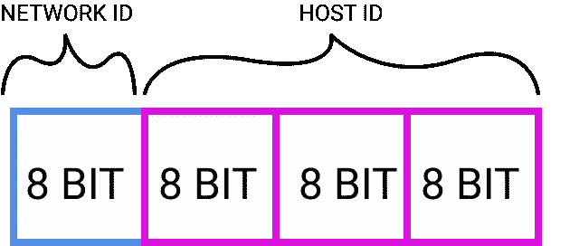
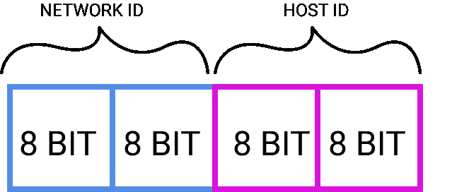
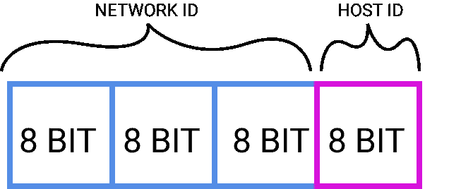
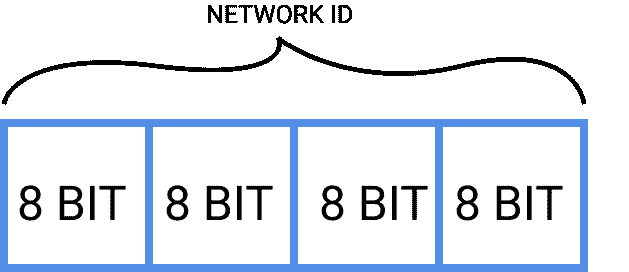
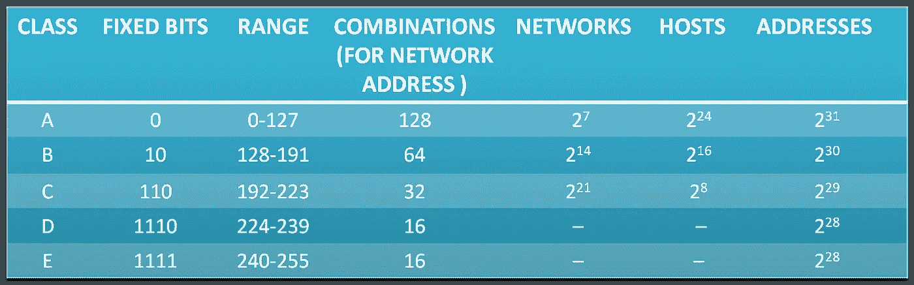

# IPv4 有类寻址

> 原文：<https://medium.com/geekculture/ipv4-classful-addressing-6c188f782bc5?source=collection_archive---------3----------------------->

互联网协议是一套在互联网上传输数据/通信的规则。IPv4 是互联网协议的第四个版本。

IPv4 使用 **32 位地址**，拥有 43 亿个地址。它使用点分十进制表示法，例如:192.168.0.2。

IPv4 地址格式为:**8 bit . 8 bit . 8 bit**(总计 32bit)

现在，有两种类型的 IPv4 地址— ***有类和无类*** 。

我们将在这里看到 ***有类寻址*** 方法。

# 有类寻址:

基本上，有 5 类地址——A、B、C、D、e。

现在让我们逐一看看它们:

## A 级:-

在 A 类中，正如你在上面看到的，32 位地址被分成四段，每段 8 位，其中前面的**8 位**用来代表**网络**，后面的**24 位**用来代表网络**主机**。

> 例如:125.16.32.64 是一个 A 类地址

现在，A 类地址的第一位总是零。

由于 32 位中有 1 位是固定的，因此还剩下 31 位来表示地址。因此，总共可以有 2 个 a 类地址和 2⁷网络 ID。

A 类地址占所有可能地址的 50%。

网络地址的范围是 0 到 127(如何？→如果我们在第一个二进制八位数中放置全零，即 00000000 = 0，并且如果我们考虑最后一个地址，即除了第一位(默认为 0)之外放置全 1，我们得到 01111111 = 127)。

> 从不使用第一个和最后一个地址，即 0.0.0.0 和 127.255.255.255，因为前者是主机地址/标识符，后者是广播地址。

因此，即使有 128 个网络地址可用，也只能使用其中的 126 个。

A 类的默认子网掩码是 **255.0.0.0** (也就是说，要找到网络 ID，我们只需要将我们的地址与这个子网掩码进行逻辑 AND 运算……多有趣啊:-))。

## B 类:-

在 B 类中，**开头的 16 位**用于表示**网络**，而**结尾的 16 位**用于表示网络**主机**。

> 例如:136.192.168.64 是 B 类地址

现在，B 类地址的第一个二进制八位数的前两位始终是 10。

由于 32 位中有 2 位是固定的，所以还剩下 30 位来表示地址。因此，b 类中总共可以有 2 个⁰地址和 2 个⁴网络 ID。

B 类地址占所有可能地址的 25%。

网络地址的范围是 128 到 191(如何？→如果在第一个二进制八位数中，除了前 2 位(默认为 10)外，所有位都是 0，则得到 10000000 = 128，如果考虑最后一个地址，即所有位都是 1，则得到 10111111 = 191)。

> 第一个和最后一个地址(即 128.0.0.0 和 191.255.255.255)从不使用，因为前者是主机地址/标识符，后者是广播地址。

因此，即使有 2 个⁴网络地址可用，也只能使用其中的 2 个⁴-2。

B 类的默认子网掩码是 **255.255.0.0。**

## C 类:-

在 C 类中，**开头的 24 位**用来表示**网络**，后面的**8 位**用来表示网络**主机**。

> 例如:193.201.198.23 是一个 C 类地址

现在，C 类地址的第一个二进制八位数的前三位始终是 110。

由于 32 位中有 3 位是固定的，所以还剩下 29 位来表示地址。因此，c 类中总共可以有 2 个⁹地址和 2 个网络 ID。

C 类地址占所有可能地址的 12.5%。

网络地址的范围是 192 到 223(如何？→如果在第一个二进制八位数中，除了前 3 位(默认为 110)外，所有位都是 0，则得到 11000000 = 192，如果考虑最后一个地址，即所有位都是 1，则得到 11011111 = 223)。

> 从不使用第一个和最后一个地址，即 192.0.0.0 和 223.255.255.255。

因此，即使有 2 个⁹网络地址可用，也只能使用其中的 2 个⁹-2。

C 类的默认子网掩码是 **255.255.255.0。**

## D 级:-

在 D 类中，没有主机或网络。

> 例如:225.108.162.1 是一个 D 类地址

现在，D 类地址的第一个二进制八位数的前四位始终是 1110。

由于 32 位中有 4 位是固定的，所以还剩下 28 位来表示地址。因此，d 类中总共可以有 2 个⁸地址

D 类地址占所有可能地址的 6.25%。

网络地址的范围是 224 到 239(如何？→如果在第一个二进制八位数中，除了前 4 位(默认为 1110)之外，所有位都为 0，则得到 111000000 = 224，如果考虑最后一个地址，即所有位都为 1，则得到 11101111 = 239)。

这些地址是为多播组电子邮件/广播保留的。

## E 类:-

E 类地址与 D 类地址非常相似。

E 类地址的第一个二进制八位数的前四位总是 1111。

由于 32 位中有 4 位是固定的，所以还剩下 28 位来表示地址。因此，e 类中总共可以有 2 个⁸地址

E 类地址也占所有可能地址的 6.25%。

网络地址的范围是 240 到 255(如何？→如果在第一个二进制八位数中，除了前 4 位(默认为 1111)之外，所有位都为 0，则得到 111100000 = 240，如果考虑最后一个地址，即所有位都为 1，则得到 11111111 = 255)。

这些地址保留用于军事目的。

总而言之，

以上就是 IPv4 中的有类寻址。

欢迎在评论中留下你的反馈。

过得愉快😊