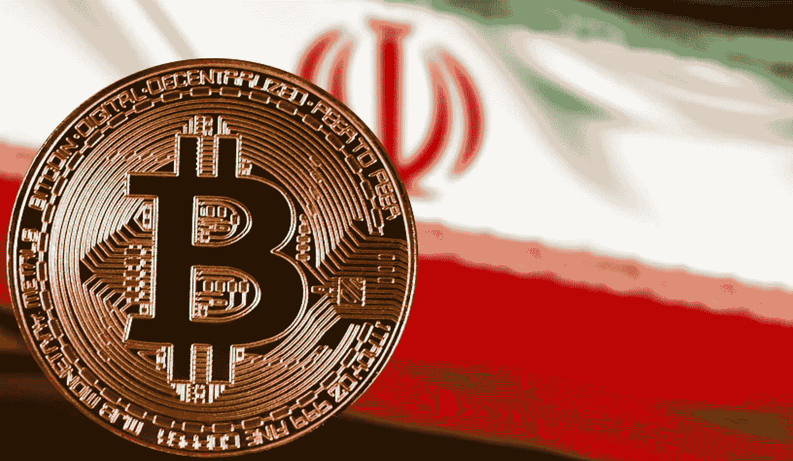

# 伊朗秘密采矿激增

> 原文：<https://medium.com/geekculture/irans-crypto-mining-surge-1668f4e12ae7?source=collection_archive---------19----------------------->

加密货币如何帮助伊朗人逃避制裁

[Bitcoin and Iranian flag](https://nairametrics.com/2021/05/26/iran-bans-bitcoin-mining/) via [Nairametrics.com](https://nairametrics.com/)

当数百万伊朗人的生命依赖于持续冷藏的新冠肺炎疫苗时，2021 年的夏天却频繁发生危险的停电。断电在伊朗并不罕见，但这是由一种新现象引起的。加密货币
开采的激增——需要大量电力——使电路不堪重负…