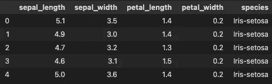
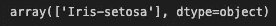
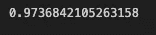

# 虹膜分类——支持向量机(SVM)

> 原文：<https://medium.com/geekculture/iris-classification-support-vector-machine-315d14778c2c?source=collection_archive---------7----------------------->

## 使用**支持向量机** (SVM)我们将预测鸢尾植物的类别(带源代码)

正如在上一篇文章中，我已经向您介绍了**支持向量机模型**，现在在这篇文章中，我将告诉您如何使用一些**代码制作一个**支持向量机模型**。**

如果您想了解**支持向量机**模型，请点击此**链接-**

 [## 什么是支持向量机(SVM)？

### 机器学习算法导论

iaviral.medium.com](https://iaviral.medium.com/what-is-support-vector-machine-svm-c1b759db65ba) 

**那么让我们开始**

**第一步**是我们需要**下载**数据集**然后将数据集应用于模型。您可以从**URL—**[https://raw . githubusercontent . com/aviralb 13/codes/main/datas/iris . CSV](https://raw.githubusercontent.com/aviralb13/codes/main/datas/iris.csv)中**下载**或**复制**数据**

# 导入库

现在我们将导入下面给出的 **pandas 和 NumPy** 如果你的系统没有安装这些库，你可以通过 **pip 命令**下载它们。

# 数据准备

现在我们将**通过**熊猫**读取**数据，并将其存储在一个名为**数据**的**变量**中，这样我们就不需要一次又一次地调用它，通过**头**命令我们可以看到**数据**的**前 5 个元素**如果你想看到更多，你可以在括号内输入数字。

现在我已经创建了一个**列表**，其中我认为它将是**决定** **因子**以**分类**虹膜并将其分配给**变量** **特征**现在我将传递**数据集**中的**特征**并将其存储为 **x** 和

这里我把**萼片长度、萼片宽度、花瓣长度、花瓣宽度**作为**特征**

# 制作模型

## 分割模型

首先，我们必须从 **sklearn** **模型** **选择**中导入**测试** **列车分割**然后我们将**分割**我们的模型数据集到一个**列车**和**测试**数据集

## 模型

这里我们将制作一个**支持向量机**，因为我们必须**对**我们的值进行分类，因此我们必须从**sk learn . SVM**导入**SVC**，然后**将**我们的**训练** **数据**放入**模型**到**训练**模型**模型**

最后**和**，我们的**模型**已经**准备好了**现在我们都准备好了从我们的**模型**到**预测**

# 预测

我们也可以通过手动将**值**添加到**列表中**来**预测** **输入的**值

> **这里我输入了**
> 萼片长度=5.1
> 萼片宽度=3.5
> 花瓣长度=1.4
> 花瓣宽度=0.2

哪一个是我们的**数据**的**第一个** **条目**并且模型正在预测它类**iris**setosa 哪一个是正确的**预测**

我没有制作一个名为**预测**的**变量**，它将**预测**我们测试数据的值

# 准确(性)

现在我们将看看如何获得我们的**模型** **精度**这里我们的模型是 **97%** 精度，这意味着它已经从 **100** 中猜出了 97 个值**正确**，这是一个**非常** **好的精度**

# 源代码

你可以去查看完整代码的链接

 [## 代码/虹膜(svm)。ipynb at main aviralb13/codes

### 在 GitHub 上创建一个帐户，为 aviralb13/codes 的开发做出贡献。

github.com](https://github.com/aviralb13/codes/blob/main/machine%20learning%20models/iris%28svm%29.ipynb) 

# 结论

在文章中，我已经给了你如何用**源代码**制作**支持向量机(SVM)** 的信息和代码，我会为你制作更多令人兴奋的模型，所以保持联系