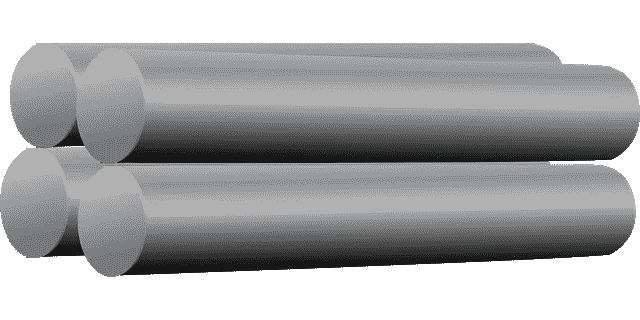
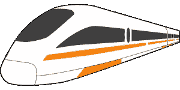

# 钢铁、铁路和煤炭工业 2.0

> 原文：<https://medium.com/geekculture/iron-steel-railroad-and-coal-industry-2-0-c70513e76d27?source=collection_archive---------20----------------------->

# 介绍

在第二次工业革命开始时，铁和金属、铁路和煤之间的相互作用得到了发展。铁路允许价格合理的物质和产品运输，这反过来又导致价格合理的铁路建设更好的道路。铁路还从蒸汽机车用煤的合理价格中获益。这一合作导致在 19 世纪 80 年代在美国境内铺设了 75，000 英里的曲调，这是国际历史上最大的数量。

# 描述

## 熨斗

温鼓风法，其中来自鼓风炉的新燃料管道用于预热直接吹入鼓风炉的助燃空气，1828 年在苏格兰的威尔逊镇钢铁厂通过 James Beaumont Neilson 的方式被发明并获得专利。热风成为高炉汽油性能的最大生命力，因为它大大减少了生产生铁所需的汽油量，成为整个工业革命中最重要的先进技术之一。19 世纪 30 年代，随着铁路的出现，生产熟铁的费用下降了。

早期的热风方法使用铁作为蓄热式加热介质。铁引起扩张和收缩的问题，这加重了铁的负担，导致失败。爱德华阿尔弗雷德考伯在 1857 年提出了考伯范围。[这个靶场使用耐火砖作为车库介质，修复了扩大和开裂的问题](https://www.technologiesinindustry4.com/2022/09/piecework-and-assembly-line-industry-2-0.html)。考珀范围改变成另外能够产生过多的热量，这导致了高炉非常过剩的生产能力。考珀系列继续在现代高炉中使用。

随着用焦炭生产生铁的价值大幅度下降，热风的使用急剧增加，高炉的规模也随之扩大。

## 钢铁

贝塞麦系统是由亨利·贝塞麦爵士发明的，它允许大规模生产金属，扩大了这种重要材料的生产规模和速度，降低了艰苦工作的要求。关键方案变成了用空气吹过铁水进行氧化，从生铁中除去多余的碳和不同的杂质。氧化还增加了铁物质的温度，并使其继续熔化。

“酸性”贝塞麦系统有一个极端的障碍，因为它需要非常稀缺的低磷赤铁矿。西德尼·吉尔克里斯特·托马斯提出了一个更先进的系统来去除铁中的磷。他和他的堂兄，威尔士 Blaenavon 钢铁厂的化学家 Percy Gilchrist 合作，在 1878 年申请了他的系统的专利；约克郡的博尔科沃恩&公司成为应用他的专利系统的主要组织。他的系统变得特别珍贵在欧洲大陆，磷酸铁的份额变得比英国多得多，在比利时和德国每个发明家的调用变得比他个人的国家更知名。在美国，尽管无磷铁在很大程度上占主导地位，但一个巨大的爱好变成了发明。

随后金属制造中的高质量强化变成了西门子-马丁系统。查尔斯·威廉·西门子爵士在 19 世纪 50 年代改进了他的蓄热炉，他在 1857 年声称能够获得更好的足够的热量来保持 70-80%的汽油。通过使用用于燃烧的汽油和空气的蓄热式预热，炉子在过高的温度下运行。通过这种方法，开放式壁炉炉可以达到足以软化金属的温度，然而，西门子现在不再以这种方式使用它。

1865 年，法国工程师 Pierre-émile Martin 成为主要负责人，取得西门子熔炉的许可证，并将其用于金属制造。西门子-马丁系统取代了贝塞麦系统。它的基本好处是，它现在不再将金属泄漏到过量的氮气中(这可能导致金属变得易碎)，它变得更容易控制，并且它授权熔化和精炼大量的废金属，减少金属制造费用，并回收任何其他情况下都很困难的废料。通过二十世纪早期的方法，它已经成为主要的金属制造系统。

价格合理的金属的可用性允许建造大型桥梁、铁路、摩天大楼和船只。其他重要的金属产品——此外还利用了开放式壁炉系统——是金属电缆、金属杆和金属板，它们使巨大的、应力过大的锅炉和用于设备的过度拉伸的动力金属成为可能，使发动机、齿轮和车轴比以前更有效。有了大量的金属，制造更有效的武器和马车、坦克、装甲防护车和军舰就变得可行了。

## 铁路

19 世纪 60 年代金属制造业的繁荣认为，铁路可能希望最终由具有侵略性价值的金属制成。作为一种更持久的材料，金属逐渐取代铁成为铁路钢轨，由于其更大的能量，现在可能需要轧制更长的钢轨。由于浮渣受到保护，熟铁变得光滑并含有瑕疵。铁轨现在也不再能辅助重型机车，而是通过锤击的方式断裂。1857 年，在格洛斯特郡的达克希尔钢铁厂，第一个用金属代替熟铁制造耐用铁轨的人变成了罗伯特·福雷斯特·穆塞特。

Mushet 的第一条金属铁轨被送往德比米德兰火车站。铁轨是作为车站技术的一部分铺设的，其中铁轨需要至少每六个月更新一次，每三个月更新一次。六年后，在 1863 年，铁路被认为是一如既往的理想，尽管事实上每天有 700 列火车通过。这为在迟到的 19 世纪改善整个行业的铁路建设提供了前提。

1867 年，宾夕法尼亚州约翰斯敦的坎布里亚铁厂合成了美国第一根商用金属铁轨。

钢轨的寿命比铁长十倍以上，随着金属价值的下降，人们开始使用更重的钢轨。这允许使用更有效的机车，可以牵引更长的火车和更长的轨道车，所有这些都大大提高了铁路的生产率。铁路已经成为整个[工业化国际](https://www.technologiesinindustry4.com/2022/09/piecework-and-assembly-line-industry-2-0.html)的运输基础设施的主导形式，在本世纪的放松中产生了持续的较低的运输价值。

更多详情请访问:[https://www . technologiesinindustry 4 . com/2022/10/iron-steel-railway-and-coal-I-by-manso or-Ahmed . html](https://www.technologiesinindustry4.com/2022/10/iron-steel-railroad-and-coal-i-by-mansoor-ahmed.html)

YouTube 频道:[https://www . YouTube . com/Channel/ucbhq 84 dcj _ mzg 6 w 4 l 1s 1 B2 g/featured](https://www.youtube.com/channel/UCbHQ84DcJ_mZG6W4L1S1b2g/featured)