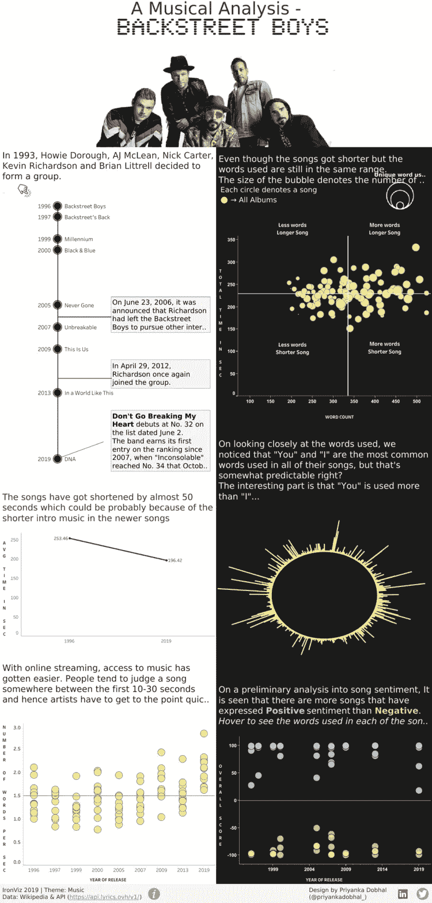
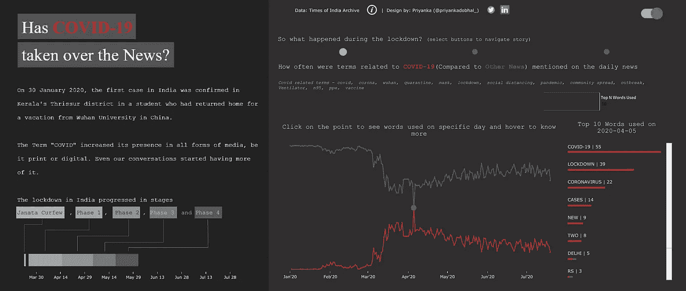
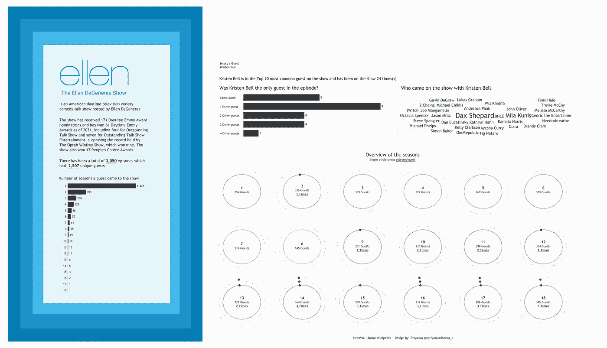
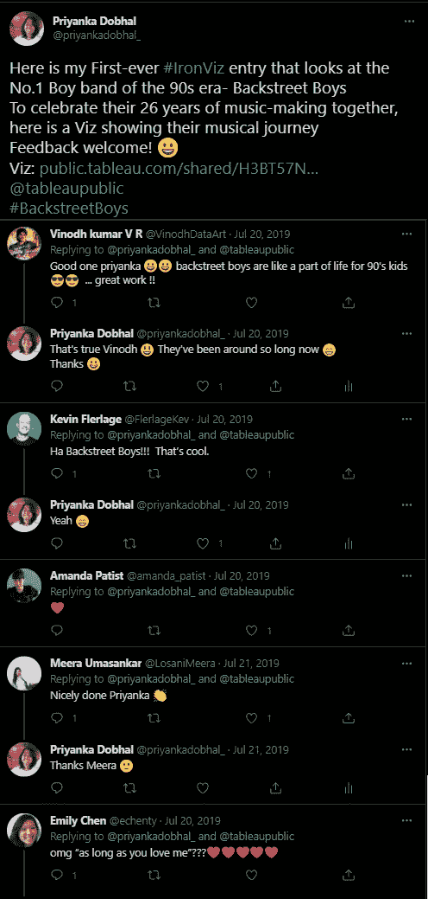

# IronViz 来了！不要错过

> 原文：<https://medium.com/geekculture/ironviz-is-here-dont-miss-out-93db1731bd15?source=collection_archive---------19----------------------->

这是一年中你参加 Tableau 最大的活动——iron viz 的时候了。

# 什么是 IronViz？

引用 Tableau“Iron Viz-世界上最大的虚拟数据可视化竞赛-点燃并展示 Tableau 社区的力量，让您有机会与世界各地的数据摇滚明星互动。三名决赛选手将晋级今年 11 月举行的 2021 年铁 Viz 锦标赛”

 [## 要么赢，要么学——你不能输

### iron Viz-世界上最大的虚拟数据可视化竞赛-点燃并展示了 Tableau 的力量…

www.tableau.com](https://www.tableau.com/community/iron-viz) 

我喜欢 Tableau 在这次活动中使用的口号:**赢或学——你不能输！的确如此。这将是我第三年参加这项活动，尽管我离赢得它还很远，但我已经学到了很多！**

# 我的个人经历

我在 2019 年参加的第一年-资格赛的主题是音乐，这是我的激情之一！:)
所以我去了我最喜欢的乐队——[后街男孩](https://public.tableau.com/app/profile/priyanka.dobhal0993/viz/BackstreetBoys-MusicalAnalysis/MusicalAnalysis)

现在我回头看看这个，我想不出我为什么会选择黑白主题😄但是我在建造这个过程中得到了很多乐趣！

这也是我第一次建立数据集。我清楚地记得那天，我在回家的公交车上。我正在构思通过 viz 展示的创意

*   专辑是什么？
*   歌曲有多长？
*   歌词里用了哪些词？
*   他们歌曲的情感分析

所以我从维基百科页面上获得了我的第一组信息。这也是我第一次用 python 提取数据。我使用 python 脚本迭代专辑以获取歌曲及其歌词，这些歌词后来被转换为每首歌曲的单词。

如果你有兴趣看一下代码，就在这里—[https://github . com/priyankadobhal 09/back street-Boys-Lyrics-Analysis](https://github.com/priyankadobhal09/Backstreet-Boys-Lyrics-Analysis)

对我手下留情！这是我的第一个代码😆

而**数据集** -

 [## 后街男孩专辑与歌词和用词-数据集由 priyankad0993

### 该数据包含后街男孩发行的所有录音室专辑的信息

数据世界](https://data.world/priyankad0993/backstreet-boys-album-with-lyrics-words-used) 

现在来说说 2020 年我和 IronViz 的**二次经历**。本次资格赛的主题是“福祉”。这是一个很大的话题，我花了很长时间才想出一个话题。我记得和[亚当](https://twitter.com/AdamMico1)讨论过我的思维过程。这一次，我想花些时间从我的同事和同事那里获得关于我的期末报告的反馈。
[**新冠肺炎接手消息了吗？**](https://public.tableau.com/app/profile/priyanka.dobhal0993/viz/IronVizHasCOVID-19takenovertheNews/LightMode)

**我是怎么想出这个主意的？**

2020 年 3 月，我去度了一个长假，当我回到家时，关于 COVID 的恐慌已经在我的城市开始了。我有点感冒，所以我决定在家工作一段时间。这持续了将近 2 周，由于这种情况，我的办公室已经宣布“在家工作”。

所以从那以后，我就一直待在家里，不断被新闻头条轰炸。

最初，我会继续查看与 COVID 相关的新闻——查看每日数据。过了一段时间后，它开始让我不知所措，所以我后退了一步。

因此，通过这个 viz，我看了一下与 COVID 相关的新闻标题。

为了获得数据，我从《印度时报》档案中抓取了 2020 年 1 月 1 日至 2020 年 7 月 19 日的新闻标题。

你可以参考我在 Github 上的**代码**-[https://github.com/priyankadobhal09/News-extract](https://github.com/priyankadobhal09/News-extract)

以及**数据集**:[https://data . world/priyankad 0993/news-headlines-times-of-India](https://data.world/priyankad0993/news-headlines-times-of-india)

现在来说说 2021 年我和 IronViz 的**第三次** **经历**。没有太多要说的，因为我基本上拿起了我的一个未完成的 viz，并设法及时提交它。所以我并不为此感到骄傲，但我只是不想打破我的记录。
[**艾伦秀上的嘉宾**](https://public.tableau.com/app/profile/priyanka.dobhal0993/viz/GuestonTheEllenDeGeneresShow/TheEllenDeGeneresShow)

# 为什么要参加？

我分享一下我的经历，让你看看有多好玩！希望你能看到我对这一切是多么兴奋，并能向这个奇妙的事件迈出第一步。

这是参加的唯一理由吗？不完全是。还有一个可能会让你更加兴奋。这个活动会让你在社区里有些知名度。

我被来自人们的所有反馈和想法淹没了:)绝对是有史以来最好的感觉之一。

通过这次活动，我去年还发现了许多了不起的人！从那时起，我就一直关注着他们的动向:)

现在我让专家来说:)几个视频帮助你开始。

另一边见！

感谢阅读:)