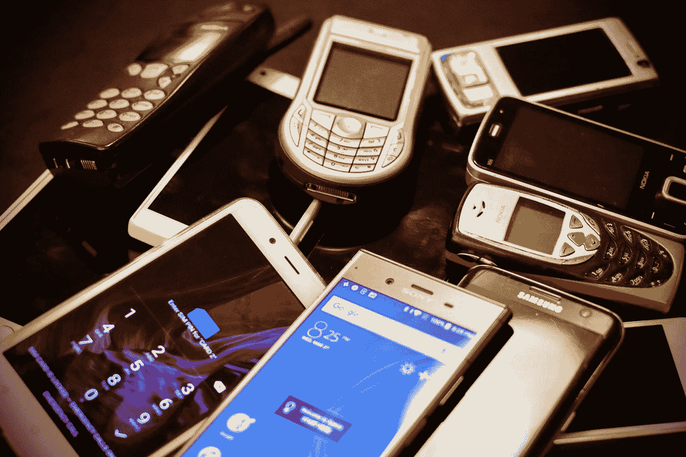

# 完全无线的未来可能吗？

> 原文：<https://medium.com/geekculture/is-a-completely-wireless-future-possible-462011a6efce?source=collection_archive---------11----------------------->

## 电线又乱又不方便。我以为我永远不会看到有一天我会高兴地抛弃我心爱的有线 3.5 毫米耳机，转而使用无线耳塞。

Photo by [Eirik Solheim](https://unsplash.com/@eirikso?utm_source=medium&utm_medium=referral) on [Unsplash](https://unsplash.com?utm_source=medium&utm_medium=referral)

我们周围的一切都在慢慢改变。我们已经经历了从摩托罗拉 DynaTACs 到 iPhone，从蒸汽火车到子弹头火车，等等。**迟早** [**LiFi**](https://lifi.co/) **可能会取代 WiFi。**

如此多的事物是熟悉的，同时又是全新的。我们生活在一个曾经被认为不可能的世界。

在我童年早期，我和慢速拨号上网打了很长时间的交道。每当有人需要固定电话的时候，我的互联网就消失了。如今，令我困惑的是，有些人以前甚至从未见过有线电话。

我爱我真正的无线耳机。我也用无线鼠标，蓝牙键盘，我甚至有一个支持无线充电的电源库。**随着我们的进步，我更喜欢有线解决方案的日子已经一去不复返了。**电线就是乱，不方便。不要让我开始说在最糟糕的时候不小心把它们分开是多么容易。

我从未想过未来会来得这么快。我相信我永远不会看到有一天我会高兴地抛弃我心爱的有线 3.5 毫米耳机，转而使用无线耳塞。由于技术的不可预测性，有时我真的想知道一个完全无线的未来是否可能。

Photo by [Gabriel Küenzi](https://unsplash.com/@productionx_ch?utm_source=medium&utm_medium=referral) on [Unsplash](https://unsplash.com?utm_source=medium&utm_medium=referral)

1903 年,认为人类飞行需要一千万年。这篇文章写完后仅仅两个月，莱特兄弟就发明了第一架成功的飞机。

我也许不能像《纽约时报》那样预测未来，但我不认为就我们现在所拥有的做出一些有根据的猜测是件坏事。

接下来，我将重点介绍三个主要组件，我认为它们对于我们的有线世界变得无线化至关重要。这些是消费电子、基础设施和工业。

请注意，我不是专家，所以不要完全相信我的想法。这些只是我的推测。

# **消费电子**

Photo by [Davide Boscolo](https://unsplash.com/@impulse9696?utm_source=medium&utm_medium=referral) on [Unsplash](https://unsplash.com?utm_source=medium&utm_medium=referral)

乍看之下，我认为消费电子产品将是第一个完全无线化或明显少于无线的产品。

**当苹果公司决定移除 iPhone 7** **上的耳机插孔时，我才真正意识到我们正在走向无线化。对我来说，手机上没有耳机插孔的想法是疯狂的。但我想这是有道理的。**

尽管无线耳机在早期有一些失误，但现在我们有了真正的无线耳机，可以与有线耳机相媲美。我也相信**设备也将是第一个无线化的设备，因为虽然这可能是一条崎岖不平的道路，但它已经被证明是可能的。**

我们已经从移除耳机插孔发展到移除与手机捆绑在一起的有线充电器。消费电子产品完全无线化不是我们能决定的。当大公司决定从他们的技术中移除某些功能时，他们没有给我们选择的余地。

无论好坏，他们在一定程度上控制了我们能买什么，不能买什么。虽然我们可以购买具有我们想要的功能的旧技术，但新设备几乎很快就会出现。最终将很难获得与最新技术兼容的旧电子产品。

随着消费技术的发展，我不会对未来出现更多无线设备感到惊讶。我们已经有了手机无线充电、无线吸尘器和一大堆智能家居设备，所以我认为电器离等式不远了。

我能想象到的拥有无线消费技术的唯一小麻烦是，你不得不把大部分电子产品放在某种充电站上。以我的经验来看，充电板…不太好。然而，不小心拉断你的电缆并损坏它也不好玩。

**也许未来会有一个更方便最终用户的中间地带。事实上，已经有技术可以解决这个问题。Ossia 是一家试图让无线充电像 WiFi 一样工作的公司。到目前为止，它看起来很有希望。但现在听起来还是好得不像真的。**

尽管如此，对我来说这已经存在是令人震惊的。这让我认为，拥有完全无线的消费电子产品迟早会来到我们身边。

# 基础设施

Photo by [Anna Jiménez Calaf](https://unsplash.com/@annajimenez?utm_source=medium&utm_medium=referral) on [Unsplash](https://unsplash.com?utm_source=medium&utm_medium=referral)

我认为这可能需要一段时间。考虑到整个世界的基础设施，也许在未来二十年左右都不会。

**放眼全球，截至 2021 年，将有 29 亿人无法使用互联网。**根据联合国[报告](https://www.un.org/en/delegate/itu-29-billion-people-still-offline)，由于新冠肺炎疫情，互联网使用量急剧增长。这一增长大部分是由发展中国家推动的。

也就是说，我认为让世界完全无线化是一项艰巨的任务。**资源较少的国家将无法立即赶上较富裕的国家。**此外，考虑到除了消除令人讨厌的电线之外还有更大的问题，他们可能认为没有必要更换开关。

另一方面，一些发达国家已经将无线游戏向前推进了一步。例如，新西兰正致力于发展无线电力。他们的政府和一家名为 *Emrod* 的初创公司合作开发了一种使用整流天线的无线能源基础设施原型。这些天线将微波从 A 点传送到 b 点。

如果一切顺利，这将是一个伟大的解决方案，为那些生活在偏远地区的人提供电力。想象一下，如果这种技术可以在世界各地建立起来——没有电力的家庭可能会成为过去。

无线电力并不是一个新概念，但它从未实用过。

[**尼古拉·特斯拉于 1899 年**](https://www.thoughtco.com/wireless-electricity-history-1991605) **第一个提出并成功演示了无线电力传输。**不幸的是，在他的时代，还没有一种经济有效的方法能被开发出来。特斯拉已经没有资金了。

有趣的是，他的一个宏大想法是创造一个[世界无线系统](https://artsandculture.google.com/story/tesla-s-vision-of-wireless-energy-nikola-tesla-museum/FQXRHCCNJKDMJg?hl=en)。如果他没有耗尽资金，我们可能会更早实现无线世界。

快进大约一个世纪后，我们仍然使用有线方式传输电力。除了电线造成的难看之外，除了把电缆塞到地下，没有人愿意改变它。

这可能是因为它真的……有效。

如果没坏，就别修。无论如何，更换基础设施也会花费一大笔钱。对于那些不得不在所有东西都被替换的时候处理可能的中断和其他问题的大众来说，这种转变将是一种痛苦。

这就是为什么我认为这种技术在全球范围内传播还需要很长时间。

# 工业

Photo by [Alex Kotliarskyi](https://unsplash.com/@frantic?utm_source=medium&utm_medium=referral) on [Unsplash](https://unsplash.com?utm_source=medium&utm_medium=referral)

我觉得让这个行业在有线技术上创新，让它们完全无线化将是一项艰巨的任务。

**为了让无线无缝，我们必须就标准**达成一致，这样我们就不必处理兼容性问题和不明确规则带来的恐惧。以 [HDMI 线缆标准](https://www.audioholics.com/audio-video-cables/hdmi-2.1-1)为例。它的不一致性使得购买一根像样的电缆比它应该的更令人困惑。

不幸的是，让这个行业遵守一套规则是具有挑战性的。这将要求政府和组织成为仲裁者，以确保公司遵守已经达成的协议。例如，[苹果正在测试 USB-C 端口 iPhones 手机](https://www.bloomberg.com/news/articles/2022-05-13/apple-plans-to-change-iphone-charging-port-to-meet-new-eu-law#xj4y7vzkg)而不是他们通常的 lightning 端口，因为欧洲的[监管机构](https://www.theguardian.com/technology/2022/jun/07/all-smartphones-to-use-usb-c-charging-ports-from-autumn-2024-says-eu)同意到 2024 年所有的智能手机都应该使用一个通用充电器。

虽然这一切都很好，但政府政策会因你的居住地而异。推动无线技术必须在全球范围内共同努力。此外，我相信这个行业的另一大动力是在技术竞赛中领先。

我认为，如果人们没有强烈的需求，大型科技公司不会非常积极地带来一个完全无线的世界。虽然消费技术可能有些可行，但对新兴技术的进一步创新，如 [LPWAN](https://www.techtarget.com/iotagenda/definition/LPWAN-low-power-wide-area-network) 和 [V2X](https://www.autoweek.com/news/technology/a36190311/v2x-technology/) 将更难实现。

如果说有什么不同的话，那就是需求能够进来。这类似于疫情推动许多人使用互联网和其他基于互联网的服务，在这个世界上，外出会给自己和周围的人带来健康风险。然而，我们现在不需要全球无线技术，所以大多数行业不会推动它。

也许会有一些雄心勃勃的公司在这里或那里推出一些技术演示，但我不指望无线世界会很快出现。然而，我确实相信，当需求出现时，技术行业将是推动完全无线创新的第一人。

# 我们还有很长的路要走。

Photo by [Joey Kyber](https://unsplash.com/@jtkyber1?utm_source=medium&utm_medium=referral) on [Unsplash](https://unsplash.com?utm_source=medium&utm_medium=referral)

回顾我写的所有东西，看起来完全无线的未来确实是可能的。已经有解决有线难题的无线解决方案，但它们都处于起步阶段。无线电力、远程网络和其他无线技术相结合，可以为我们的无线未来铺平道路。

所有这些都让我相信，在我有生之年，无线世界可能不会出现，或者在我成为不知道新技术如何工作的婴儿潮一代时，我可能会瞥见它。

尽管如此，我认为我会完全敬畏。看到曾经只是想法的东西变成现实令人震惊。

然而，像任何事情一样，总是有风险。

完全无线的未来并不完全安全。这需要我们一直连接到网络。只要有与外部资源的连接，就总是存在安全风险。现在，有[黑客可以控制刹车灯](https://www.wired.com/story/hacking-traffic-lights-netherlands/)。

你能想象如果人们能够侵入无线网络并关闭整个城市会有多糟糕吗？是啊，那可不好玩。

除此之外，我们的数据也处于危险之中，因为我们可能在许多设备上连接到多个网络。如果别人能发现我们家里有多少设备，我们使用它们的频率以及其他敏感数据，我们还不如住在玻璃盒子里。

最后，还有资本主义的风险。我毫不怀疑将会出现一个大公司来垄断无线市场。希望他们会有能让他们保持一致的竞争者。我们只能希望提供我们需要的技术的公司和监管他们产品的政府不要变得太贪婪。

如果我们想要一个完全无线的未来，取得良好的平衡是必不可少的。但最重要的是，我们需要群众的声音，以确保我们不必面对一个对我们不利的未来。

但是谁知道会不会这样呢？未来总是不可预知的，我也说不清未来。我只能用我们现在所拥有的去思考。

老实说，我真的等不及不用处理另一根受损电缆的那一天了。

如果你已经做到了这一步，感谢你的阅读！我真的很感激。因为我住的地方，我不能靠中等收入生活。但是如果你想支持我所做的，你可以滑过一个[高保真](https://ko-fi.com/angeliz)！你也可以在评论中或者在[推特](https://twitter.com/_angeliz_r)上让我知道你的想法！