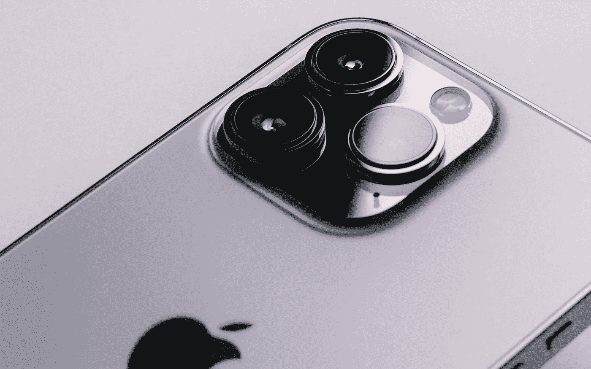

# 苹果是在围绕去年的处理器打造 iPhone 14 吗？奇怪…没那么奇怪。

> 原文：<https://medium.com/geekculture/is-apple-building-the-iphone-14-around-last-years-processor-weirdly-not-that-weird-ce82c3bcb453?source=collection_archive---------2----------------------->

## 但是，如果公司想全身而退，就必须为消费者做这件事

iPhone Pro models differentiated themselves from the “vanilla” iPhone models of the same year through better camera setups. This year might be different. (Howard Bouchevereau, Unsplash)

**众所周知**尽管苹果活跃在如此多的不同产品类别中，但每年占据头条最多的总是 iPhone。由……