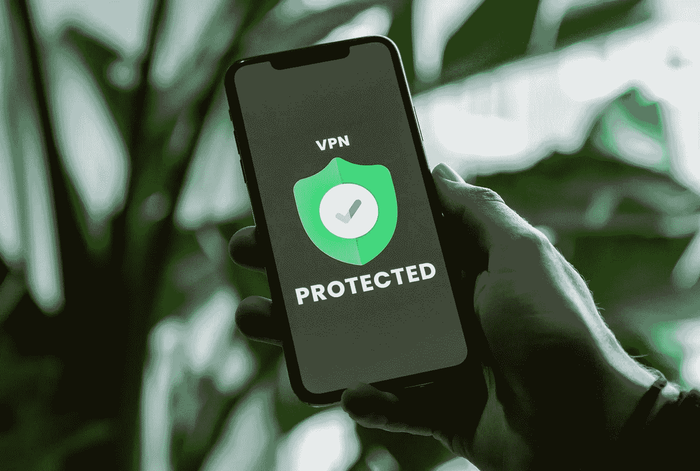

# 苹果的 iCloud+私有中继真的是 VPN 吗？

> 原文：<https://medium.com/geekculture/is-apples-icloud-private-relay-really-a-vpn-2932bb2d336d?source=collection_archive---------31----------------------->

Photo by [Privecstasy](https://unsplash.com/@privecstasy?utm_source=medium&utm_medium=referral) on [Unsplash](https://unsplash.com?utm_source=medium&utm_medium=referral)

## 为好奇的苹果用户提供更私密的互联网体验。

在苹果全球开发者大会(WWDC)上，该公司推出了一系列新的隐私功能。其中包括一个名为 iCloud+ (iCloud Plus)的增强型 iCloud 订阅。