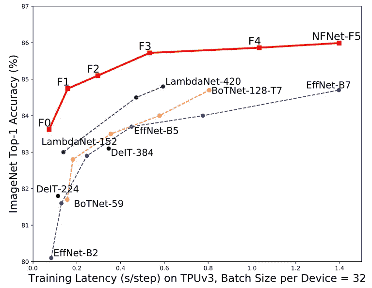
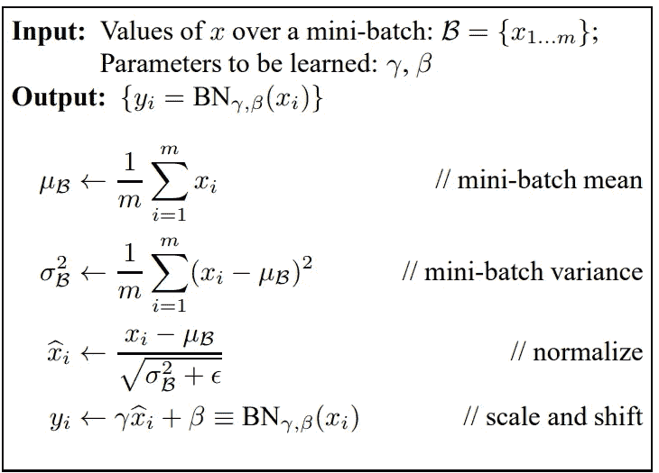
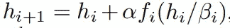
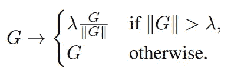
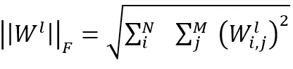
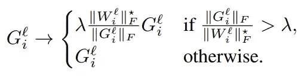
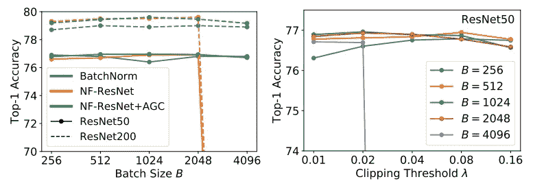
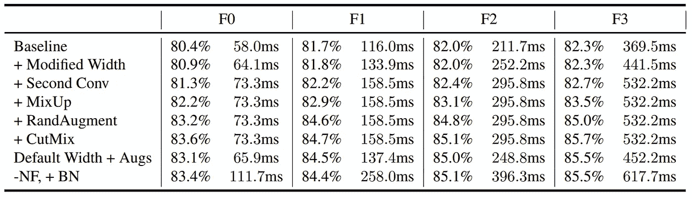

# 批量归一化有害吗？改进无规格化器的结果

> 原文：<https://medium.com/geekculture/is-batch-normalization-harmful-improving-normalizer-free-resnets-cf44f2fc0b2e?source=collection_archive---------4----------------------->

Photo by [Sarah Kilian](https://unsplash.com/@rojekilian?utm_source=medium&utm_medium=referral) on [Unsplash](https://unsplash.com?utm_source=medium&utm_medium=referral)

最近几乎所有的深度学习架构都普遍使用批处理规范化来提高收敛速度和改善性能。但实际上并没有多少作品关注 BN 的弊端，而是将它们视为对模型有益的某种魔法。在这篇文章中，我们将试图理解 BN 的真实动态，理解它的挑战和局限性，并讨论一种训练深度网络的替代方法。我们还将看看最近的一项技术，它通过消除批处理规范化实现了一流的分类性能。

该论文可通过以下链接获得。

批量归一化:[批量归一化:通过减少内部协变量偏移来加速深度网络训练](https://arxiv.org/pdf/1502.03167.pdf)

NF-resnet:[特征化信号传播，以弥补非标准化 resnet 中的性能差距](https://arxiv.org/pdf/2101.08692.pdf)

背景+自适应梯度裁剪:[无需归一化的高性能大规模图像识别](https://arxiv.org/pdf/2102.06171v1.pdf)

## 批量标准化和收益[【论文】](https://arxiv.org/pdf/1502.03167.pdf)

批量规范化是做什么的？简而言之，批量标准化旨在通过减去和除以小批量统计数据来标准化输入。准确地说，该过程被描述为下面的函数。

根据经验，使用批量标准化的好处是收敛速度更快，准确度更高。如果我们更深入地研究这些改进的动力，批处理规范化

*   缩减剩余分支:作为剩余网络的特殊协同，BN 约束了剩余分支的规模，稳定了早期训练。
*   消除了均值漂移:ReLU 的输出是[0，inf)，自然有非零均值。这在深度神经网络中会变得复杂并成为问题，因为它会导致网络为所有数据预测相同的标签。
*   具有正则化效果:因为批量统计是在训练数据的另一个子集上计算的，所以 BN 本质上充当了加强网络泛化的噪声。
*   允许有效的大批量训练:BN 增加了最大稳定学习率，这是大批量训练的关键组成部分。

上面列出的益处是其他研究的结论，在原始论文中有进一步的阐述。

## BN 的问题

哇，批处理规范化似乎确实为任何深度神经网络提供了很大的好处。也许不是，因为批处理规范化是

*   惊人的计算开销:BN 是一个非常占用内存的任务，因为所有的批次统计数据都必须存储在层中。计算成本也很昂贵(大约 20%，取决于网络)
*   训练和 at 推断之间的差异:推断的结果取决于批量大小？此外，引入必须调整的超参数。
*   打破了小批量中训练样本之间的独立性:这是一个明显的问题，因为每个样本都是使用小批量统计数据进行标准化的。后果是由于担心*作弊*而在一些任务中受到限制，如序列建模、对比学习。
*   性能对批量大小很敏感:当批量太小时，BN 的性能通常很差。
*   归一化会限制模型的能力:本文中没有讨论，但 StyleGAN2、ESRGAN 等论文在使用归一化时会在生成的图像中发现伪像。因为归一化会强制零均值，所以该算法会在图像中产生尖峰，从而改变图像其余部分的幅度。

已经提出了批处理规范化的一些替代规范化来解决所提到的问题。一些例子是实例规范化和层规范化。其他工作修改初始化过程和网络架构，以逐个获得 BN 的好处。一些作品甚至能够成功地超越使用 BN 的 ResNets(使用额外的正则化)。

然而，当批量非常小时，它们优于它们的批量归一化对应物，但是对于大批量，它们的性能比批量归一化网络差。大多数方法也有 BN 的一些局限性或有其独特的问题。这个结果也不能与美国国家运输署网络的结果相提并论。

[无规格化器的 ResNets](https://arxiv.org/pdf/2101.08692.pdf) (NF-ResNets)是一个没有规格化的网络架构，可以用 ResNets 训练到有竞争力的精度。NF-resnet 的剩余块按以下函数进行缩放。我们将在另一篇文章中深入讨论这篇文章，但是这篇文章中提出的技术通常适用于任何其他网络架构。

## 自适应渐变裁剪[【论文】](https://arxiv.org/pdf/2102.06171v1.pdf)

本文提出自适应梯度裁剪(AGC)技术来改善无归一化网络。梯度裁剪通过按照下面的公式约束梯度来稳定训练。然而，梯度削波被发现对削波阈值λ敏感。

Gradient clipping

假设 W 和 G 是第 *l* 层的权重矩阵和梯度。权重的 Frobenius 范数||W ||ᶠ被计算为权重平方之和的平方根。

Frobenius norm

权重和梯度||G ||ᶠ/||W ||ᶠ的 Frobenius 范数之间的比率提供了梯度步长有多大的更好的*相对*度量。为了解决对限幅阈值λ的依赖性，AGC 限幅梯度基于梯度范数与参数范数的单位比，如下式所示。

作者认为

> AGC 是一些归一化优化器的放宽，其基于参数范数施加最大更新大小，但不同时施加更新大小的下限或忽略梯度幅度。

## 实验

左图比较了带批处理归一化的 resnet、NF-resnet 和带 AGC 的 NF-resnet。AGC 似乎有助于将 NF-resnet 扩展到更大的批量，同时保持与批量归一化网络类似/更好的性能。对较大批量的训练更不稳定，因为学习率也随着批量的增加而线性增加。比如批量 4096 训练时，学习率是压倒性的 1.6。右图比较了不同限幅阈值和批量的结果。需要较小的限幅阈值来约束具有大批量的训练。

另一个实验通过将 AGC 应用于网络中的某些层来研究 AGC 是否对所有层都有益。结果表明，不剪切最终的线性层总是更好的，并且在不剪切初始卷积的情况下稳定地训练是可能的，但是当以批量大小 4096 以默认学习速率 1.6 训练时，必须剪切所有四个阶段。AGC 应用于除最终线性层之外的每一层。

## 寻求最先进的

本文应用各种规则和技术来提高性能并与 EfficientNet 竞争。通过修改，ResNeXt-D 模型大大超过了 EfficientNet。取消批量标准化的效果似乎令人失望，因为 NF-ResNet 和 AGC 的修改并没有显示出下表所述的精度提高。然而，它们确实在延迟方面提供了显著的收益，这可以通过模型缩放转化为更高的准确性。

## 结论

已经有许多关于分析标准化层的局限性的工作，包括批量标准化和提出替代方案。大多数 BN 替代品在大批量训练时表现不佳。本文提出了一种自适应梯度裁剪策略，使神经网络能够在大批量和大学习速率下训练。

然而，本文中使用的 NF-ResNet 主干网似乎有许多局限性。首先，这些修改是特定于基于 ResNet 的具有跳过连接的体系结构的。这将不适用于深度学习的许多其他应用。接下来，虽然提出了许多与性能相关的 BN 问题，但除了延迟之外，该解决方案与批量标准化网络相比并未显示出显著的改进。这可能表明，该解决方案实际上并没有解决 BN 的问题，而只是更有效地实现了 BN。

尽管如此，这篇论文提供的结果和见解给我留下了深刻的印象。对我来说，在稳定训练的同时去除批处理规范化似乎是深度学习要实现的一个重要里程碑。