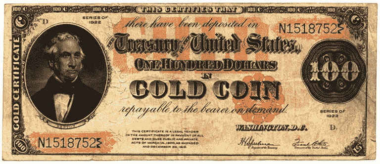
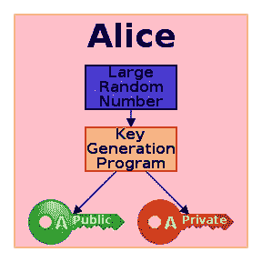
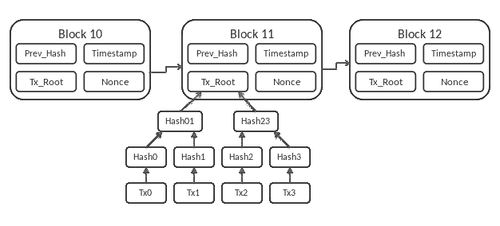

# 比特币是真钱吗？

> 原文：<https://medium.com/geekculture/is-bitcoin-real-money-f025eb531716?source=collection_archive---------12----------------------->

最近，比特币和其他加密货币似乎受到了很多关注。比特币是第一个出现的，它吸引了经济学家、技术专家、企业家、政治家、活动家、自由主义者，名单还在继续。有些人喜欢它，有些人似乎讨厌它。但是为什么呢？

比特币是真钱吗，还是只是书呆子的另一个花哨玩具？我将尝试回答这个问题，并在这个过程中，向你解释比特币是什么，以及它是如何工作的。

比特币具有独特的经济和技术特征，这使其与众不同。从经济学的角度来看，它声称没有通货膨胀——这是由于有控制的供应。在技术方面，它引入了我们现在所知的*区块链—*一种不可伪造的数字账本。接下来，我们将讨论更多的细节。

# 没有钱，没有问题

开始我们讨论的一个好地方是问我们自己:钱是什么？常见的答案是，钱是我们用来买东西的东西:电视、电话、食物、衣服等。–或支付服务费用，如电费、互联网接入、房屋维修、洗牙等。没错。货币是商品和服务的交换媒介，但让我们再深入一点。是什么赋予了我们称之为货币的纸片价值？似乎很多人，要么不知道，要么对这个问题有错误的答案。

作为货币使用的东西，必须有一些特殊的特征。货币必须是不可伪造的、可携带的、可普遍验证的。我们必须能够使用货币作为记账单位，并用它来给东西定价。它必须很稀有或者很难制作。如果你住在海边，你不能用贝壳作为货币。

由于这些原因，历史上的社会都使用贵金属作为货币，如青铜、黄金或白银。我们知道阿兹特克人[使用可可豆作为一种货币形式](https://news.asu.edu/content/asu-archaeologist-talks-aztec-currency-new-york-times)，因为可可豆被认为是有价值的。事实上，住在山区的人们——在那里很难得到它们——会用[贝壳作为货币](https://en.wikipedia.org/wiki/Shell_money)。在更近的历史中，黄金是整个欧洲、美国和其他国家的货币。这种货币体系被称为 [*金本位*](https://en.wikipedia.org/wiki/Gold_standard) 。

但是，由于黄金太重，大量携带变得不方便。正如我们前面提到的，钱需要是可携带的。所以，尽管这听起来是个好问题，政府还是引入了纸币。这些是黄金券，可以兑换一定数量的黄金。对于每一张纸质证书，都有相应的实物黄金储备。

下图是一张 1922 年的美国金质证书。注意上方*的图例“已存入”*，下方*的图例“见票即付”*。

*US gold certificate from 1922 (Public domain).*

1929 年大萧条后，美国和其他国家开始[放弃金本位](https://www.history.com/this-day-in-history/fdr-takes-united-states-off-gold-standard)。纸币不再由黄金支持，所以它变成了法定货币。

# 你的钱就像小叮当

现代法定货币，如美元或欧元，只是一种价值承诺。这个价值是由发行纸币的政府承诺的。它之所以有价值，是因为我们都相信它有价值。总的来说，我们是赋予金钱价值的人。就像童话人物小叮当一样，金钱的价值只存在于我们相信它的时候。另一个很好的类比是圣诞老人(对不起，孩子们)或者选择电影《黑客帝国》中墨菲斯的蓝色药丸。

作为一个思想实验，想象有一天，企业决定不再接受美元作为货币。出于实验的目的，我们假设您居住在美国(但也可能是任何其他国家和当地货币)。现在唯一被接受的货币是人民币(这也可以是任何其他货币，只要它不同于我们选择的第一种货币)。在这种情况下，你的美元只是一张毫无价值的纸。它们有价值的唯一原因是，这些企业相信它们有价值，它们愿意用自己的服务或商品来交换这些纸张。

像这样的事情可能会发生在贵重金属上，比如黄金，这是值得怀疑的(尽管不是不可能的)。鉴于黄金数量有限且难以获得，它具有内在价值。

# 我的钱去哪了？

另一方面，纸币可以无限量地被创造出来。政府可以简单地印更多的钞票(遵循他们的货币政策，当然，这是他们自己定义的)。这给钱的价值带来了问题。额外的纸币供应会导致通货膨胀，这意味着货币贬值。原因是新的货币没有任何有形的东西支持——比如黄金或其他大宗商品——而且数量更多。

政府报告当年的通货膨胀率，例如，5%的通货膨胀率。这意味着你的钱现在贬值了 5%。与前一年相比，你现在需要用更多的纸来支付同样的东西。如果通货膨胀率保持在这个数字，十年后你的钱将只值现值的一半。

第一次世界大战后，在魏玛共和国时期，德国经历了一段时间的 T2 恶性通货膨胀。*帝国马克——当时这种货币被称为*——一文不值，以至于表现主义艺术家会用它来作为他们绘画的画布。

通货膨胀降低了人们存钱的积极性。为什么你会存钱，知道它的购买力在未来会更少？当它更有价值时，现在花掉它当然更好。这就是经济学家所说的*高* [*时间偏好*](https://en.wikipedia.org/wiki/Time_preference) ，心理学家称之为*即时满足*。即时满足的反义词当然是 [*延迟满足*](https://en.wikipedia.org/wiki/Delayed_gratification) 。一些人认为延迟满足是人类区别于其他物种的特征之一。它需要提前思考和规划未来的能力。

到目前为止，我已经讨论了什么是货币，它的一些历史和它的特征。我们现在换个话题，讨论比特币。在回答我们的主要问题之前，我需要解释一下比特币是什么，以及它是如何工作的。之后，我们将利用我们对货币的了解来确定比特币是否属于这一类别。

# 我们现在处于数字时代

2008 年 10 月，笔名中本聪发布了[比特币白皮书](https://bitcoin.org/bitcoin.pdf)。几个月后，这项新技术的软件实现也随之而来。似乎没有人知道中本聪的真实身份——可能是一个人，也可能是一群人。Satoshi 的身份并不重要，因为该软件是 [*开源*](https://opensource.com/resources/what-open-source) ，这意味着任何人都可以看一看，修改它，做出改进，使用它，并自由地重新发布它。

比特币是一种基于密码学、数学、[博弈论](https://en.wikipedia.org/wiki/Game_theory)和计算机科学的数字货币。它允许我们将数字“货币”作为现金使用，而不需要第三方。如果爱丽丝想给鲍勃发送比特币，她可以直接通过 P2P(点对点)网络连接来完成——而不必向她的银行或信用卡公司支付任何费用。

比特币——以及一般的金融交易——的一个重要方面是保证信息安全。而且，由于这些交易是通过全球分布式网络(即互联网)进行的，我们要求它们是可靠、正确和值得信赖的。比特币技术通过结合我上面提到的学科来解决这些问题。

在比特币网络中，没有中央权威。系统由参与用户或*节点*保管。这些节点通过[共识算法](https://en.wikipedia.org/wiki/Consensus_(computer_science))接受或拒绝每一笔交易。然后一个叫做区块链的数字分类账记录每一笔交易。每个人都可以访问和验证区块链中的任何交易。如果任何人都可以独立验证，就不再需要“信任”了。

# 现在是谁？

比特币的关键组成部分之一是密码学，因此得名*加密货币*。密码学是数学和计算机科学的一个分支，它使用代码或*密码*来处理安全信息。当信息被保护或加密后，它就可以被传输而不用担心第三方的存在，第三方被称为对手。目标接收者将有一个*密钥*，允许对原始消息进行*解密*。

我们每天在网上购物或使用银行应用程序转账时都会用到这项技术。我们的信息，比如我们的信用卡号，被加密，然后通过互联网传输。即使恶意代理收集了这些信息，没有合适的密钥也几乎不可能破译。这种形式的安全数据交换也被称为*公钥加密*。

# 不要丢了你的钥匙！

我一直提到在处理加密信息时需要一个“密钥”。事实上，我们需要两个密钥来使用公钥密码系统。一个是*公共*密钥，另一个是*私有*密钥——密钥只不过是一长串数字和字符。私钥是安全的，而公钥可以与其他人共享。

下面的流程图表示用户 Alice 的计算机生成加密密钥对。

*Flowchart describing the process of generating a public and private key (Public domain).*

这以下面的方式工作。假设您想要接收一条包含私人信息的重要消息。首先，您的计算机使用一种[加密算法](https://www.sciencedirect.com/science/article/pii/B978012803843700048X)生成密钥对。然后，您与发送方共享公钥，发送方将使用它来加密信息。当您收到消息时，您使用您的私钥来解密它。因为你是唯一拥有私钥的人——而且它只能与公钥结合使用——所以你是唯一可以访问信息的人。

请注意保护私钥的重要性。此外，没有必要为每次信息交换生成新的密钥对。多个发送者可以使用相同的公钥进行加密。而且，只有私钥的所有者才能访问该信息。但是，如果您丢失了私钥，任何加密的信息都将无法访问。类似于丢失保险箱的密码。

# 戴上安全帽

密码术也是我们如何产生或*挖掘*新比特币的一个组成部分。比特币*矿工*必须解决一个密码难题才能获得奖励——在这种情况下，是预定数量的比特币。第一个解决这个难题的人会得到奖励。胜利者是由节点共识决定的，这一切都记录在区块链里。

“谜题”包括找到一个具有特殊特征的*加密哈希—*一大串数字。挖掘器执行[散列操作](https://en.wikipedia.org/wiki/Cryptographic_hash_function)，直到找到产生目标散列的正确值组合。这个结果很容易被其他节点验证。由于找到正确散列的唯一方法是通过 [*强力*](https://en.wikipedia.org/wiki/Brute-force_search) 方法，这构成了网络中节点批准所需的*工作证明*。

这个系统被设计成使得链条中每一个后续的难题都变得更难解决。最初，使用个人电脑挖掘比特币是可能的。随着谜题变得越来越难，需要更多的计算资源和特殊硬件，如[GPU](https://www.intel.com/content/www/us/en/products/docs/processors/what-is-a-gpu.html)和[ASIC](https://en.wikipedia.org/wiki/Application-specific_integrated_circuit)。今天，大部分拥有足够资源的公司进行采矿。

矿工是比特币网络中一种特殊类型的节点。但是，其他节点起着特殊的作用。他们负责核实交易并在区块链分类账中保存记录。任何人都可以运行这种节点，由于每笔交易都需要达成一致才能有效，因此没有人拥有特殊权限。

# 每个人都在谈论区块链

在比特币系统中，区块链是真理的来源。值得一提的是，比特币白皮书首次介绍了区块链。它的特别之处在于几乎不可能篡改或伪造任何记录。按照设计，这样做所需的计算资源数量是惊人的。这个特性阻止了恶意代理试图改变它。

中本聪在 2009 年创造了*创世纪区块*，诞生了比特币区块链。一个*块*代表一组信息，包括交易记录、时间戳和加密散列。一旦填充了一个块，它就链接到前一个块，并开始一个新的块。可以访问每一个事务和记录，一直追溯到初始块。

下图描述了区块链的结构。事务记录(标记为“TX_Root”)用一种称为 [*Merkle 树*](https://en.wikipedia.org/wiki/Merkle_tree) 的数据结构来表示。

*Diagram of the blockchain structure (Matthäus Wander — Own work. CC BY-SA 3.0).*

区块链也是一个去中心化和分布式的分类账，这使得它非常稳健。网络中的每个节点都保留一份副本。现在在计算机科学中，要求一个 [*分布式系统*](https://en.wikipedia.org/wiki/Distributed_computing) 是容错的。这意味着即使系统的某些组件出现故障，系统也应该继续正常工作。 [*拜占庭故障*](https://en.wikipedia.org/wiki/Byzantine_fault) 是指系统需要就来自不同节点的哪些信息是正确的达成一致，以便继续进行[3]。正如我们已经看到的，区块链通过要求每个事务在节点之间进行验证和协商来解决这个问题。

区块链解决的另一个问题是双重支出问题。数字现金系统中存在的潜在缺陷。当同一个令牌被使用或花费两次时，就会出现这种情况。由于其数字特性，同一令牌可以被复制多次。然而，区块链阻止了这种情况的发生。由于每笔交易都经过核实和记录，任何企图都很容易被发现。

最后，区块链允许创建*智能合约。它们被写成软件程序，系统保证它们的执行。智能合同为双方提供自动托管服务，不需要可信的第三方。例如，比特币从一个人到另一个人的转移是通过智能合约来确保的。*

*早些时候，我讨论了货币的一些特征以及是什么使它有价值。我们现在可以继续讨论比特币是否可以被视为货币，以及是什么赋予了它价值。*

# *如果它走路像鸭子，叫声像鸭子…[4]*

*首先，我们回忆一下货币的属性，看看比特币有没有。我把它们列在下面。*

**钱需要便携*。这个很简单，比特币可以被“运送”到世界上的任何地方。只要你有一部能上网的手机或电脑，你就可以在任何地方访问和使用你的比特币。*

*金钱必须是不可伪造的(或者至少是难以伪造的)。正如我们之前看到的——多亏了区块链——制造假比特币几乎是不可能的。每一枚比特币都来自开采过程，并记录在区块链中。*

*金钱应该是普遍可验证的。当你收到一美元或一欧元时，你应该能够认出它——因为你知道它看起来像什么——而不需要打电话到银行核实。再说一次，有了比特币，多亏了区块链，这才成为可能。如果不涉及比特币，比特币交易根本不可能。*

**钱应该很少或者很难赚*。正如我前面提到的，稀缺性使得像黄金这样的东西更有价值。比特币也有这个属性。回想一下，比特币挖矿不仅需要强大的硬件，而且找到正确的哈希变得越来越困难。这一点，再加上预先设定的供应量，使得比特币变得稀缺。事实上，这是比特币的革命性特征之一——它创造了数字稀缺性[5]。*

**货币必须允许我们用它来定价——作为记账单位。这是货币的一个关键特征，在这一点上，比特币没有。目前，比特币的价格波动很大。这使得给里面的东西定价变得不切实际。一些人预测比特币的价格将开始稳定，但在那之前，这就是我们的现状。**

*所以我们可以看到比特币具备了货币的大部分特征。然而，它仍然缺乏允许我们在其中定价的关键属性。因此，我们不能将比特币视为货币——至少不是传统货币。*

*我们不能忽视一个事实，即今天有地方接受比特币作为支付。我们也可以上网用它买东西。比特币正被用作交易媒介。这不就是钱应该做的吗？*

*使用比特币作为货币的地方和人数仍然很少——尽管它似乎在增长。正如我们从历史中所知，社会倾向于用“更好”的货币来代替他们的货币。墨西哥人不再像阿兹特克人那样使用可可豆作为货币。比特币是否会成为主流货币，我想只有时间会告诉我们。*

*现在让我们来考虑是什么赋予了比特币价值。事实证明，这可能更像是一个哲学问题，但是让我们深入研究一下。*

# *你相信吗？*

*我之前提到过，自从我们的货币不再由黄金支撑，它们的价值就由相信它的人来赋予(还记得小叮当吗)。比特币或许也是如此。但是，一些人认为比特币更像黄金，而不是传统的法定货币。*

*这些争论背后的原因在于比特币的属性。与黄金一样，比特币是稀缺的，难以获得或“开采”。就像地球上的黄金数量有限一样，比特币也只会有 2100 万个。对比特币数量的硬性限制保证了不会出现通货膨胀。它使其成为一种通货紧缩的货币，这意味着它的价值会随着时间的推移而增加。*

*当然，比特币与黄金的不同之处在于，它的开采完全由计算机完成。而且，你不能触摸或佩戴比特币。似乎问题又回到了人们是否相信比特币的价值。有人说比特币缺乏内在的*价值。其他人认为，我们需要花费资源来获得它的事实赋予了它价值。然而，其他人将其视为价值* 资产的 [*。*](https://en.wikipedia.org/wiki/Store_of_value)*

*我会让你决定这一个。*

# *展望未来*

*像任何新发明一样，比特币必须对人们的生存有用。采用率似乎在上升，但很难预测(如果不是不可能的话)未来它是会继续存在还是会被其他东西取代。*

*从技术角度来看，比特币很吸引人。密码学、数学和博弈论规则的结合——创造一个强大的数字货币分布式系统——是引人注目的。当我们考虑到——第一次——像这样的技术已经成功实施时，情况就更是如此。*

*然后我们有了比特币的社会经济含义。一个世界范围的、分散的金融系统，任何人——只要有互联网连接——都可以参与其中。智能合约允许人们在世界任何地方进行交易，而不需要可信的第三方。*

*比特币技术(以及随后产生的所有加密资产)开启了一个新的金融范式，被称为*去中心化金融*或 [DeFi](https://www.coindesk.com/what-is-defi) 。顾名思义，在分散的金融体系中，没有中央权威。而且，有一种新的软件应用——叫做 [*分散式应用【*](https://en.wikipedia.org/wiki/Decentralized_application)*—*正在出现。*

*我们也有像 NFT(不可替换的令牌)这样的东西，这是由区块链促成的。NFT 是独特的数字资产，其作者和所有权的证明被记录在区块链中——它们变得越来越受欢迎。人们正在寻找加密和区块链的新用途。*

*N. N .塔勒布在他的《黑天鹅》一书中指出，很多时候，工程师开发工具只是为了乐趣。而且，通常这些工具最终会被用来做一些它们被创造出来时没有想到的事情。正如他所说:*

*“我们制造玩具。其中一些玩具改变了世界。”*

*比特币会是这样吗？比特币会改变世界吗？在我看来，这已经发生了。*

# ***注意事项***

*[1]想要更深入、更引人入胜地讲述魏玛时期的德国，我推荐奥托·弗里德里希的《大洪水前的[*:20 世纪 20 年代的柏林肖像*](https://www.amazon.com/Before-Deluge-Portrait-Berlin-1920s/dp/0060926791) 。*

*[2]我们可以认为存钱和投资是一个好策略。我觉得是，但是投资也隐含着风险。你可以赔钱，也可以赚钱。你也希望回报率高于通货膨胀率。如果通货膨胀上升，闲置的货币就会贬值。另一方面，我们可以说借钱和欠钱是好的，因为债务的价值会下降。理论上，这是正确的，但请记住，我们对贷款和信用有兴趣，通常还有费用。还有，**请不要把这个当成理财建议**。*

*[3]分布式系统中的*拜占庭故障*发生在可能有一个或多个节点具有不可靠的信息时，这可能是由于故障或恶意活动。*

*[4]完整的短语是*“如果它走路像鸭子，叫声像鸭子，那么它一定是鸭子。”*是指计算机编程语言中*鸭打字*的概念。当一个程序的解释器或编译器决定一个对象可以采取的值或动作的类型时使用它——而不需要在程序中明确声明。这是通过验证对象是否具有某些属性来确定的(支持这种*类型化*的编程语言被称为*动态类型化语言*)。*

*[5]数字稀缺是特殊的，因为它与数字信息应该做的事情相反——它限制了我们可以制作的一条信息的副本数量。*

*[6]比特币具有高度可分性。我们可以将一个比特币分割到小数点后 8 位(10^-8).比特币的最小单位叫做一个 *satoshi。**

**原载于*[*https://stemhash.com*](https://stemhash.com/is-bitcoin-real-money/)*。**