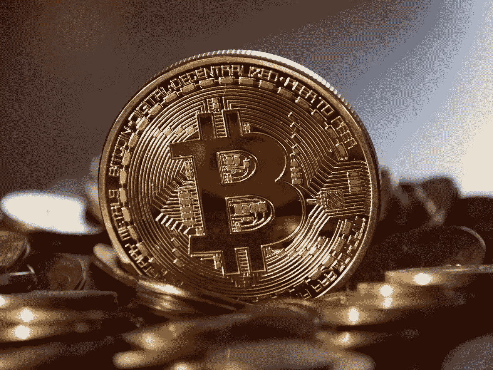

# 比特币的维护成本真的比美元高吗？答案让你吃惊

> 原文：<https://medium.com/geekculture/is-bitcoin-really-more-expensive-to-maintain-than-us-dollar-the-answer-surprise-you-7043b39ff0e4?source=collection_archive---------30----------------------->

我没有重新发明轮子，而是决定对比我们日常使用的另一种商品——美元，来看看比特币消耗了多少能源。

我做了一个难以置信的粗略计算，我经常从刚接触比特币的人那里听到一个问题:“它需要多少电？”

一笔普通的比特币交易大约需要 33 美元的电费。客观地说，生产一美元只需要 2 美分。相比之下，生产一枚比特币的成本是生产我们通常使用的货币的 33 倍。但是这些能量并不用于生产任何物质产品。它只根据比特币的协议为电脑时间付费。稍后将由知识更丰富的人对其进行评估(一般的反应是比特币的电费比美元低)，但它可以作为初步的粗略估计。

由于美元保持了数百年的稳定性，并被各国央行采用为储备货币，因此它在世界各地都得到使用。美元可以被认为是一种“类黄金”商品:既可以储存价值，也可以在各方之间免费转让。

既然我们已经知道了美元每年的维护成本，那么比特币又是从哪里来的呢？

比特币网络是一系列执行计算和检查不一致性的节点(计算机)。他们通过下载整个全球交易历史(大约每年翻一番)，然后进行被称为“挖掘”的大规模数字处理来实现这一点。挖掘过程也很难消除，因为它有一个重要的功能:防止人们凭空创造额外的比特币。该数据库中包含的信息总量加起来约为 150GB，这意味着需要在硬件上进行大量投资，并且需要几个月的时间来创建一个欺诈数据库。

下面是对这个数字的粗略估计:

比特币区块链目前有大约 180GB 的信息，这意味着复制它需要 150GB。这也意味着你将需要 6 个月的时间来下载区块链和自己做任何数字运算，否则它会为你做。这是假设你有一个 100Mbps 的连接，只需要 15 个高端计算机芯片。如果你假设速度稍慢，那么矿工最多只有 30 天的时间从当前位置(180GB)下载比特币区块链。这是一个非常粗略的计算；希望有更懂行的人在细节上指正。

为了计算能源使用量，我们需要将进入系统的钱数乘以它在系统中停留的年数。现在我们有了这个数字，让我们看看保持一美元需要多少能量:

在我们的系统中有两种不同的方法来记录金钱:把它存入银行或者借出去。第一种选择很昂贵，因为银行必须支付转账费用和存款利息，但许多人不会介意为了方便而付费。相比之下，个人可以把钱放在口袋里，而不必担心费用和利率操纵。这导致了网上货币交易所和类似的个人货币交易所的出现，如街头市场。

银行持有的货币总量高于我们经济中流通的货币总量。其中一个原因是，银行账户由联邦存款保险公司(FDIC)承保，该公司为每位储户担保高达 25 万美元。相比之下，我们看到人们由于欺诈和其他存款余额威胁而失去全部存款。

无论如何，让我们假设所有货币中只有 10%由银行持有(我认为更现实的数字会更低，因为投资者持有大量不稳定的股票和债券)。

为了理解维持一美元所需的能源总量，我们需要用能源成本除以流通的美元数量。

美元在 130 多个国家使用，所以我们用一个更保守的数字，假设全球只有 5 亿人会使用比特币。如果这笔钱只有 10%存在银行(如果有很多较小的交易所，这个数字会更低)，那么美元将有 5 亿存款。这相当于 2000 亿美元，每年的能源成本为 5 美元/2000 亿美元= 0.008%*500，000，000 = 0.8%

相比之下，比特币网络目前使用的能源约为 0.3%，比美元少 30 万倍。即使你假设采用率高得多，系统中的资金量大得多(大多数经济学家会根据定义进行预测)，那么比特币的维护成本仅为 3.2 美分/年/假设世界上 70%的人将使用比特币进行交易(每月 3000 亿美元/4500 万美元)。

如果你有一美元被高估，那么它将值半个比特币。

当然，我们假设比特币将完全取代美元。但如果这种情况发生，那么短期金融波动将会减少，因为不再需要投机和其他市场操纵技术。投资股市是一种不可持续的行为，因为公司实际上并没有赚更多的钱；他们只是印刷更多的股票来提高价格，这意味着投资者应该只在他们想投资一家公司(或者看到价值大幅升值)的时候才把钱花在股票上。房地产也是如此，银行将房地产作为贷款的抵押品。世界可能永远处于固定的能源预算中。

银行不是会破产、需要纾困的企业。它们是系统不可分割的一部分，实际上没有失败的风险，因此不能被忽视或忽略。消费者必须付费才能享受将钱存入银行账户的特权。相比之下，比特币建立在自由市场和公平竞争的基础上，在比特币接管后，真正的商业将照常进行，因为是它们的客户决定了它们的成败(如果它们因糟糕的客户服务而破产，基于信任的系统可能会像多米诺骨牌一样崩溃)。

比特币将需要有交易费，以便矿工继续采矿，但将它视为另一种税收(对富人)或简单地像信用卡一样的另一种支付网络也不无道理。它更便宜，因为你不必支付电费和物理空间。信用卡的使用人数已经超过了比特币，那么为什么不在我们假设的能源成本减半的世界中应用信用卡呢？

如果你有一美元被高估，那么它将值半个比特币。在以正常单位(即人们真正关心的东西)为事物定价方面，我们现在有 1 美元/4500 万美元= 2.22 比特币每美元(1 美元/2000 亿美元= 0.45 比特币每美元)。相对于美元来说，比特币最终可能不会有那么高的价值，但认为我们会简单地将货币从美元转移到比特币而不做任何改变是不现实的，这实际上意味着比特币将一文不值(也就是说，没有人愿意将美元兑换成比特币)。

比特币系统是基于对所有参与者的公平和利益，因此一个巨大的采矿平台在几年的时间里让数十万人流离失所，让他们留在家里是没有意义的，否则他们可以支付更多的人，并在经济中引发各种其他经济活动。

比特币通缩的事实意味着，随着时间的推移，购买力可能会大致保持不变。随着时间的推移，事情可能不会一成不变，但如果没有许多外部因素影响事情的变化，这是很难做到的。如果你有一种货币，你希望它的购买力随着时间的推移保持不变，那么通货紧缩就会被人讨厌，你可能会想摆脱它。然而，如果你有像比特币这样的通货紧缩的东西，随着时间的推移，它的购买力最终变得相等，那么这将是一件非常好的事情。它将阻止各种交易的发生，因为人们会不断地试图购买比他们出售的东西价值更低的东西。

比特币通缩的事实意味着，随着时间的推移，购买力可能会大致保持不变。随着时间的推移，事情可能不会一成不变，但如果没有许多外部因素影响事情的变化，这是很难做到的。如果你有一种货币，你希望它的购买力随着时间的推移保持不变，那么通货紧缩就会被人讨厌，你可能会想摆脱它。然而，如果你有像比特币这样的通货紧缩的东西，随着时间的推移，它的购买力最终变得相等，那么这将是一件非常好的事情。它将阻止各种交易的发生，因为人们会不断地试图购买比他们出售的东西价值更低的东西。

举个简单的例子，想象一下，美元将继续像过去几年那样膨胀。由于政府在需要的时候印钞票，随着时间的推移，钞票变得越来越不值钱，出口商品和进口商品的购买力都下降了；那些得到美元的人将比他们原来有更多的购买力。相比之下，比特币的设计是通过限制发行速度，使得一百年后只会有 2100 万个比特币存在。这意味着企业可以依赖使用比特币的人的可预测的业务量(你不能花比你拥有的更多的比特币)。有限的供应也意味着一旦 2100 万个被开采完，就不会再有新的了。比特币的总量与美元的总量相同，因为有足够的硬币供每个人拥有，但它们的价值不同。

存储情况会自行解决(你可以在区块链或在线钱包上存储你的东西)。安全问题会自行解决(您可以创建没有中心故障点的加密数据库)。如果有其他问题，那么解决方案将会根据需要出现。在大多数情况下，设计另一个系统来纠正比特币的缺陷，比让所有人都参与进来改变比特币要容易得多，也便宜得多。

这是比特币最有可能出现的情况，也不是大多数人愿意接受的。不过，如果你仔细想想，或许你会意识到，这是发生在我们身上最好的事情，如果不加入比特币系统，我们最终会损失惨重。将所有东西都放在一个集中的系统中根本不可持续，也不公平；这只是某人的意见。中央集权制度的优点要比缺点多得多，但是对于任何好东西，总会有人想要更多，直到他们受够了(然后他们还想要更多)。

美国实际上是第一个使用中央集权货币的地方。金本位制实际上是由法国引入的，美国开始印刷钞票，好像再也找不到黄金了。这也意味着中央银行将永远与战争联系在一起。

我真的认为事情将会改变，不管对某些人来说第一眼(或者第二、第三、第四眼)会是什么样子。比特币系统以各种方式崩溃，但它还没有崩溃到足以阻止它成为想要分散货币的人的主流系统。如果比特币被大多数人使用，我一点也不会感到惊讶(只要政府不介入)。

比特币和 PMs

如果您已经读到这里，那么您可能会对我的其他文章感兴趣。多年来，我一直在写关于贵金属的文章。如果你想每周收到像这样发人深省的加密文章，请随时在 [**Pateron**](https://www.patreon.com/arsenkay) 上支持我，在那里你将获得每周文章，它也将支持我的工作，但允许我为你写更多高质量的内容。