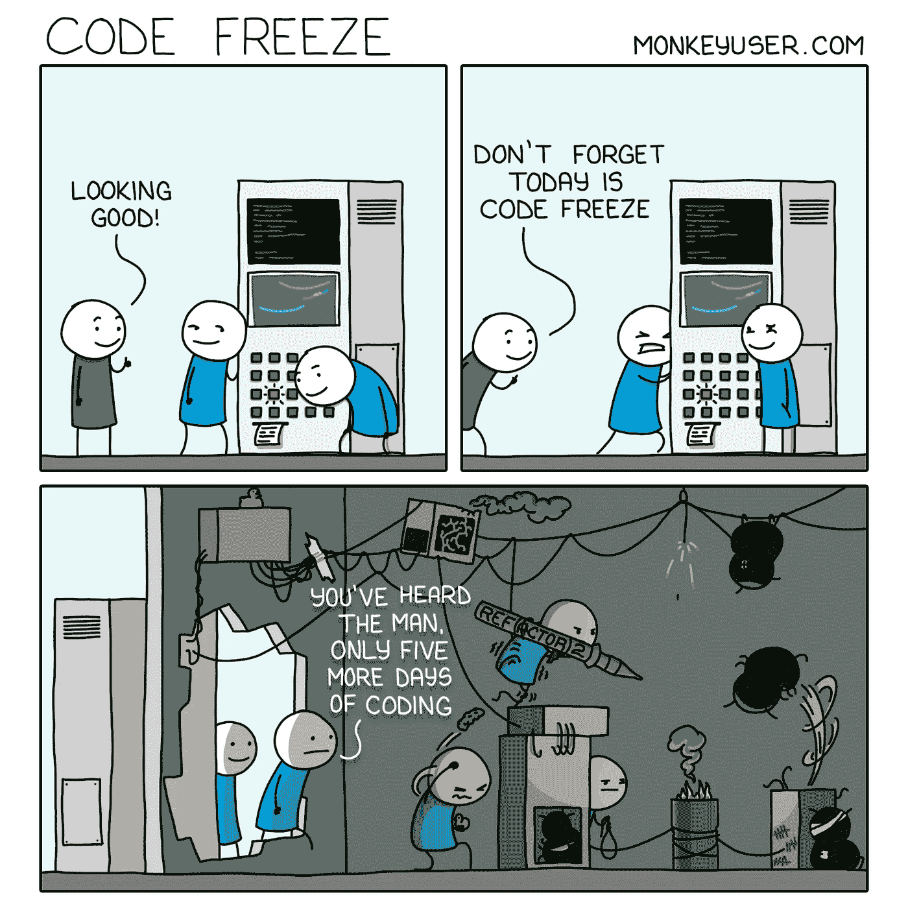
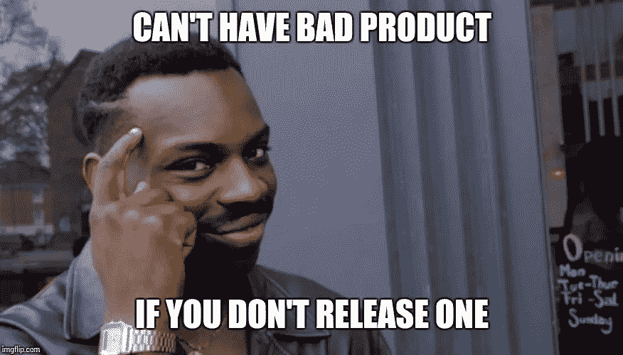

# 代码冻结仍然相关吗？

> 原文：<https://medium.com/geekculture/is-code-freeze-still-relevant-9c077495b64?source=collection_archive---------7----------------------->

Photo by [sydney Rae](https://unsplash.com/@srz?utm_source=medium&utm_medium=referral) on [Unsplash](https://unsplash.com?utm_source=medium&utm_medium=referral)

## 练习 CI/CD 时，代码冻结还重要吗？

假设您熟悉代码冻结的概念，这是项目中的专用时间，我们(开发人员)应该更严格地对代码或其他资源进行更改，以便将项目推向发布或迭代结束。

我最近一直在思考这个概念。我问自己，当我们有一个全面的 CI\CD 管道时，为什么我们需要停止一切？嗯，你可以选择其中一个版本，并将其设置为发布候选版本。

我研究并询问了周围的人，下面你可以找到我的结论。

## 代码冻结？啊哈？

code freeze bane — [src](https://makeameme.org/meme/the-code-freeze-fe4f1917d8)

首先，首先，定义什么是代码冻结。[维基百科](https://en.wikipedia.org/wiki/Freeze_(software_engineering))将其定义为:

> **冻结**是开发过程中的一个时间点，在此之后，对源代码或相关资源进行更改的规则变得更加严格

该页面强调了 3 种常见的冻结类型:

**规范冻结**是指所有各方都同意不再添加新的需求、规范或特性，并停止编码。

在**功能冻结**中，所有新功能的开发都被暂停，以便所有的精力都集中在寻找和修复 bug 以及改善用户体验上。特性冻结有助于通过防止引入新的、未经测试的源代码、资源及其交互来提高程序的稳定性。

最后，一个**代码冻结**，其中不允许对源代码进行任何更改，确保已知正常工作的代码区域将继续正常工作。在开发的最后阶段，当评估一个特定的版本或迭代时，代码冻结更为常见。

## 我们真的需要它吗？

Code freeze?- [src](https://www.monkeyuser.com/2020/code-freeze/)

现在我们都同步了它是什么，问题是它现在是否相关，在那里大多数(我假设)组织实践一种 CI\CD 管道？答案没有这么简单；**这取决于**领域和产品需求。

以在 [Igentify](https://www.igentify.com/) (我工作的地方)发生的事情为例，我们开发的产品按照健康技术领域的要求受到监管。我们为此应用了一个特性冻结，所以所有的特性都是稳定的，代码被转移到一个专门的分支，并且在发布之前应用了(手动和自动)测试。如果发现任何错误，我们会尽快修复它们。与此同时，主(当前)分支正在开发新功能。所以，更新的发展不会停止；它的优先级较低，速度较慢。

然而，这一概念与 CD (commit == new version)的概念相矛盾，在 CD 中，你可以使用任何已经准备好的东西(就代码、测试等而言)。)并将其交付给生产部门。例如，如果发现一个 bug，快速修复它，推送到分支机构。在某种程度上，它在开发人员和产品之间建立了一个缓冲区。他们可以继续工作，根本不知道有冻结。

在某些情况下，为了降低发布风险，打破 CD 概念是值得的。例如，我了解到像谷歌这样的大型科技公司会在假期冻结代码，因为大多数员工都和家人在一起，这导致解决生产问题的劳动力减少。

## 提醒你一句，⚠️

test, testing, and some more testing — [src](https://www.cryan.com/daily/2020/OfficeSpaceCodeFreeze.jpg)

我们应该警惕使用冻结的频率，它可能指向**不可靠的测试**，因此加强测试链将减少对它的需求。此外，有些人可能会认为你的过程有问题，因为你说某些贡献不能集成。有许多可能的原因，例如:

*   没有自动化测试。
*   缓慢和/或不稳定的测试。
*   长特征分支。
*   未经同意的设计变更。
*   损坏的版本不会立即恢复。
*   开发人员不在最新的主干上工作。

不管是什么，如果你不能在不停止整个团队的情况下整合，你就不能做 CI。

## 最后的话

The target is to release — [src](https://imgflip.com/i/1z3cu4)

事实是这里没有绝对。

持续集成和测试的目的是缩短反馈循环，给程序员更多的可见性。因此，测试和构建中的问题更少，但这并不意味着你不做开发周期的其他部分——它们只是更高效和有效，因为与开发相关的问题更有可能在过程的早期被发现。

然而，高度的信心并不意味着某些东西应该不经过相同的最终阶段就进入发布，而代码冻结是其中的一个关键因素。为了确保您发布的基线是预期的，您仍然需要它(或者至少是一个分支)。

请注意，更简单的情况可能不需要冻结。CI 过程应该确保开发分支的状态可以被发布。尽管如此，某些特定代码还不能发布到产品中的原因可能有很多。其他依赖项可能需要同时发布，或者出于任何业务原因。

在任何情况下，IMHO，发布风险必须得到管理，在某些情况下是由于降低 CD 率，尽管我们将努力不损害它并找到其他方法。