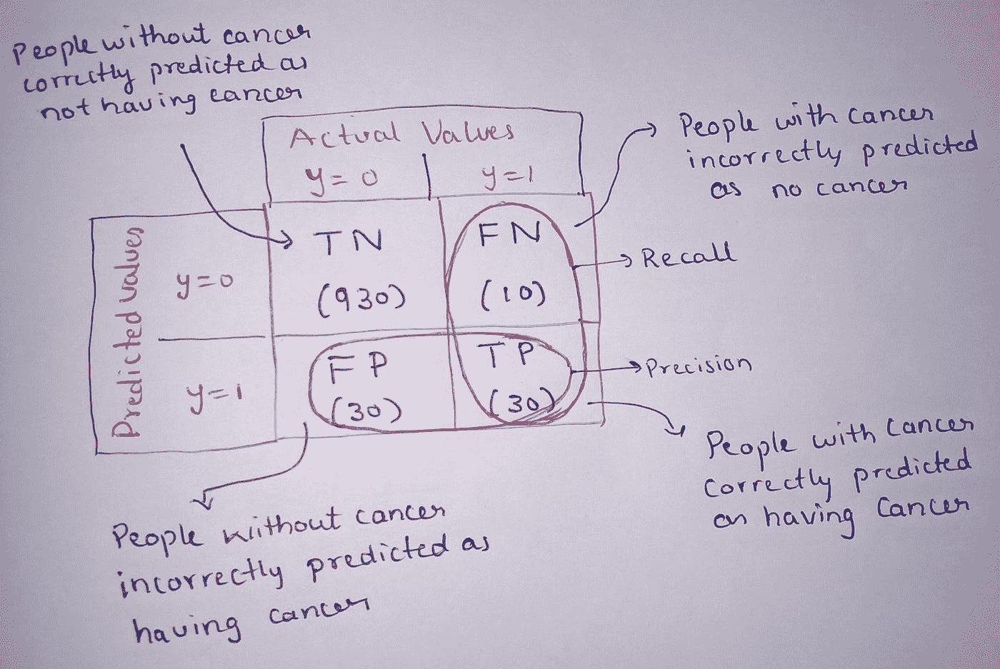
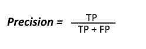
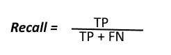
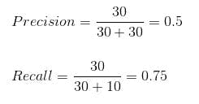
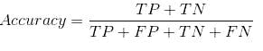
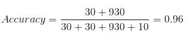
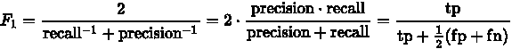

# 混淆矩阵真的很混乱吗？

> 原文：<https://medium.com/geekculture/is-confusion-matrix-really-confusing-1a92388bae35?source=collection_archive---------52----------------------->

看完这篇博客，我相信你不会被困惑矩阵所迷惑。

让我们开始吧。

**混淆矩阵**是用于描述模型性能的表格。

我们可以用精度作为度量来分析模型的性能，那为什么还要用混淆矩阵呢？？？
混乱矩阵有什么必要？？？

为了理解这一点，让我们考虑癌症预测模型的**例子**。
由于这是一个二元分类模型，其工作是基于一些特征来检测癌症患者。考虑到数百万人口中只有少数人患癌症，我们认为所提供的数据中只有 1%为癌症阳性。
**患癌标为 1，未患癌标为 0，**
这里要注意的一个有趣的事情是，如果一个系统给出的预测全是 0，那么预测准确率也将是 99%。这类似于在模型输出中写入 print(0)。这将有 99%的准确率。
但这是不正确的对吗？？

既然您已经知道了问题是什么，以及在这种情况下需要一个新的度量来帮助，那么让我们看看混淆矩阵是如何解决这个问题的。

让我们考虑一个具有 1000 个数据点的分类数据集的例子。

我们得到下面的混淆矩阵:
将会有两个类 1 和 0。
1 表示该人患有癌症，0 表示他们没有癌症。

通过看这个表，我们有 4 种不同的预测值和实际值的组合。让我们把预测值看作正的和负的，把实际值看作真的和假的。

坚持住，这很容易，你会明白的。

**真阳性** :
解释:模型预测阳性，为真。
实例理解:模型预测到一个人得了癌症，一个人真的得了。

**真阴性** :
解释:模型预测为阴性，为真。
举例理解:模型预测一个人没有癌症，他实际上没有癌症。

**假阳性** :
解释:模型预测阳性，是假的。
例子理解:模型预测一个人得了癌症，但他实际上并没有得癌症。

**假阴性** :
解释:模型预测阴性，为假。
举例理解:模型预测一个人没有癌症，而这个人实际上得了癌症。

**精度** :
在我们预测正确的所有正类中，实际上有多少是正的。

**回忆一下** :
在所有的正类中，我们正确预测了多少。

图片来源:维基百科

计算上表的精度和召回率。

让我们用准确度来比较这个。

该模型的准确率为 96%，但精确度为 0.5，召回率为 0.75
，这意味着 50%的正确预测病例被证明是癌症病例。而我们的模型成功预测了 75%的癌症阳性。

考虑一个用 print(0)代替 prediction 的例子。所以我们每次都得到 0。

这里的准确率是 91.4%，但是准确率和召回率呢？？
由于 TP 为 0，精度变为 0。
由于 TP 为 0，召回变为 0。
这是理解精度和召回的经典例子。

现在你明白了为什么精确度对于不平衡的数据集不是很有用，以及精确度和召回率是如何发挥关键作用的。

重要的一点是要明白，什么时候用精确，什么时候用回忆？？

在假阳性比假阴性更重要的情况下，精确度是一个有用的度量。
例如，在像 Youtube、Google 这样的推荐系统中，这是一个重要的指标，错误的推荐可能会导致用户离开平台。

召回是一个有用的度量，其中假阴性比假阳性更重要。例如，在医学领域，检测没有疾病阳性的患者在一定程度上是可以容忍的，但是应该总是预测有疾病的患者。

那么当我们不确定是用精度还是用召回的时候是什么情况呢？？
或者两者一个高怎么办，模型好不好？？？

要回答这个问题，让我们看看什么是 F1 的分数。

**F1-score** 是精度和召回率的调和平均值，精度和召回率相等时为高值。

**为什么不是正态算术平均值而是调和平均值？？**
因为算术平均值在两者之一为高值时给出高值，而调和平均值只有在两者几乎相等时才会为高。

所以从我们的例子来看，F1 的分数就变成了
F1 = 2TP/(2TP+FP+FN)= 2*30/(2*30+30+10)= 0.6

我相信看完这个困惑矩阵就不再那么困惑了！

希望你在这里学到了新的东西，不要忘记在你的想法下面发表评论。感谢阅读！
不断学习，不断成长。

*最初发布于*[*https://kirankamath . hash node . dev*](https://kirankamath.hashnode.dev/is-confusion-matrix-really-confusing)*。*